# Demo 1 — Crypto Batch and Streaming Lakehouse

## Overview

This project demonstrates an end-to-end Databricks lakehouse solution that combines a historical batch source and a live streaming source.

The solution uses:

- Binance historical OHLCV files as the batch source
- Binance public market APIs as the live source
- Azure Event Hubs for event transport
- Spark Structured Streaming for ingestion
- Delta Lake for reliable table storage
- Unity Catalog for governance
- an external Azure-backed Volume
- Bronze, Silver, and Gold data layers
- Databricks Workflows for orchestration
- Databricks Asset Bundles for deployment
- Databricks AI/BI dashboards for analytics

Tracked symbols:

- `BTCUSDT`
- `ETHUSDT`
- `SOLUSDT`

Historical period:

- January 2026
- daily interval
- 31 records per symbol
- 93 historical rows in total

---

## Why this project is interesting

This project is interesting because it combines several data-engineering patterns in one small and explainable solution:

1. **Batch and streaming in the same architecture**  
   Historical CSV files and live events are processed independently and joined later at the Gold layer.

2. **Real cloud integration**  
   Data is stored in Azure Data Lake, live records pass through Azure Event Hubs, and Databricks processes both sources.

3. **Schema evolution**  
   The original streaming events contain six fields. A later producer version adds four new fields without breaking existing data.

4. **Idempotent processing**  
   Historical data uses `MERGE`, while streaming data uses checkpoints and Event Hub offsets.

5. **Governed storage**  
   Data is accessed through a Unity Catalog external Volume instead of unmanaged paths.

6. **Deployment as code**  
   The workflow is deployed through Databricks Asset Bundles rather than only being created manually.

7. **Business-facing output**  
   The project finishes with Gold tables and a dashboard rather than stopping at ingestion.

---

## Problem statement

Market data arrives in different forms:

- historical market data is delivered as monthly files;
- live prices arrive continuously as events;
- schemas can change over time;
- rerunning pipelines must not create duplicate records;
- both technical and business users need trusted, reusable outputs.

The project solves this by building one governed lakehouse pipeline that:

- downloads and stores historical Binance files;
- publishes current prices to Azure Event Hubs;
- consumes live events with Structured Streaming;
- preserves ingestion and Event Hub metadata;
- evolves the streaming schema safely;
- validates completeness and uniqueness;
- creates clean Silver tables;
- creates dashboard-ready Gold tables;
- deploys and runs the entire workflow automatically.

---

## Architecture

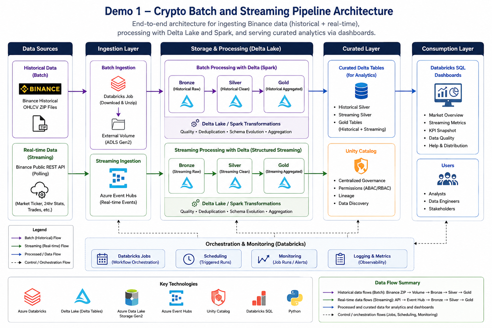

```text
                         BATCH BRANCH

Binance Data Vision
        |
        | monthly ZIP / CSV files
        v
Azure-backed external Volume
        |
        v
Historical Bronze
        |
        v
Historical Silver
        |
        +-------------------------+
                                  |
                                  v
                            Gold tables
                                  |
                                  v
                         Databricks Dashboard
                                  ^
                                  |
        +-------------------------+
        |
        |              STREAMING BRANCH
Binance Public REST API
        |
        v
Python Event Hub Producer
        |
        v
Azure Event Hubs
        |
        v
Spark Structured Streaming
        |
        v
Streaming Bronze
        |
        v
Streaming Silver
        |
        +-------------------------+
                                  |
                                  v
                            Gold tables
```

---

## Azure and Unity Catalog configuration

| Item | Value |
|---|---|
| Catalog | `dbr_dev` |
| Schema | `parvinbadalov` |
| Volume | `demo1_crypto` |
| Storage account | `dlspl21databricks` |
| Container | `parvinbadalov` |
| Azure directory | `demos/demo1_crypto` |

External location:

```text
abfss://parvinbadalov@dlspl21databricks.dfs.core.windows.net/demos/demo1_crypto
```

Unity Catalog Volume path:

```text
/Volumes/dbr_dev/parvinbadalov/demo1_crypto
```

Volume structure:

```text
demo1_crypto/
├── raw/
│   ├── historical/
│   └── streaming_test/
├── landing/
│   └── historical/
├── system/
│   ├── schema/
│   │   └── crypto_ticks/
│   └── checkpoints/
│       └── crypto_ticks/
└── archive/
```

---

## Pipeline notebooks

```text
Demos/Demo1/
├── config/
│   └── 00_config.ipynb
├── setup/
│   └── 01_setup.ipynb
├── batch/
│   ├── 02_historical_download.ipynb
│   └── 03_batch_ingestion.ipynb
├── streaming/
│   ├── 04_eventhub_producer.ipynb
│   ├── 05_eventhub_consumer.ipynb
│   └── 06_schema_evolution_demo.ipynb
├── validation/
│   └── 07_validation.ipynb
├── transformation/
│   ├── 08_silver_transformation.ipynb
│   └── 09_gold_aggregation.ipynb
├── dashboard/
│   ├── dashboard_queries.sql
│   └── dashboard.lvdash.json
├── resources/
│   └── demo1_job.yml
├── docs/
│   └── evidence/
└── README.md
```

---

## Workflow design

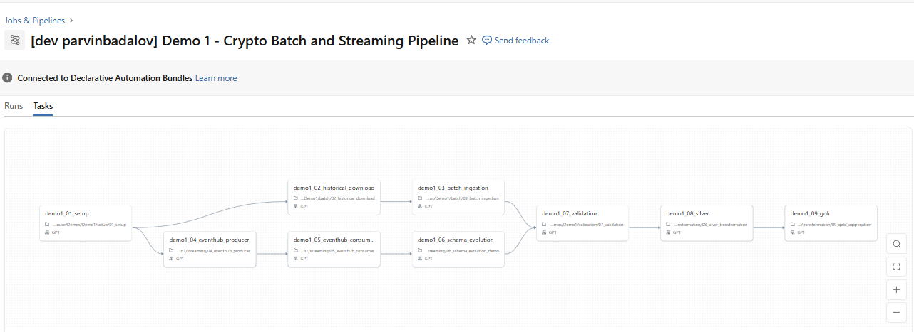

```text
01_setup
├── 02_historical_download
│   └── 03_batch_ingestion
└── 04_eventhub_producer
    └── 05_eventhub_consumer
        └── 06_schema_evolution

03_batch_ingestion ─┐
06_schema_evolution ┴→ 07_validation
                       → 08_silver
                       → 09_gold

```


The workflow starts with infrastructure setup, then runs the batch and streaming branches in parallel. Both branches meet at validation before Silver and Gold transformations are created.


## Data layers

### Bronze

| Table | Purpose |
|---|---|
| `demo1_crypto_ohlcv_bronze` | Historical OHLCV source data with ingestion metadata |
| `demo1_crypto_ticks_bronze` | Raw Event Hub events with partition and offset metadata |

### Silver

| Table | Purpose |
|---|---|
| `demo1_crypto_ohlcv_silver` | Clean, deduplicated daily candles with derived metrics |
| `demo1_crypto_ticks_silver` | Clean, deduplicated live tick events |

### Gold

| Table | Purpose |
|---|---|
| `demo1_crypto_latest_prices_gold` | Latest live prices and comparison with historical close |
| `demo1_crypto_market_summary_gold` | Historical returns, ranges, streaming metrics, and ingestion delay |

---

## Streaming event schemas

Initial event:

```json
{
  "event_id": "UUID",
  "symbol": "BTCUSDT",
  "price_usd": 63424.38,
  "event_time": "2026-08-02T20:38:12Z",
  "producer_id": "demo1_binance_price_producer",
  "source_system": "binance_public_api"
}
```

Evolved fields:

```json
{
  "change_pct_24h": 1.25,
  "high_price_24h": 64000.00,
  "low_price_24h": 62000.00,
  "volume_24h": 12345.67
}
```

Older records remain valid and contain `NULL` values for fields that did not exist in the original schema.

---

## Reliability and idempotency

### Historical batch

The historical Bronze table uses this business key:

```text
symbol + open_time
```

The pipeline uses Delta `MERGE`:

- matching rows are updated;
- new rows are inserted;
- reruns do not duplicate the same daily candle.

### Streaming

The streaming pipeline uses:

- Event Hub partition;
- Event Hub offset;
- Structured Streaming checkpoint;
- `availableNow=True`.

The checkpoint resumes processing from the last completed offset.

### Validation

The validation notebook checks:

- both Bronze tables exist;
- expected symbols are present;
- historical business keys are unique;
- streaming event IDs are unique;
- Event Hub partition-offset pairs are unique;
- critical fields are populated;
- OHLC rules are valid;
- source files exist;
- Volume folders are accessible;
- schema-evolution columns exist;
- original and evolved records coexist.

Final result:

```text
Passed: 23
Failed: 0
Total checks: 23
```

---

## Good and bad parts of the project

### Good

- clear separation between batch and streaming branches;
- real Event Hub integration instead of simulated Spark input;
- external Azure-backed Unity Catalog Volume;
- checkpoint-based streaming recovery;
- idempotent historical `MERGE`;
- additive schema evolution;
- strong validation coverage;
- reusable shared configuration;
- deployment through Asset Bundles;
- dashboard-ready Gold layer;
- easy-to-follow notebook numbering and workflow graph.

### Limitations / bad parts

- only one month of historical data is used;
- only three symbols are tracked;
- live prices are polled, not received through a true exchange WebSocket;
- the project uses an existing all-purpose cluster rather than dedicated job compute;
- Gold tables are overwritten rather than incrementally updated;
- the schema-evolution demo intentionally sends new test records on every full run;
- historical and live timestamps come from different periods, so comparison is illustrative rather than time-aligned;
- the first download implementation used a fixed `/tmp` path, which caused a deployment-time permission error and had to be replaced with a unique temporary directory.

These limitations are acceptable for a board demo because they keep the project understandable and affordable.

---

## What was easier and what was harder

### Easier parts

- creating schemas and external Volume folders;
- reading the three historical CSV files;
- creating Bronze and Silver Delta tables;
- creating dashboard SQL datasets;
- adding job dependencies;
- building validation summaries.

### Harder parts

1. **Event Hub authentication through Kafka**  
   Shared compute required the Databricks-shaded Kafka login class.

2. **Checkpoint behavior**  
   The consumer had to reuse the same checkpoint so old offsets were not reprocessed.

3. **Schema evolution**  
   The producer, JSON schema, streaming write, and Delta table all had to evolve consistently.

4. **Idempotent historical loading**  
   The `MERGE` business key had to identify one symbol and one daily candle correctly.

5. **Bundle deployment**  
   Notebook paths, resource includes, job parameters, and source-linked deployment had to align.

6. **Local temporary storage in jobs**  
   A fixed `/tmp/demo1_crypto_download` path failed with a permission error. The fix was to use `tempfile.mkdtemp()` and remove the directory after the run.

7. **Dashboard design across different price scales**  
   BTC, ETH, and SOL have very different values, so some charts naturally compress smaller symbols.

---

## Main issue solved during deployment

The first bundle-deployed run failed in the historical download task:

```text
PermissionError: [Errno 13] Permission denied:
'/tmp/demo1_crypto_download/BTCUSDT-1d-2026-01.zip'
```

Cause:

- the notebook used one fixed local `/tmp` directory;
- the directory was not writable by the deployed workload.

Fix:

```python
import tempfile
from pathlib import Path

driver_download_dir = Path(
    tempfile.mkdtemp(prefix="demo1_crypto_download_")
)
```

The temporary directory is now unique for every job run and is cleaned up after the files are copied.

The next bundle run completed successfully in approximately seven minutes.

---

## Dashboard

The dashboard includes:

- symbol filter;
- date-range filter;
- candle-direction filter;
- historical closing-price trend;
- historical return by symbol;
- historical volume;
- bullish/bearish/neutral day counts;
- latest 24-hour market snapshot;
- live versus historical price;
- live streaming trend;
- historical price range;
- 24-hour price change;
- streaming event metrics;
- latest prices table;
- KPI cards;
- dashboard refresh timestamp;
- explanatory help section.

---

## How to deploy

From the repository root:

```bash
databricks bundle validate -t dev
databricks bundle deploy -t dev
databricks bundle run -t dev Demo_1_Crypto_Batch_and_Streaming_Pipeline
```

Successful deployment output:

```text
Validation OK
Deployment complete
TERMINATED SUCCESS
```

---

## Evidence

### External Volume

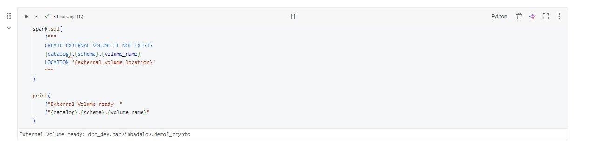

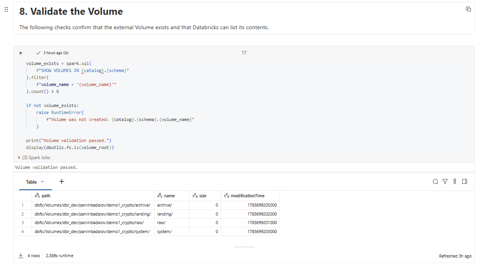

### Historical files

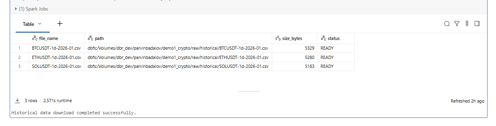

### Historical Bronze

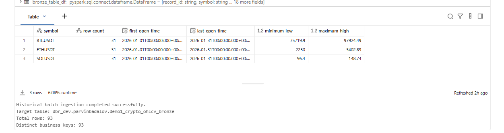

### Event Hub producer

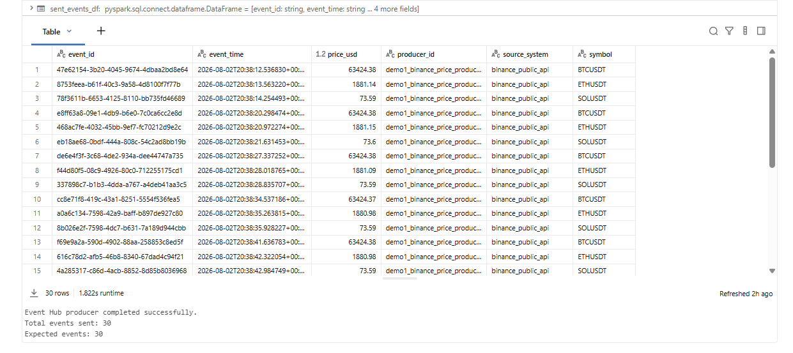

### Streaming Bronze

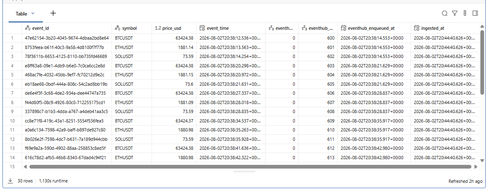

### Schema evolution

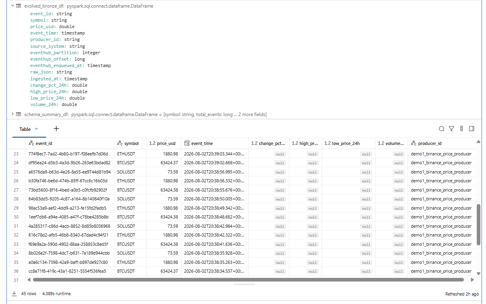

### Validation

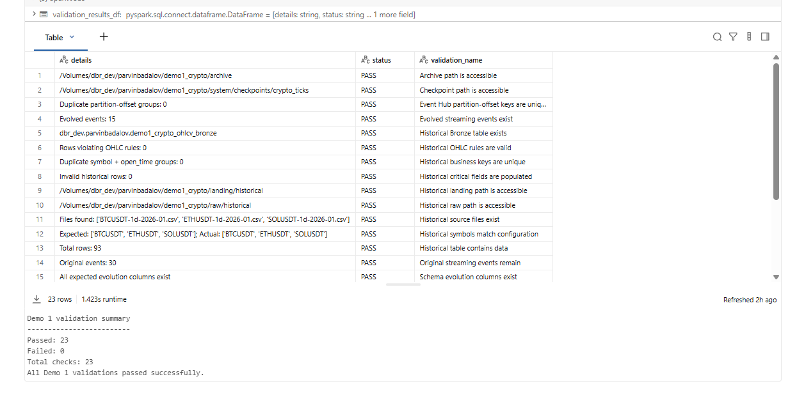

### Silver

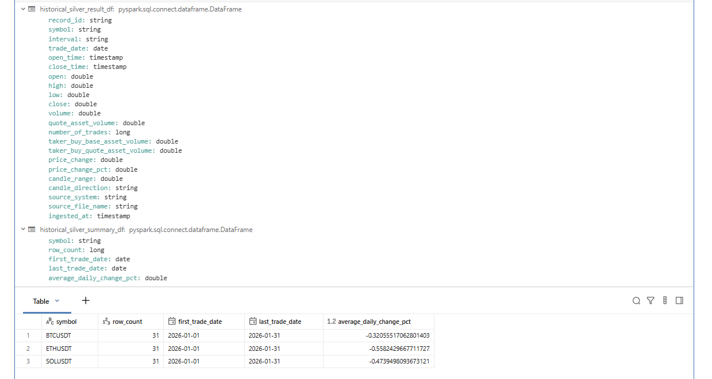

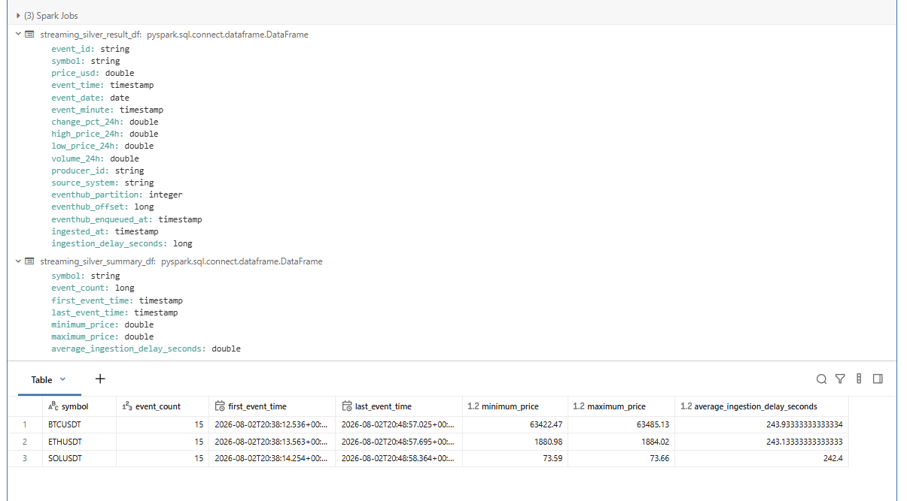

### Gold

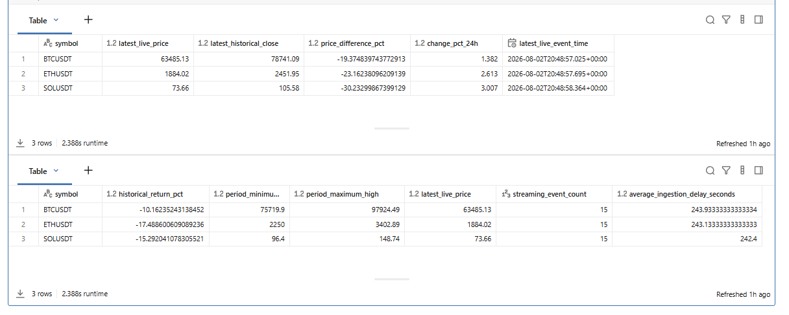

### Bundle deployment and successful workflow

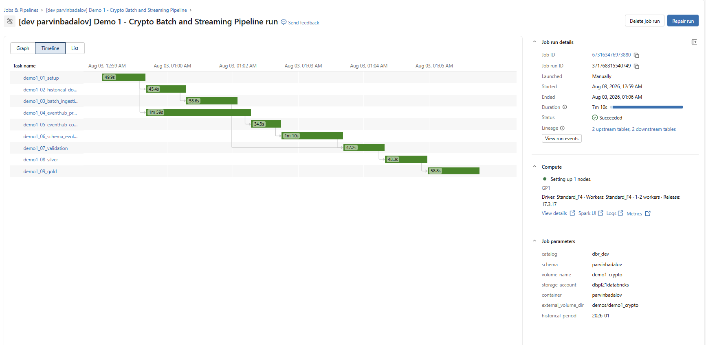

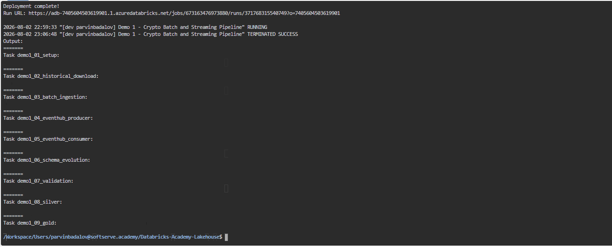

### Dashboard

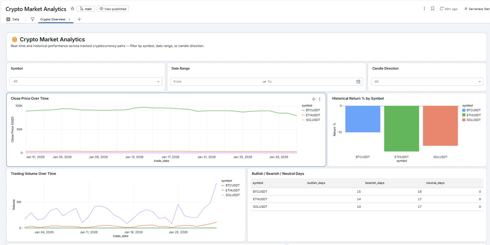

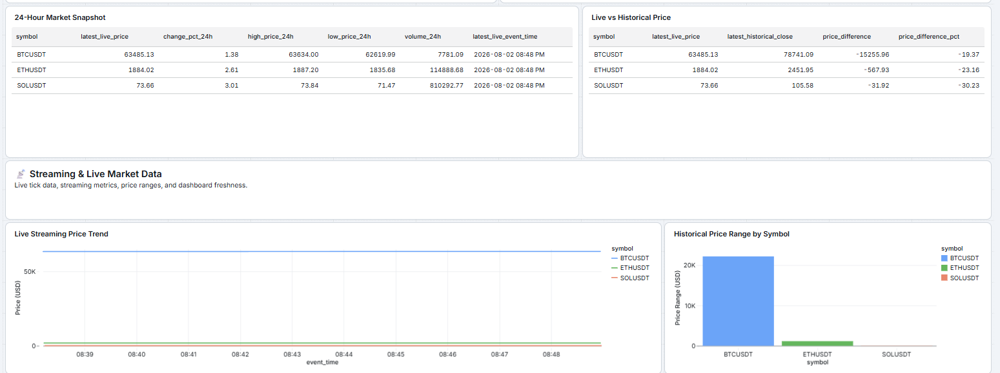


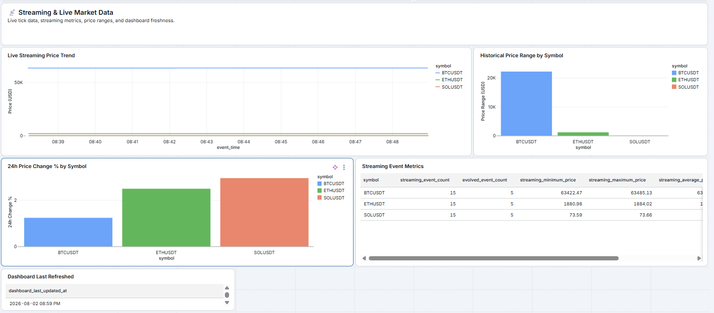


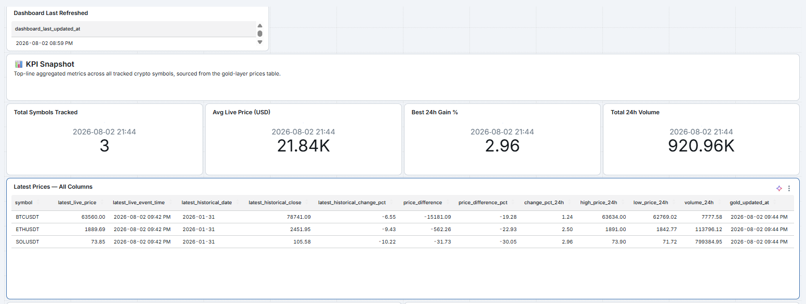

---

## Short board explanation

> The project solves the problem of combining historical file-based market data with live event data in one governed Databricks lakehouse. Historical Binance files are stored in an Azure-backed Unity Catalog Volume and loaded idempotently with Delta `MERGE`. Live Binance prices are sent to Azure Event Hubs and consumed by Spark Structured Streaming with persistent checkpoints. The streaming schema is evolved by adding 24-hour market fields while preserving older records. Validation checks data quality, Silver tables clean and deduplicate the records, Gold tables provide business-level metrics, and a Databricks dashboard presents the results. The entire workflow is deployed and executed through Databricks Asset Bundles.
