# Demo 2: RetailPulse E-Commerce Lakehouse

RetailPulse is an end-to-end Azure Databricks reference implementation for an e-commerce
medallion lakehouse. It demonstrates deterministic source generation, incremental
ingestion with Auto Loader, controlled schema evolution, explicit data-quality routing,
SCD Type 2 history, temporally correct Gold facts, governed analytics, reconciliation,
alerting, automated tests, and an AI/BI dashboard.

## Architecture

```text
Azure-backed Unity Catalog external volume
        |
        +--> customers snapshots (CSV)
        +--> products reference data (CSV)
        `--> orders (JSON / Auto Loader)
                    |
                    v
                 Bronze
                    |
                    v
        Silver classification
       VALID / WARN / QUARANTINE
          |                  |
          |                  `--> quarantine + DQ metrics
          v
   trusted = VALID + WARN
          |
          +--> customer SCD2
          +--> dim_product
          +--> dim_date
          `--> fact_order_lines
                    |
                    v
               Gold marts
                    |
                    v
        demo2_sales_governed
          RLS + CLS fallback
                    |
             +------+------+
             |             |
             v             v
       AI/BI dashboard   SQL alert
```

The project reuses the existing Unity Catalog schema `dbr_dev.parvinbadalov` and the
Azure-backed external volume `dbr_dev.parvinbadalov.demo2_ecommerce`. Runtime files,
Auto Loader schema metadata, and checkpoints are isolated below:

```text
/Volumes/dbr_dev/parvinbadalov/demo2_ecommerce/runtime
```

## End-to-End Workflow

The final Azure Dev workflow completed successfully with all 11 tasks passing. Notebook
tasks ran on GP2, while the Lakeflow pipeline used serverless compute.

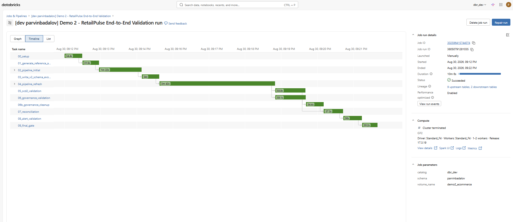

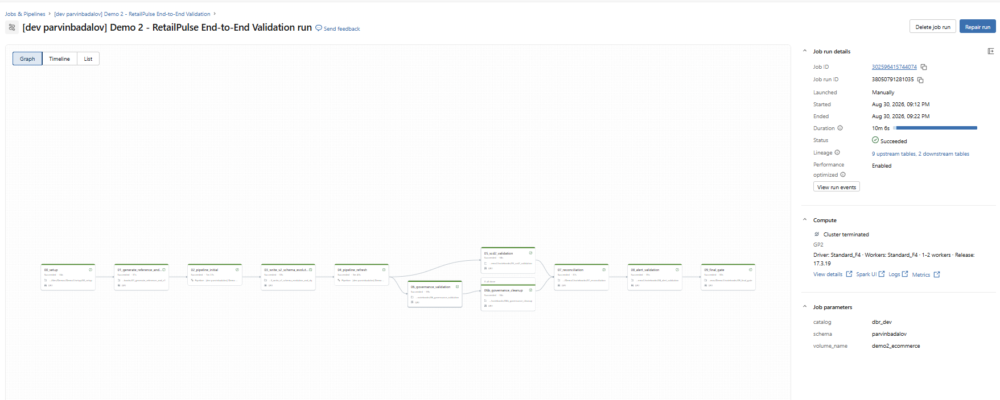

The workflow order is:

```text
00_setup
  |
01_generate_reference_and_v1
  |
02_pipeline_initial
  |
03_write_v2_schema_evolution_and_dq
  |
04_pipeline_refresh
  |
  +-------------------------+
  |                         |
05_scd2_validation   06_governance_validation
                              |
                        06b_governance_cleanup
                              |
  +-------------+-------------+
                |
07_reconciliation
                |
08_alert_validation
                |
09_final_gate
```

## Bronze and Incremental Ingestion

The source generators create repeatable CSV/JSON inputs:

- V1 contains 24 valid order lines.
- V1 physically omits `sales_channel` and `coupon_code`.
- V2 contains exactly 100 physical rows.
- V2 introduces non-null `sales_channel` and `coupon_code`.
- Customer snapshots are dated `20260801` and `20260830`.
- Product reference data is loaded separately.
- Bronze preserves source duplicates and adds technical metadata.

The initial pipeline run proves the V1 pipeline state:

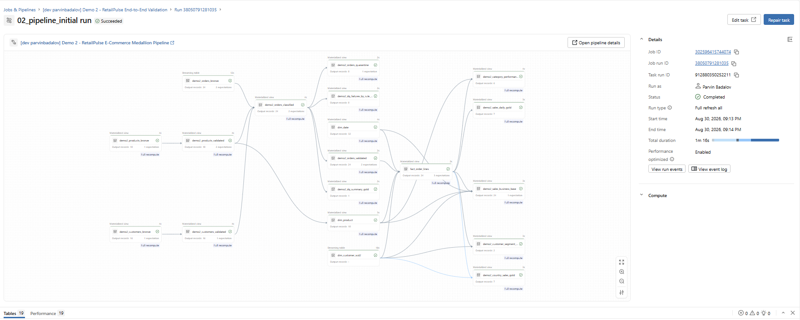

The controlled V2 batch was then written and verified:

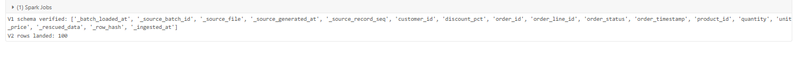

The refresh completed successfully and shows the full post-V2 Lakeflow graph with the
updated record counts:

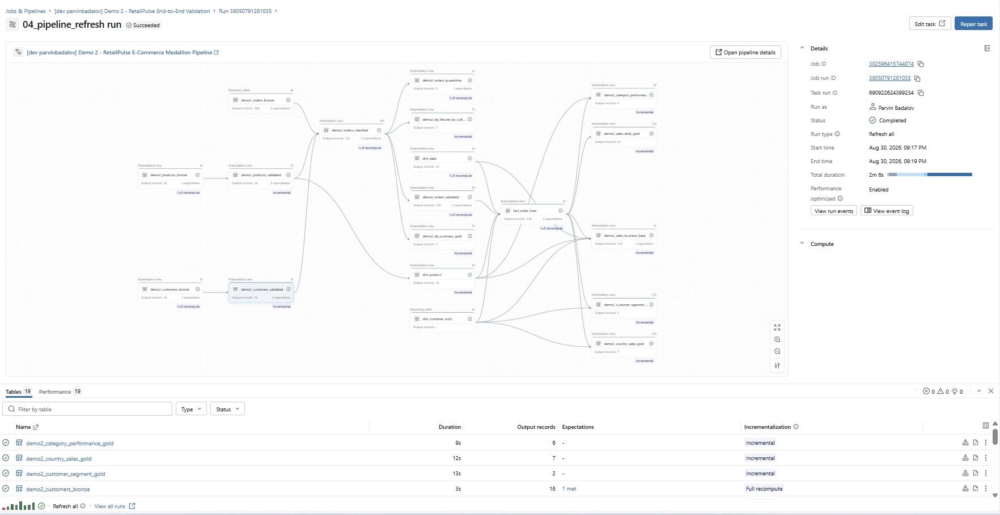

## Data Quality

Silver performs deterministic duplicate ranking rather than silently calling
`dropDuplicates()`. Every physical order row receives one final quality status.

The controlled batch results are:

| Batch | Physical rows | VALID | WARN | QUARANTINE | Trusted |
|---|---:|---:|---:|---:|---:|
| V1 initial | 24 | 24 | 0 | 0 | 24 |
| V2 schema evolution | 100 | 92 | 2 | 6 | 94 |

The six quarantined rows intentionally demonstrate one occurrence each of
`DUPLICATE_ORDER_LINE_ID`, `CUSTOMER_ID_MISSING`, `UNKNOWN_PRODUCT_ID`,
`NON_POSITIVE_QUANTITY`, `INVALID_DISCOUNT`, and `FUTURE_ORDER_TIMESTAMP`.

The two `HIGH_DISCOUNT` warning rows remain in the trusted business layer.

Discount classification is deterministic:

```text
discount_pct <= 0.30            -> VALID
0.30 < discount_pct <= 0.50     -> WARN
discount_pct > 0.50             -> QUARANTINE
```

## Customer SCD Type 2 and Temporal Facts

`dim_customer_scd2` uses `dp.create_auto_cdc_from_snapshot_flow()` and tracks only the
business attributes:

- customer name,
- email,
- country,
- city,
- loyalty tier.

Technical ingestion metadata is deliberately excluded from SCD tracking.

`C001`, `C003`, and `C006` each have two historical versions, and every customer has
exactly one current version. Facts resolve the customer version valid on the order date
using a half-open validity interval.

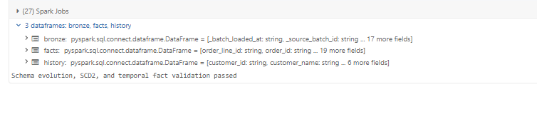

## Gold Star Schema

The Gold model uses one trusted order line as the fact grain:

```text
dim_customer_scd2
        |
dim_date -- fact_order_lines -- dim_product
```

Supporting Gold objects include:

- `demo2_sales_daily_gold`
- `demo2_category_performance_gold`
- `demo2_country_sales_gold`
- `demo2_customer_segment_gold`
- `demo2_dq_summary_gold`
- `demo2_dq_failures_by_rule_gold`

The final fact layer contains 118 trusted order lines across V1 and V2.

## Governance: RLS and CLS

`demo2_sales_governed` is the primary analytical source. It uses a fail-closed
dynamic-view implementation backed by `demo2_user_country_access`.

The logic is:

- no identity mapping -> zero rows,
- country mapping -> only that country,
- `all_access = true` -> unrestricted rows,
- `can_view_pii = false` -> customer name and email are masked,
- access is evaluated using `SESSION_USER()`.

The pipeline governance validation and cleanup both passed:

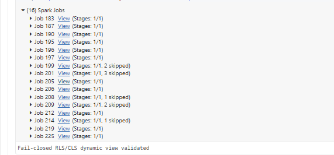

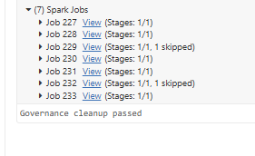

The workflow governance probe recorded 118 base rows and 118 visible rows for the
explicitly mapped administrative session. Cleanup completed with zero probe mappings
remaining.

### Viewer-Specific Validation

Viewer-specific RLS/CLS was also validated using a **second authenticated workspace
user**. The identity is intentionally not recorded in this public documentation.

| Viewer test | Result |
|---|---|
| Authenticated user with no access mapping | **0 visible rows — PASS** |
| User mapped to `PL` | **PL rows only — PASS** |
| `all_access = false` | **No unrestricted access — PASS** |
| `can_view_pii = false` | **`customer_name` masked — PASS** |
| `can_view_pii = false` | **`email` masked — PASS** |
| Distinct visible country count | **1 (`PL`) — PASS** |

The configured restricted-viewer mapping is shown below without exposing the user's
email address:

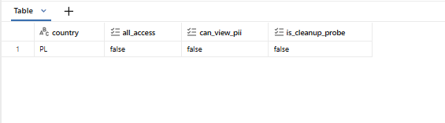

This closes the viewer-specific SQL governance evidence gap. The implementation remains
a dynamic-view fallback rather than native Unity Catalog row-filter and column-mask
policy objects.

## Reconciliation and Final Quality Gate

The deterministic reconciliation for V2 is:

```text
100 Bronze physical rows
= 92 VALID
+ 2 WARN
+ 6 QUARANTINE

94 trusted Silver rows
= 94 Gold fact rows

trusted duplicates = 0
fact duplicates    = 0
customer orphans   = 0
product orphans    = 0
date orphans       = 0
```

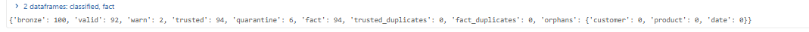

The final workflow gate completed successfully:

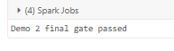

## Alerting

The SQL alert evaluates the latest logical ingestion batch using `_batch_loaded_at DESC`
with a deterministic batch ID tiebreaker.

For the V2 batch:

```text
quarantine_rate_pct = 6.0
threshold            = 5.0
condition            = 6.0 > 5.0
result               = TRUE
```

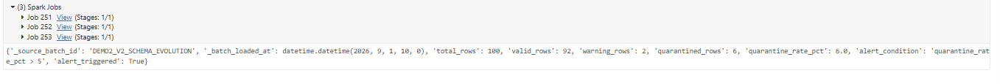

The recurring alert schedule is intentionally **PAUSED** to prevent unattended
executions in the Academy environment.

## AI/BI Dashboard

The published RetailPulse dashboard uses individual data permissions
(`embed_credentials=false`). Business visuals read from `demo2_sales_governed`, while
DQ visuals read from Gold DQ aggregates.

Validated headline KPIs:

| KPI | Result |
|---|---:|
| Net Revenue | 15,962.40 |
| Gross Revenue | 16,360.83 |
| Orders | 59 |
| Customers | 8 |
| Items Sold | 236 |
| Average Order Value | 270.55 |

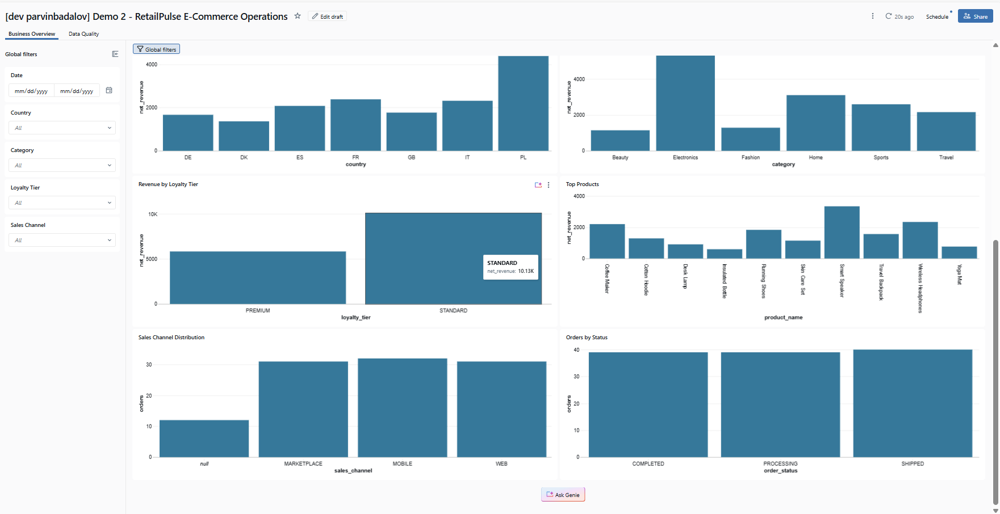

The business dashboard also includes country, category, loyalty-tier, top-product,
sales-channel, and order-status analysis:

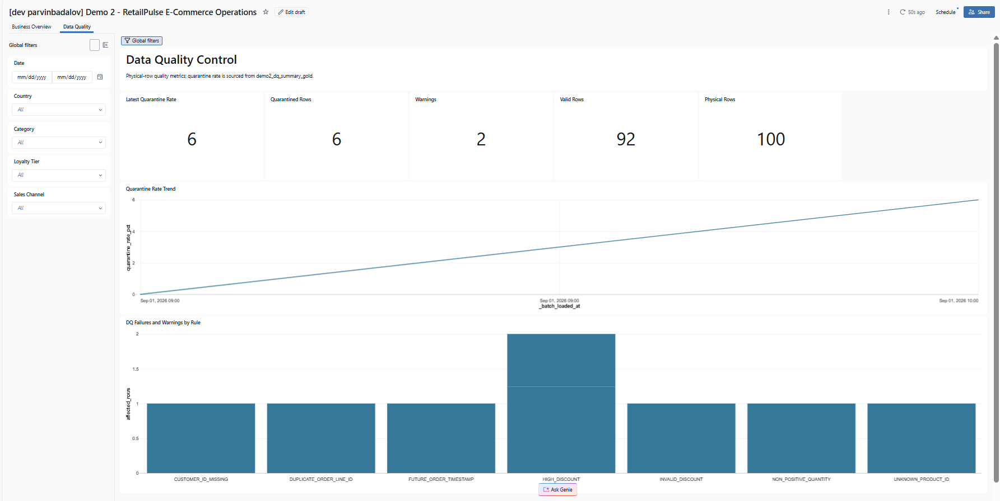

The Data Quality page makes the V2 result immediately visible: 100 physical rows,
92 valid rows, 2 warnings, 6 quarantined rows, and a 6% quarantine rate.

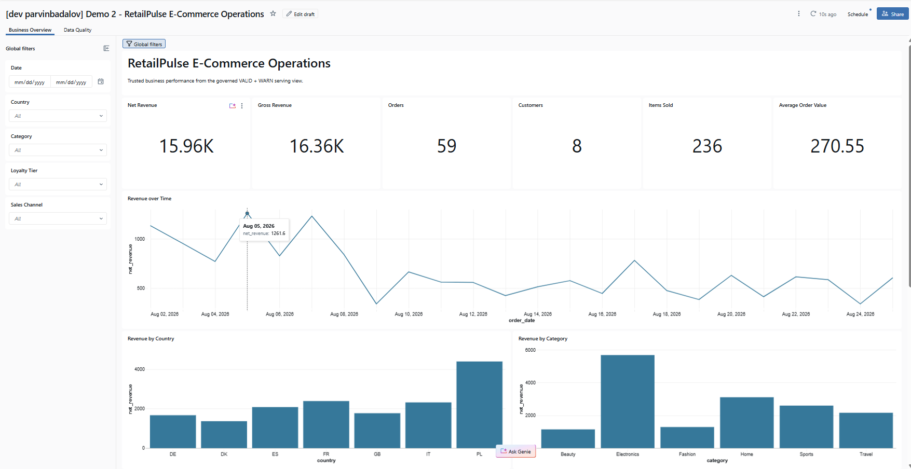

## Testing

Local and remote verification completed successfully:

```text
Pure pytest:        14 passed, 2 deselected
Remote Chispa:       2 passed, 14 deselected
Ruff:                All checks passed
Black:               32 files unchanged
pip check:           No broken requirements found
Bundle validation:   Validation OK
```

The pure tests cover deterministic data generation, hashing, DQ classification,
temporal lookup, reconciliation, governance predicates, and schema-evolution
expectations. Chispa validation runs through Databricks Connect.

## Azure Dev Validation

| Resource | Final result |
|---|---|
| End-to-end workflow | Run `38050791281035` SUCCESS; 11/11 tasks passed |
| Validation job | `302596415744074` |
| External volume | `dbr_dev.parvinbadalov.demo2_ecommerce` active |
| Lakeflow pipeline | `63c982e0-4c02-4b13-a949-3c6e227718c0` COMPLETED |
| SQL alert | `4215558586839739` deployed; schedule PAUSED |
| AI/BI dashboard | `01f1a4a6833a1f10967638a44a6486de` active and published |
| Azure Prod | Untouched |

Final Demo 2 scoped bundle plan:

```text
0 add, 0 change, 0 delete, 4 unchanged
```

## Repository Structure

```text
Demos/Demo2/
|-- README.md
|-- config/
|   `-- quality_rules.yml
|-- contracts/
|   |-- customers.yml
|   |-- orders.yml
|   `-- products.yml
|-- dashboard/
|   |-- dashboard_queries.sql
|   `-- demo2_dashboard.lvdash.json
|-- docs/
|   `-- evidence/
|       `-- screenshots/
|-- notebooks/
|   |-- 01_generate_reference_and_v1.py
|   |-- 03_write_v2_schema_evolution_and_dq.py
|   |-- 05_scd2_validation.py
|   |-- 06_governance_validation.py
|   |-- 06b_governance_cleanup.py
|   |-- 07_reconciliation.py
|   |-- 08_alert_validation.py
|   `-- 09_final_gate.py
|-- pipeline/
|   |-- bronze.py
|   |-- silver.py
|   |-- scd2.py
|   |-- gold.py
|   `-- governance.py
|-- resources/
|   |-- demo2_alert.yml
|   |-- demo2_dashboard.yml
|   |-- demo2_job.yml
|   `-- demo2_pipeline.yml
|-- setup/
|   `-- 00_setup.py
|-- sql/
|-- src/demo2/
|-- tests/
|-- tools/
|-- pyproject.toml
`-- requirements-dev.txt
```

## How to Validate

From the repository root:

```powershell
.\.venv-demo2\Scripts\python.exe -m pytest Demos/Demo2/tests -m "not spark" -q

$env:DEMO2_REMOTE_SPARK = "1"
$env:DATABRICKS_CONFIG_PROFILE = "AZURE_DEV"
$env:DEMO2_CLUSTER_ID = "0702-171207-xo9bbc0y"
.\.venv-demo2\Scripts\python.exe -m pytest Demos/Demo2/tests -m spark -q

.\.venv-demo2\Scripts\python.exe -m ruff check Demos/Demo2
.\.venv-demo2\Scripts\python.exe -m black --check Demos/Demo2

databricks bundle validate -t azure_dev --profile AZURE_DEV
```

## Git and Promotion Status

Demo 2 was merged into `main` through **GitHub PR #2** after the repository quality
checks passed. The local repository and Azure Databricks Workspace Git folder were then
synchronized with `main`.

No Azure Prod execution was performed as part of Demo 2.

## Implementation Notes

The final clean run includes three fixes discovered during Azure Dev validation:

- SCD2 snapshot processing reads deterministic snapshot inputs instead of accessing a
  pipeline-managed table prematurely.
- Bronze uses `_metadata.file_path` because Unity Catalog rejects `input_file_name()`.
- Gold fact/customer aliases qualify `customer_id` to avoid an ambiguous reference.

## Known Limitations

- Governance uses the workspace-supported dynamic-view fallback rather than native
  Unity Catalog row-filter and column-mask policy objects.
- The SQL alert schedule is intentionally paused.
- Business dashboard filters do not automatically filter independent DQ batch datasets.
- Viewer-specific SQL RLS/CLS was validated with a second authenticated identity, but a
  separate second-user dashboard screenshot is not included in this evidence package.
