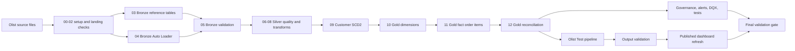
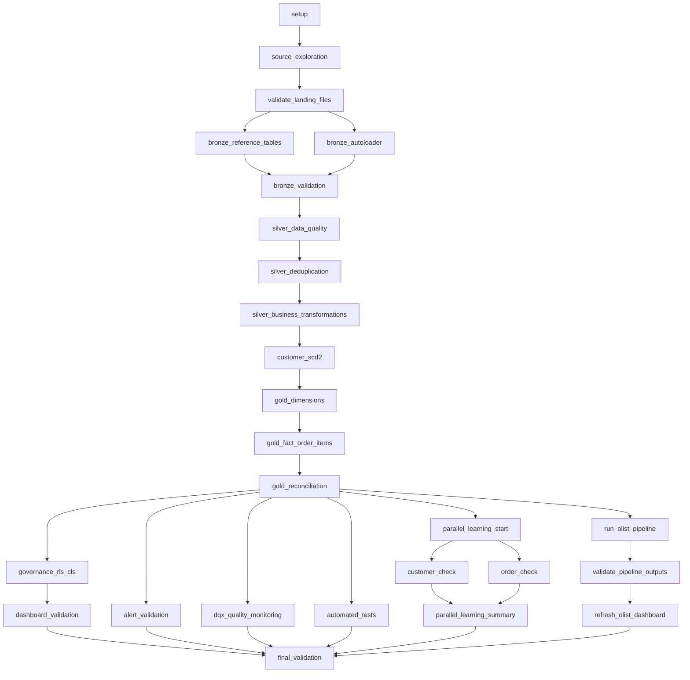

# Demo2 Olist Lakehouse

## Business objective

This project turns the Brazilian Olist e-commerce dataset into a governed, testable lakehouse workflow. It gives analysts reliable order, customer, product, payment, and delivery metrics while making data-quality failures visible before a dashboard refresh.

The workflow is designed for Azure Databricks development and is managed by the isolated bundle `demo2-olist-end-to-end`.

## Technologies

- Azure Databricks Jobs and Lakeflow Declarative Pipelines
- Unity Catalog and Delta tables
- Python, PySpark, SQL, and Databricks notebooks
- `databricks-labs-dqx` for data-quality monitoring
- Pytest for local unit and integration tests
- Databricks SQL dashboard and Genie exploration
- Databricks Asset Bundles for repeatable deployment

## Architecture



The main notebook workflow owns the lakehouse build. The existing Olist Test pipeline reads the Gold fact table and creates learning materialized views. The Job treats that pipeline as one `pipeline_task`, then validates its published tables before refreshing the dashboard.

## Complete large Job DAG



The final task has a dependency on every required terminal branch. A failure in a notebook check, test task, pipeline validation, parallel branch, or dashboard refresh prevents the Job from reporting success.

## Repository structure

- `databricks.yml`: isolated bundle configuration and Azure development variables.
- `resources/demo2_olist_job.yml`: comprehensive large Job.
- `resources/demo2_olist_end_to_end.job.yml`: preserved small bundle-managed pipeline-validation Job.
- `notebooks/00_setup.py` through `17_dqx_quality_monitoring.ipynb`: main learning workflow.
- `pipeline/Olist Test/`: existing declarative pipeline sources, tests, utilities, and output validator.
- `pipeline/parallel_learning/`: four executable parallel-learning notebooks.
- `tests/unit/` and `tests/integration/`: local project tests.
- `tools/run_tests.ipynb`: Job-level automated test entry point.
- `config/` and `contracts/`: environment and Gold contract definitions.
- `sql/`: SQL validation and alert queries.
- `dashboard/`: dashboard specification and exported dashboard definition.
- `docs/`: presentation notes and deployment evidence.

Exploration scripts under `pipeline/Olist Test/explorations/` are intentionally not Job tasks. Helper modules under `utilities/` and `src/` are imported by executable tasks rather than scheduled independently.

## Main workflow responsibilities

1. `00_setup` prepares the development catalog, schema, volume, and landing context.
2. `01_source_exploration` and `02_validate_landing_files` establish that the source is usable.
3. Bronze reference and Auto Loader tasks run in parallel, then `05_bronze_validation` checks their outputs.
4. Silver tasks apply quality rules, deduplication, business transformations, and customer history logic.
5. Gold tasks build dimensions and `gold_fact_order_items`.
6. Reconciliation, governance, dashboard, alert, DQX, and automated-test tasks verify the result.

## Olist Test declarative pipeline

The existing pipeline ID is supplied through `${var.demo2_pipeline_id}`. Its Python and SQL sources execute inside Lakeflow and create:

- `dbr_dev.parvinbadalov.learning_orders_base`
- `dbr_dev.parvinbadalov.learning_orders_by_status`
- `dbr_dev.parvinbadalov.learning_pipeline_summary`
- `dbr_dev.parvinbadalov.learning_quality_status`

The workflow does not create a duplicate pipeline. After the pipeline succeeds, `pipeline/Olist Test/tests/validate_pipeline_outputs.py` checks row counts, order counts, monetary values, and quality status. Only then can `refresh_olist_dashboard` run.

## ParallelLearning

`00_parallel_start.ipynb` confirms the target context. `01_customer_check.ipynb` and `02_order_check.ipynb` independently validate Gold customer and order-item outputs. `03_parallel_summary.ipynb` consumes their task values. This preserves useful parallelism without scheduling helper files or exploration-only assets as tasks.

## Data quality behavior

Bronze validation protects input shape and availability. Silver rules protect keys, required attributes, and business-valid values. Gold reconciliation protects metric completeness. DQX records rule outcomes and quarantine/audit information.

Databricks expectations have three important behaviors:

- `expect`: records violations but keeps the row in the output.
- `expect_or_drop`: records the violation and removes the invalid row.
- `expect_or_fail`: fails the update when the expectation is violated.

The Olist Test base transformation uses `expect_or_fail` for a non-null `order_id`, because an order without an identity cannot be trusted by downstream aggregates. The project uses fail-fast behavior for this contract; it does not silently publish incomplete learning outputs. Other rules are used according to whether invalid rows can be quarantined safely or should remain visible for investigation.

## Tables and important columns

The main Gold contract centers on `dbr_dev.parvinbadalov.gold_fact_order_items`, including `order_item_sk`, `order_id`, `order_status`, `price`, `freight_value`, and `item_total_value`. Customer history is represented by `gold_dim_customer` and its governance views. Learning outputs are listed above. Audit and monitoring tables include `gold_reconciliation_audit`, `olist_final_validation_audit`, `dqx_gold_fact_order_items_quarantine`, `dqx_gold_fact_order_items_audit`, and `olist_pipeline_alert_status`.

Expected development validation values:

| Metric | Expected |
| --- | ---: |
| `order_item_rows` | 112650 |
| `distinct_orders` | 98666 |
| `total_price` | 13591643.70 |
| `total_freight` | 2251909.54 |
| `total_value` | 15843553.24 |
| `quality_status` | PASS |
| status aggregation rows | 7 |

## Testing strategy

- Unit tests cover reusable table naming and DQX rule definitions.
- Integration tests query the published learning summary and quality status.
- Pipeline tests run with the existing Olist Test pipeline.
- Reconciliation checks compare Gold metrics with the expected contract.
- Runtime checks cover governance, alerts, DQX, dashboard readiness, and final validation.
- The large Job's final gate requires all terminal branches to succeed.

## Parameters and prerequisites

The Job parameters are `expected_order_item_rows`, `expected_distinct_orders`, `expected_status_count`, `expected_total_price`, `expected_total_freight`, `expected_total_value`, and `expected_quality_status`. Bundle variables provide catalog `dbr_dev`, schema `parvinbadalov`, cluster `0702-171207-xo9bbc0y`, warehouse `3ed106620db591d9`, pipeline `a54606ca-9067-44da-8ce9-e24c70f180f4`, and dashboard `01f1a7f2e75d17f8bbc359d20695d8e3`.

Prerequisites are an authenticated Databricks CLI profile named `AZURE_DEV`, access to the stated Azure Databricks workspace, the existing cluster, SQL warehouse, published dashboard, and Olist Test pipeline. Local tests require the dependencies in the project setup files.

## Isolated development commands

Run these from `Demos/Demo2_Olist` only:

```powershell
databricks bundle validate -t azure_dev
databricks bundle summary -t azure_dev
databricks bundle deploy -t azure_dev
databricks bundle run -t azure_dev demo2_olist_pipeline
```

The summary must show only the preserved small Job and the comprehensive large Job. Never deploy Demo2 Olist from the repository root bundle. The root bundle must not manage these resources.

## Jobs, dashboard, and Genie

Three Job identities are intentionally distinct:

- `Demo2 Olist End-to-End Workflow_manual`: preserved manual Job, untouched.
- `demo2_olist_end_to_end_workflow`: preserved small bundle-managed Job, Job ID `443959986174452`.
- `demo2_olist_pipeline`: comprehensive bundle-managed Job that runs the complete DAG in development.

The published dashboard uses the existing dashboard and SQL warehouse. Its KPIs include order-item volume, distinct orders, price, freight, total order value, status distribution, and quality status. Genie can be used over the published Gold and learning tables for governed ad hoc questions after the pipeline and validation tasks succeed.

## Troubleshooting

- Incorrect notebook extension: compare the YAML path with the tracked file; `.py` and `.ipynb` are not interchangeable for source-format tasks.
- Missing notebook path: run the bundle from this directory and check the relative path under `notebooks/` or `pipeline/`.
- Databricks-injected `-f`: the output validator uses `parse_known_args()` and logs ignored internal arguments.
- Credentials or token refresh: renew the `AZURE_DEV` profile without adding secrets to Git.
- Pipeline failure: inspect the Olist Test update and its source transformation expectations before rerunning the large Job.
- Dashboard refresh failure: verify the existing warehouse is running and the published dashboard ID is unchanged.
- Bundle scope safety: stop if summary includes anything other than the two Demo2 Olist Jobs or schedules resource removal.

## Development evidence and limitations

The successful development run completed on 2026-09-04. The comprehensive Job is `135818015304158`, Run `107916031830226`, and its [run evidence](https://adb-7405604503619901.1.azuredatabricks.net/?o=7405604503619901#job/135818015304158/run/107916031830226) reports `TERMINATED SUCCESS`. All 26 tasks succeeded, including DQX, parallel learning, the Olist Test pipeline, output validation, dashboard refresh, and final validation. Observed metrics were 112650 order items, 98666 distinct orders, 13591643.70 price, 2251909.54 freight, 15843553.24 total value, 7 status rows, and `PASS`. Full task-by-task evidence is in [docs/DEPLOYMENT_EVIDENCE.md](docs/DEPLOYMENT_EVIDENCE.md).

No screenshots or results are inferred. The workflow depends on existing shared workspace resources, fixed development data, and the published dashboard. Future improvements could parameterize all notebook table names, add a dedicated job cluster policy, publish richer lineage, and move expected metrics into a versioned contract.
