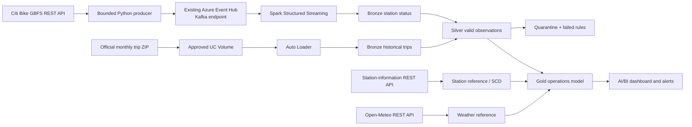
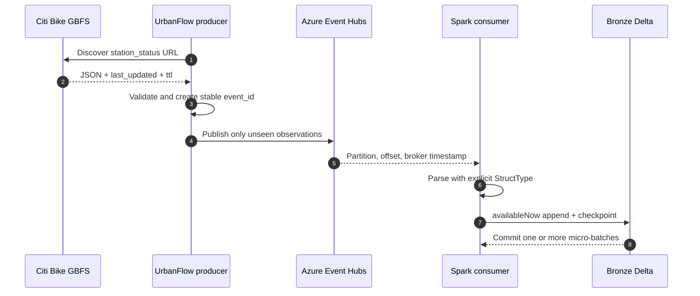
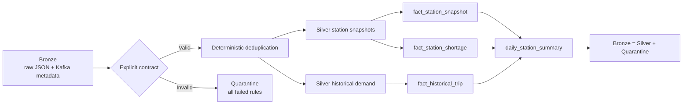
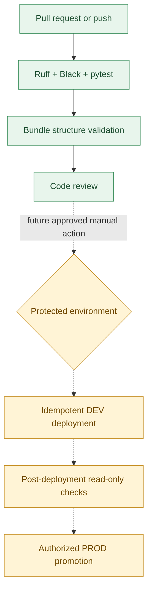
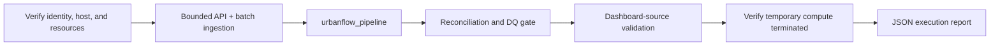

# Demo 3 — UrbanFlow: Real-Time Bike-Sharing Analytics

UrbanFlow is an educational Azure Databricks lakehouse for a practical operations problem:
**which Citi Bike stations are empty, nearly empty, full, or nearly full, and which ones show
repeated shortage patterns?** It combines real public APIs, historical trips, a Kafka-style
Event Hubs stream, Spark, Delta Lake, Unity Catalog, testing, CI/CD, and Databricks SDK patterns.

> **Milestone status — local foundation complete.** Public sources and existing cloud resources
> have been verified read-only. The API client, bounded producer, Kafka consumer helpers,
> transformations, quality rules, automation safety primitives, real-data fixtures, tests, and
> two educational notebooks are implemented. No UrbanFlow Azure resource has been created or
> modified, no event has been published, and no Databricks compute has been started.

## Business problem

An empty station prevents a rental. A full station prevents a return. UrbanFlow begins with two
transparent demonstration rules:

- **Low bicycle availability:** two or fewer available bicycles.
- **Low docking availability:** two or fewer available docks.

These thresholds are configurable teaching rules. They are not claimed as validated Citi Bike
operating standards. Later stages will add repeated observations, capacity ratios, historical
demand, weather, and recency before producing a station-priority indicator.

## Verified real data sources

| Source | Verified use | Current observation |
|---|---|---|
| [Citi Bike GBFS](https://gbfs.citibikenyc.com/gbfs/2.3/gbfs.json) | Feed discovery, station reference, station status | GBFS 2.3 discovery currently points to Lyft-hosted feeds; station feeds reported 2,520 stations and a 60-second TTL during discovery. |
| [Citi Bike trip history](https://citibikenyc.com/system-data) | January 2024 historical demand sample | The official archive uses the modern 13-column ride schema and is 369,035,302 bytes. UrbanFlow reads a bounded ZIP range and keeps only 40 attributed rows. |
| [Open-Meteo](https://open-meteo.com/en/docs) | New York weather enrichment | Current response contains observation time, temperature at 2 m, precipitation, and wind speed at 10 m. |

The committed samples are dated observations for reproducible tests. They are not presented as
current operational state. See [sample attribution](data/samples/ATTRIBUTION.md).

### Station identifier finding

Current GBFS uses a UUID as `station_id`. January 2024 trip files use values such as `7407.13`.
Those historical IDs match current GBFS `short_name`, not the UUID. All 40 selected historical
rows matched a current `short_name` during sample preparation. UrbanFlow therefore retains both
identifiers and documents the mapping rather than asserting a direct historical-to-current UUID
join.

## Technology stack

- Python 3.11, requests, PyYAML, Azure Event Hubs SDK, Databricks SDK
- Azure Event Hubs Standard through its Kafka-compatible endpoint
- Spark Structured Streaming and bounded `availableNow` micro-batches
- Delta Lake and Unity Catalog
- Databricks Asset Bundles
- pytest, Ruff, Black, chispa-ready Spark test configuration
- GitHub Actions with static-only PR and push validation

## 1. Overall solution architecture



## 2. Event Hubs and Kafka ingestion



An Event Hub behaves like a Kafka topic. A partition is an ordered shard. An offset identifies
one record within that partition. A consumer group gives UrbanFlow an independent reading
position. The Spark checkpoint records processed offsets and query state. Delivery can still be
at least once around retries, so stable event IDs and idempotent Silver processing remain
necessary.

## 3. Medallion and quality flow



The implemented local quality rules cover completeness, numeric validity, non-negative counts,
capacity consistency, known-station referential integrity, source timestamps, and freshness.
Quarantined rows retain all failed-rule names. The later Delta implementation will reconcile
every Bronze row to either Silver or Quarantine.

## 4. CI/CD design



The current [UrbanFlow workflow](../../.github/workflows/demo3_urbanflow.yml) contains only static
validation. It has no Azure login, deployment, producer, Job, pipeline, or cluster step. A live
path will be added only after resources and permissions are approved. Two authorized deployment
environments have not been demonstrated, so DEV-to-PROD promotion remains pending.

## 5. Planned Databricks Job orchestration



This graph is the intended orchestration, not live evidence. The permanent Job and Lakeflow
resources do not exist yet. The SDK module already implements host verification, notebook upload,
explicit polling, timeout reporting, and exact termination verification for later use.

## Implemented modules

| Module | Purpose |
|---|---|
| `gbfs_client.py` | Discovers current feed URLs, handles HTTP errors, validates envelopes and required fields, and preserves source/collection timestamps. |
| `producer.py` | Builds stable event IDs, suppresses duplicate observations within a bounded run, honors the GBFS TTL, and publishes without logging credentials. |
| `streaming.py` | Builds Kafka/SASL options, defines the explicit Spark schema, preserves partition/offset metadata, and starts an `availableNow` Bronze write. |
| `transformations.py` | Classifies shortages, deduplicates, joins station reference data, summarizes availability, and demonstrates SCD2 transitions. |
| `quality.py` | Routes valid and invalid observations with named completeness, validity, consistency, referential-integrity, and freshness rules. |
| `automation.py` | Verifies the exact workspace host, uploads source notebooks, polls Jobs/pipelines, and independently confirms cluster termination. |
| `cli.py` | Validates configuration and public sources, checks workspace identity read-only, and protects Event Hubs publishing behind an explicit confirmation flag. |

## Educational notebooks

- [`01_fundamentals.py`](notebooks/01_fundamentals.py) is the first working business milestone.
  It reads real samples, builds explicit schemas, selects, filters, joins, aggregates, flags
  shortages, prepares an opt-in idempotent MERGE, and runs a dashboard-ready SQL query.
- [`03_streaming.py`](notebooks/03_streaming.py) explains topics, partitions, offsets, consumer
  groups, checkpoints, micro-batches, restart semantics, and a guarded bounded Event Hubs read.

Every code cell has a preceding Markdown cell covering what, why, input, output, key concepts,
expected result, presentation wording, and rerun/cost implications.

## Run locally

```powershell
cd Demos\Demo3
python -m venv .venv
.\.venv\Scripts\python.exe -m pip install -e ".[dev]"
.\.venv\Scripts\python.exe scripts\validate_sources.py
.\.venv\Scripts\python.exe scripts\validate_bundle.py
.\.venv\Scripts\python.exe -m pytest
.\.venv\Scripts\python.exe -m ruff check .
.\.venv\Scripts\python.exe -m black --check .
```

Optional public-source validation makes read-only internet requests and does not contact Azure:

```powershell
.\.venv\Scripts\python.exe scripts\validate_sources.py --live
```

Refresh samples deliberately with:

```powershell
.\.venv\Scripts\python.exe scripts\prepare_demo.py --overwrite
```

The offline bundle check validates `databricks.yml` against the schema shipped by the installed
Databricks CLI. An authenticated `databricks bundle validate --target dev` is a separate read-only
workspace check; it is not required by pull-request CI and never deploys the bundle.

## Event producer safety

Importing and testing the producer requires no Event Hubs connection. A real publish needs both
environment variables and an explicit CLI flag:

```powershell
$env:AZURE_EVENTHUB_CONNECTION_STRING = "<retrieve securely; never paste into Git>"
$env:AZURE_EVENTHUB_NAME = "parvinbadalov_evh"
urbanflow --config config\azure.yml produce --poll-count 1 --confirm-publish
```

Do not run this command until the combined Azure execution request is approved.

## Academy coverage

The detailed, evidence-based matrix is in
[`docs/LABS_1_TO_9_COVERAGE.md`](docs/LABS_1_TO_9_COVERAGE.md). Current highlights:

- **Implemented locally:** REST discovery/parsing, DataFrame business rules, explicit schemas,
  deduplication, quality routing, SCD2 example, bounded producer, Kafka consumer configuration,
  checkpoints, mocked SDK polling/cleanup, DAB configuration, static CI, and offline tests.
- **Discovered read-only:** target workspace identity, Unity Catalog resources, Event Hubs Kafka
  capability, Key Vault secret metadata, storage, secret scope, and compute policies.
- **Pending live validation:** UrbanFlow schema/Volume, messages, Bronze/Silver/Gold tables,
  Lakeflow pipeline, Job, dashboard, alert, security demonstrations, deployment promotion, and
  execution screenshots.

## Documentation

- [Architecture and design decisions](docs/ARCHITECTURE.md)
- [Labs 1–9 coverage matrix](docs/LABS_1_TO_9_COVERAGE.md)
- [Read-only Azure resource inventory](docs/RESOURCE_INVENTORY.md)
- [Cost and safety plan](docs/COST_AND_SAFETY.md)
- [20–25 minute presentation guide](docs/PRESENTATION_GUIDE.md)
- [Evidence policy and future screenshots](docs/evidence/README.md)

## Known limitations

- No UrbanFlow cloud object has been created or executed yet.
- The existing Event Hub has only one hour of retention, suitable for a short demonstration rather
  than durable history.
- The consumer group and secret scope exist, but access has not been exercised by UrbanFlow.
- The proposed `parvinbadalov_urbanflow` schema and `urbanflow_landing` Volume do not yet exist.
- Current and historical station identifiers require the documented `short_name` crosswalk.
- Dashboard, alerts, Lakeflow declarations, full medallion tables, approximately 1,000-file
  Auto Loader experiment, governance policies, and real execution evidence belong to later stages.

## Cost and safety boundary

The first live test is intentionally small: one GBFS poll, up to about 2,520 small JSON events,
one bounded `availableNow` consumer, and immediate compute termination verification. It will reuse
the existing Event Hub, Key Vault secret, catalog, and authorized storage path. Nothing live will
run until the user approves the combined request in [the cost and safety plan](docs/COST_AND_SAFETY.md).
