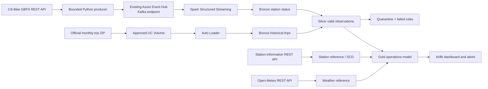
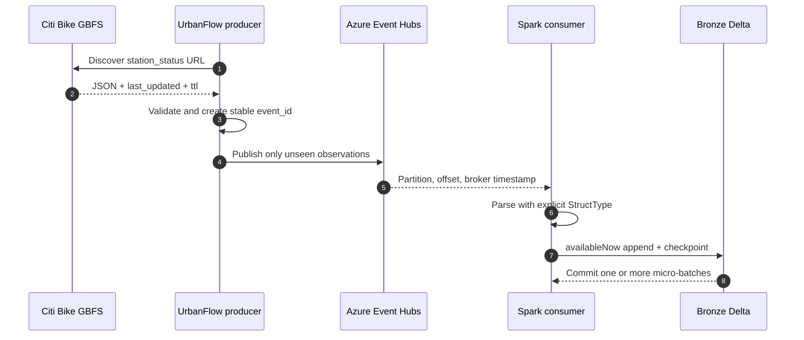
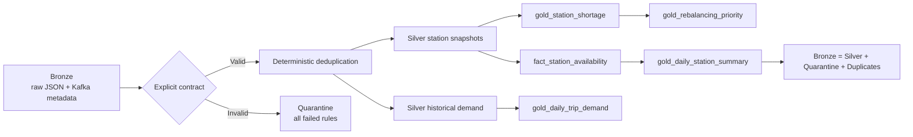
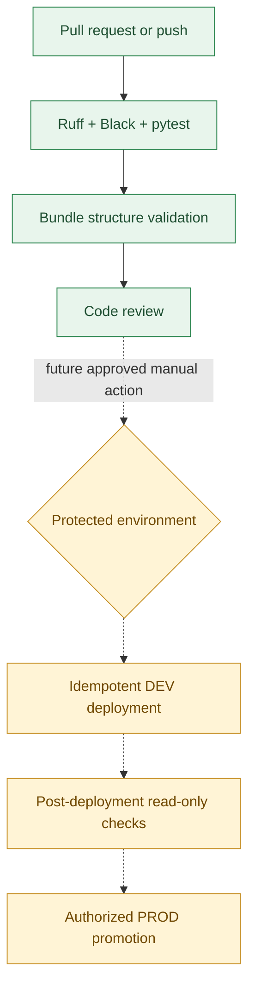
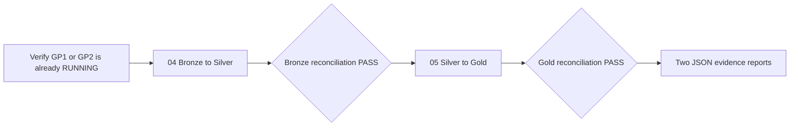

# Demo 3 — UrbanFlow: Real-Time Bike-Sharing Analytics

UrbanFlow is an educational Azure Databricks lakehouse for a practical operations problem:
**which Citi Bike stations are empty, nearly empty, full, or nearly full, and which ones show
repeated shortage patterns?** It combines real public APIs, historical trips, a Kafka-style
Event Hubs stream, Spark, Delta Lake, Unity Catalog, testing, CI/CD, and Databricks SDK patterns.

> **Milestone status — Bronze, Silver/Gold, and bounded Phase 3 samples validated live.** On 2026-09-29 the
> bounded producer published 2,520 events and Job `404404108673495` wrote 2,520 reconciled rows to
> `dbr_dev.parvinbadalov_urbanflow.bronze_station_status`, with zero missing, unexpected, rejected,
> or duplicate event IDs. On 2026-10-02 the corrected Silver/Gold path reconciled 2,520 rows and
> removed 89 stale out-of-service priorities; its repeat was idempotent. The 40-row historical
> **DEVELOPMENT SAMPLE** and 48-hour weather sample also passed bounded GP1 runs. On 2026-10-03,
> Databricks Connect reproduced the corrected counts read-only and GE passed 20/20 expectations
> across Silver and the named historical sample. The full monthly archive, Lakeflow deployment,
> published dashboard, and governance changes remain unexecuted.

## Business problem

An empty station prevents a rental. A full station prevents a return. UrbanFlow begins with two
transparent demonstration rules:

- **Low bicycle availability:** two or fewer available bicycles.
- **Low docking availability:** two or fewer available docks.

These thresholds are configurable teaching rules. They are not claimed as validated Citi Bike
operating standards. Later stages will add repeated observations, capacity ratios, historical
demand, weather, and recency before producing a station-priority indicator.

## Verified real data sources

| Source | Verified use | Current observation |
|---|---|---|
| [Citi Bike GBFS](https://gbfs.citibikenyc.com/gbfs/2.3/gbfs.json) | Feed discovery, station reference, station status | The working versioned discovery URL resolves current feeds instead of hard-coding them; the legacy `/gbfs/en/gbfs.json` URL returned HTTP 403 on 2026-09-29. |
| [Citi Bike trip history](https://citibikenyc.com/system-data) | January 2024 historical demand sample | The official archive uses the modern 13-column ride schema and is 369,035,302 bytes. UrbanFlow reads a bounded ZIP range and keeps only 40 attributed rows. |
| [Open-Meteo](https://open-meteo.com/en/docs) | New York weather enrichment | Current response contains observation time, temperature at 2 m, precipitation, and wind speed at 10 m. |

The committed samples are dated observations for reproducible tests. They are not presented as
current operational state. See [sample attribution](data/samples/ATTRIBUTION.md).

### Station identifier finding

Current GBFS uses a UUID as `station_id`. January 2024 trip files use values such as `7407.13`.
Those historical IDs match current GBFS `short_name`, not the UUID. All 40 selected historical
rows matched a current `short_name` during sample preparation. UrbanFlow therefore retains both
identifiers and documents the mapping rather than asserting a direct historical-to-current UUID
join.

## Technology stack

- Python 3.11, requests, PyYAML, Azure Event Hubs SDK, Databricks SDK
- Azure Event Hubs Standard through its Kafka-compatible endpoint
- Spark Structured Streaming and bounded `availableNow` micro-batches
- Delta Lake and Unity Catalog
- Databricks Asset Bundles
- pytest, Ruff, Black, chispa-ready Spark test configuration
- GitHub Actions with static-only PR and push validation

## Shared academy compute selection

UrbanFlow does not define a notebook job cluster. Ordinary notebook tasks use the DAB variable
`compute_cluster_id`, whose verified default is GP1. Changing that variable to the verified GP2 ID
switches compute without editing a notebook.

| Cluster | Verified ID | Latest state | Runtime / access mode | Effective permission | Decision |
|---|---|---|---|---|---|
| GP1 | `0702-132442-toro5spu` | `RUNNING` (read-only check 2026-10-03) | DBR `17.3.x-scala2.13`, `USER_ISOLATION` | `CAN_MANAGE` through `admins`; `users` has `CAN_RESTART` | Used for the approved read-only Connect/GE validation; UrbanFlow did not change its lifecycle |
| GP2 | `0702-171207-xo9bbc0y` | `TERMINATED` (read-only check 2026-10-02) | DBR `17.3.x-scala2.13`, `USER_ISOLATION` | `CAN_MANAGE` through `admins`; `users` has `CAN_RESTART` | Compatible fallback when already running; currently unavailable under the same rule |

DBR 17.3 and standard access mode meet the documented
[Unity Catalog compute requirements](https://learn.microsoft.com/en-us/azure/databricks/data-governance/unity-catalog/requirements)
and support Structured Streaming from Kafka. The UrbanFlow options do not use the callback
settings listed in the
[standard-compute Kafka limitations](https://learn.microsoft.com/en-us/azure/databricks/compute/standard-limitations).
This is a compatibility assessment, not live network evidence. The preflight accepts a cluster
only when its ID, name, runtime, access mode, attach permission, and current `RUNNING` state all
match. It never starts, restarts, resizes, or terminates GP1 or GP2.

Both Job resources default their live gates to `false` and use `existing_cluster_id`. A manual run
against a terminated all-purpose cluster could start it, so Phase 2 deployment and execution remain
blocked until an academy operator already has the selected cluster running and the consolidated
live test is approved.

## 1. Overall solution architecture



## 2. Event Hubs and Kafka ingestion



An Event Hub behaves like a Kafka topic. A partition is an ordered shard. An offset identifies
one record within that partition. A consumer group gives UrbanFlow an independent reading
position. The Spark checkpoint records processed offsets and query state. Delivery can still be
at least once around retries, so stable event IDs and idempotent Silver processing remain
necessary.

## 3. Medallion and quality flow



The physical Silver contract enforces identifiers, parsing, required availability fields,
non-negative counts, binary station-state flags, source timestamps, and optional known-station
referential integrity. Quarantined rows retain every failed-rule name. Duplicate delivery is a
third explicit outcome, so reconciliation proves `Bronze = Silver + Quarantine + Duplicates`.
All three quality outcomes and the downstream Gold tables use idempotent Delta persistence. The
bounded station, historical sample and weather sample paths have live evidence; the full monthly
archive remains unexecuted.

## 4. CI/CD design



The current [UrbanFlow workflow](../../.github/workflows/demo3_urbanflow.yml) contains only static
validation. It has no Azure login, deployment, producer, Job, pipeline, or cluster step. A live
path will be added only after resources and permissions are approved. Two authorized deployment
environments have not been demonstrated, so DEV-to-PROD promotion remains pending.

## 5. Databricks Job orchestration



The `urbanflow_silver_gold_test` definition is one unscheduled, two-task DAG. It defaults
`run_transform=false`, pins both tasks to the configured existing cluster, and does not invoke the
producer, Event Hubs, serverless compute, or Lakeflow. It is implemented and validated locally but
has not been deployed or run. The earlier Bronze Job exists as workspace Job `404404108673495`.

## Implemented modules

| Module | Purpose |
|---|---|
| `gbfs_client.py` | Discovers current feed URLs, handles HTTP errors, validates envelopes and required fields, and preserves source/collection timestamps. |
| `producer.py` | Builds stable event IDs, suppresses duplicate observations within a bounded run, honors the GBFS TTL, and publishes without logging credentials. |
| `streaming.py` | Builds Kafka/SASL options, defines the explicit Spark schema, preserves partition/offset metadata, and starts an `availableNow` Bronze write. |
| `reporting.py` | Produces secret-free Bronze and end-to-end JSON reconciliation with IDs, counts, rejects, duplicates, offsets, and timestamps. |
| `medallion.py` | Prepares deterministic Silver records, Quarantine rows, duplicate accounting, shortage flags, and Bronze reconciliation locally. |
| `silver.py` | Applies the Spark Silver contract, deterministic broker ordering, freshness, reconciliation, and three idempotent Delta MERGEs. |
| `gold.py` | Builds the station dimension, stable availability fact, daily summary, shortages, rebalancing priorities, Gold reconciliation, and Delta MERGEs. |
| `historical.py` | Defines explicit-contract and schema-evolution Auto Loader paths, rescued-data validation, checkpoints, join match reporting, and daily trip demand. |
| `dimensions.py` | Demonstrates SCD1/SCD2 with null-safe changes, interval audits, idempotent reruns, and synthetic-change labelling. |
| `persistence.py` | Validates identifiers and renders reusable null-safe Delta MERGEs that reject duplicate source keys. |
| `transformations.py` | Classifies shortages, deduplicates, joins station reference data, summarizes availability, and demonstrates SCD2 transitions. |
| `quality.py` | Routes valid and invalid observations with named completeness, validity, consistency, referential-integrity, and freshness rules. |
| `automation.py` | Verifies the exact workspace host, assesses GP1 then GP2 read-only, blocks shared-cluster termination, uploads notebooks, and polls Jobs/pipelines. |
| `cli.py` | Validates configuration and public sources, reports GP1/GP2 readiness read-only, and protects Event Hubs publishing behind an explicit confirmation flag. |

## Educational notebooks

- [`01_fundamentals.py`](notebooks/01_fundamentals.py) is the first working business milestone.
  It reads real samples, builds explicit schemas, selects, filters, joins, aggregates, flags
  shortages, prepares an opt-in idempotent MERGE, and runs a dashboard-ready SQL query.
- [`03_streaming.py`](notebooks/03_streaming.py) explains topics, partitions, offsets, consumer
  groups, checkpoints, micro-batches, restart semantics, and a guarded bounded Event Hubs read.
- [`03_eventhubs_to_bronze.py`](notebooks/03_eventhubs_to_bronze.py) performed the completed first
  live test for execution `urbanflow-20260929T195132Z-r3`.
- [`04_bronze_to_silver.py`](notebooks/04_bronze_to_silver.py) is the dry-run-by-default physical
  Silver task with contract routing, reconciliation, MERGEs, and JSON evidence.
- [`05_silver_to_gold.py`](notebooks/05_silver_to_gold.py) is the dependent Gold task with stable
  fact schema, honest one-snapshot summaries, operational outputs, MERGEs, and JSON evidence.

Every code cell has a preceding Markdown cell covering what, why, input, output, key concepts,
expected result, presentation wording, and rerun/cost implications.

## Run locally

```powershell
cd Demos\Demo3
python -m venv .venv
.\.venv\Scripts\python.exe -m pip install -e ".[dev]"
.\.venv\Scripts\python.exe scripts\validate_sources.py
.\.venv\Scripts\python.exe scripts\validate_bundle.py
.\.venv\Scripts\python.exe -m pytest
.\.venv\Scripts\python.exe -m ruff check .
.\.venv\Scripts\python.exe -m black --check .
```

Optional public-source validation makes read-only internet requests and does not contact Azure:

```powershell
.\.venv\Scripts\python.exe scripts\validate_sources.py --live
```

Refresh samples deliberately with:

```powershell
.\.venv\Scripts\python.exe scripts\prepare_demo.py --overwrite
```

The offline bundle check validates `databricks.yml` against the schema shipped by the installed
Databricks CLI. An authenticated `databricks bundle validate --target dev` is a separate read-only
workspace check; it is not required by pull-request CI and never deploys the bundle.

Read-only GP1/GP2 preflight is available through:

```powershell
urbanflow --config config\azure.yml compute-status --profile URBANFLOW_AZURE_READONLY
```

Adding `--require-ready` makes the command fail unless GP1 or GP2 is compatible and already
`RUNNING`. It never changes cluster state.

## Event producer safety

Importing and testing the producer requires no Event Hubs connection. A real publish needs both
environment variables and an explicit CLI flag:

```powershell
$env:AZURE_EVENTHUB_CONNECTION_STRING = "<retrieve securely; never paste into Git>"
$env:AZURE_EVENTHUB_NAME = "parvinbadalov_evh"
urbanflow --config config\azure.yml produce --poll-count 1 --confirm-publish
```

The first producer run is complete. Phase 2 must not run this command again: it reuses execution
`urbanflow-20260929T195132Z-r3` directly from the verified Bronze table.

## Academy coverage

The detailed, evidence-based matrix is in
[`docs/LABS_1_TO_9_COVERAGE.md`](docs/LABS_1_TO_9_COVERAGE.md). Current highlights:

- **Implemented locally:** isolated Lakeflow declarations, dashboard and governance SQL, the
  1,000-file generator, SCD audits, DAB configuration, and static CI.
- **Discovered read-only:** target workspace identity, Unity Catalog resources, Event Hubs Kafka
  capability, Key Vault secret metadata, storage, secret scope, and compute policies.
- **Validated live:** the 2,520-event Bronze stream and exact reconciliation; corrected Silver and
  Gold tables plus an idempotent repeat; the 40-row historical development sample; and the 48-hour
  weather sample; plus read-only Databricks Connect and GE validation, all with stored evidence.
- **Pending live:** exactly seven Academy rows remain; see
  [the classified execution batches](docs/PENDING_REQUIREMENTS.md).

## Documentation

- [Architecture and design decisions](docs/ARCHITECTURE.md)
- [Labs 1–9 coverage matrix](docs/LABS_1_TO_9_COVERAGE.md)
- [Read-only Azure resource inventory](docs/RESOURCE_INVENTORY.md)
- [Cost and safety plan](docs/COST_AND_SAFETY.md)
- [First bounded streaming test runbook](docs/FIRST_STREAMING_TEST.md) — Phase 1, validated live
- [Silver and Gold bounded run runbook](docs/SILVER_GOLD_RUNBOOK.md) — Phase 2, validated live
- [20–25 minute presentation guide](docs/PRESENTATION_GUIDE.md)
- [Live execution evidence](evidence/README.md)
- [Evidence policy and future screenshots](docs/evidence/README.md)

## Known limitations

- Bronze is one real snapshot, so availability summaries are not historical trends.
- The existing Event Hub has one day of retention, suitable for a short demonstration rather
  than durable history.
- GP1 was already `RUNNING` during the 2026-10-03 read-only inspection. GP2's latest recorded check
  remains `TERMINATED` on 2026-10-02. UrbanFlow did not start, stop, resize or reconfigure either
  cluster.
- The existing secret and consumer group were exercised successfully during the completed Bronze
  run; Phase 2 performs no secret read and no Event Hubs operation.
- Current and historical station identifiers require the documented `short_name` crosswalk.
- The full monthly archive, 1,000-file Auto Loader discovery run, Lakeflow deployment, published
  dashboard, alert, governance changes, and maintenance operations have not run.

## Cost and safety boundary

The safe Databricks Connect and GE read checks are complete. A Jobs API trigger creates a run
record, and the 1,000-file Auto Loader exercise uploads files and writes checkpoints and Delta rows,
so each remaining step needs explicit write approval. Exact commands and rollbacks are in
[the pending-requirements plan](docs/PENDING_REQUIREMENTS.md).
