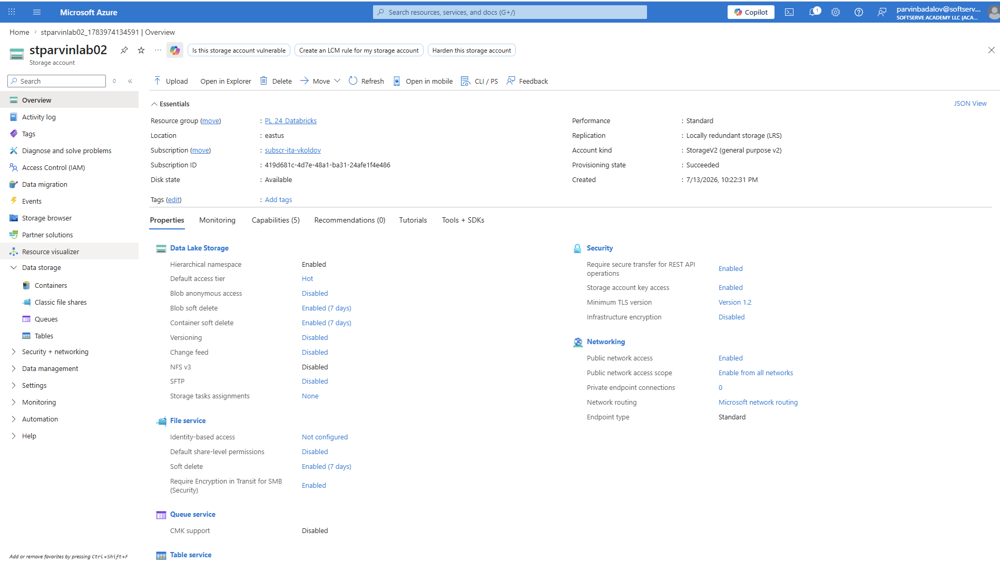
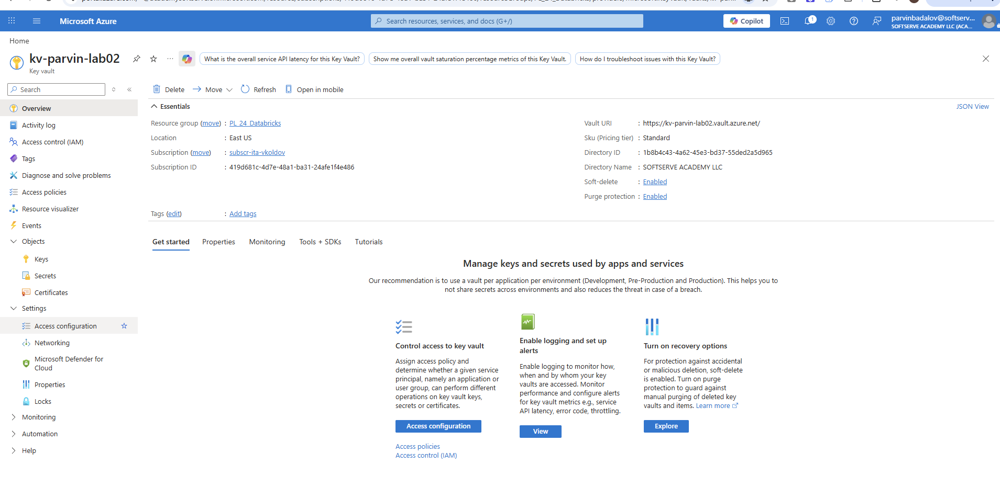
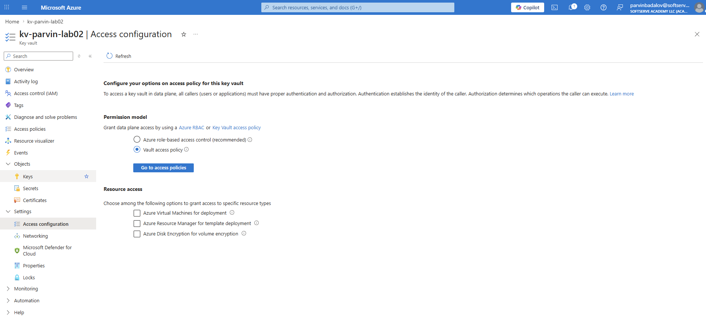
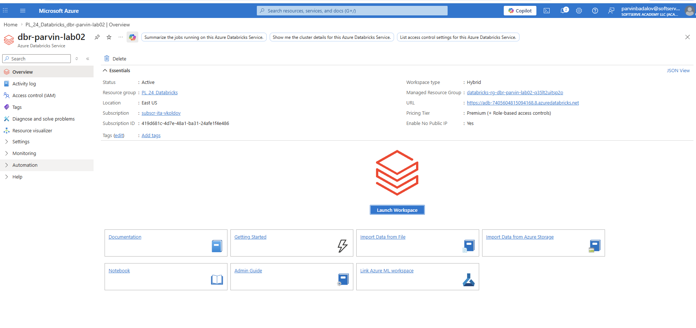
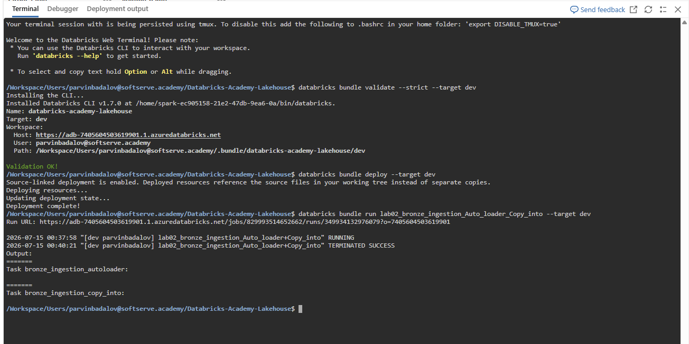
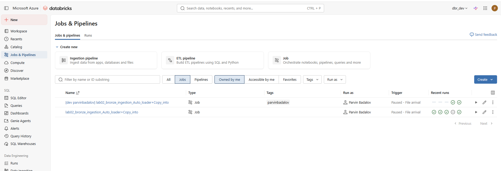

# Lab 2 — Stage 1: Azure Services Provisioning

## Overview

The goal of Stage 1 was to provision the core Azure services individually and review the configuration parameters required for a Databricks lakehouse environment.

All resources were created in the same Azure subscription, resource group, and region.

| Setting | Value |
|---|---|
| Subscription | `subscr-ita-vkoldov` |
| Resource Group | `PL_24_Databricks` |
| Region | `East US` |
> 
## 1. Storage Account — ADLS Gen2

**Resource name:** `stparvinlab02`

### Key configuration

| Parameter | Value |
|---|---|
| Region | `East US` |
| Performance | `Standard` |
| Redundancy | `Locally-redundant storage (LRS)` |
| Account kind | `StorageV2` |
| Hierarchical namespace | `Enabled` |
| Default access tier | `Hot` |
| Public network access | `Enabled` |
| Public network access scope | `Enable from all networks` |

Hierarchical namespace is enabled, which provides ADLS Gen2 capabilities.



## 2. Azure Key Vault

**Resource name:** `kv-parvin-lab02`

### Key configuration

| Parameter | Value |
|---|---|
| Region | `East US` |
| Pricing tier | `Standard` |
| Permission model | `Vault access policy` |
| Soft-delete | `Enabled` |
| Purge protection | `Enabled` |

The Key Vault was also used to create a personal Azure Key Vault-backed Databricks secret scope for learning purposes.

### Databricks secret scope

| Field | Value |
|---|---|
| Scope Name | `parvin-lab02-kv-scope` |
| Manage Principal | `Creator` |
| DNS Name | `https://kv-parvin-lab02.vault.azure.net/` |
| Resource ID | Azure Key Vault resource ID |





## 3. Azure Databricks Workspace

**Resource name:** `dbr-parvin-lab02`

### Key configuration

| Parameter | Value |
|---|---|
| Region | `East US` |
| Pricing tier | `Premium` |
| Workspace type | `Hybrid` |
| Managed resource group | Automatically created by Azure Databricks |
| Secure Cluster Connectivity / No Public IP | `Enabled` |
| VNet injection | `Not configured` |

Azure automatically created a managed resource group for the infrastructure managed by the Databricks workspace.



## Naming and Resource Relationships

The resources use descriptive names containing the resource type, owner identifier, and lab number:

- `stparvinlab02` — Storage Account
- `kv-parvin-lab02` — Azure Key Vault
- `dbr-parvin-lab02` — Azure Databricks Workspace

The three resources are deployed in the `PL_24_Databricks` resource group and the `East US` region. The Storage Account provides ADLS Gen2 storage, Key Vault provides secret management, and Azure Databricks provides the data processing and analytics workspace.

## Stage 1 Result

Stage 1 was completed successfully. An ADLS Gen2 storage account, Azure Key Vault, and Azure Databricks workspace were provisioned, and their important configuration parameters were reviewed and documented.

# Stage 2 — Shared Resources and Governed Lakehouse Setup

## Overview

In Stage 2, the work moved from individually created learning resources to the shared academy environment.

The goal was to use the shared Azure and Databricks resources while creating a personal governed lakehouse area with:

- a personal ADLS container
- a personal Unity Catalog external location
- personal Bronze, Silver, and Gold schemas
- a personal Azure Key Vault-backed secret scope for learning
- idempotent Bronze ingestion
- ingestion metadata
- a Databricks Job running on the shared all-purpose cluster
- legacy Service Principal storage access awareness

The final implementation also compares two ingestion approaches:

1. Auto Loader
2. `COPY INTO`

---

## 4. Shared ADLS Container

A personal container was created in the shared ADLS Gen2 storage account.

| Setting | Value |
|---|---|
| Shared storage account | `dlspl21databricks` |
| Personal container | `parvinbadalov` |
| Root path | `abfss://parvinbadalov@dlspl21databricks.dfs.core.windows.net/` |

All Stage 2 data is stored under this personal container.

---

## 5. Unity Catalog External Location

A personal Unity Catalog external location was created using the shared storage credential.

| Setting | Value |
|---|---|
| External location | `parvinbadalov_external_location` |
| Storage path | `abfss://parvinbadalov@dlspl21databricks.dfs.core.windows.net/` |

The external location provides the Unity Catalog governance layer over the personal ADLS container.

The notebooks build ABFSS paths from the `storage_account` and `container` parameters. Those paths are covered by the external location even though the external location name itself is not referenced directly in the notebook code.

---

## 6. Medallion Schemas

Three personal schemas were created in the shared `dbr_dev` catalog.

| Layer | Schema |
|---|---|
| Bronze | `dbr_dev.parvinbadalov_bronze` |
| Silver | `dbr_dev.parvinbadalov_silver` |
| Gold | `dbr_dev.parvinbadalov_gold` |

The schemas are backed by storage paths in the personal ADLS container:

```text
bronze/
silver/
gold/
```

Example:

```sql
CREATE SCHEMA IF NOT EXISTS dbr_dev.parvinbadalov_bronze
MANAGED LOCATION
'abfss://parvinbadalov@dlspl21databricks.dfs.core.windows.net/bronze/';
```

---

## 7. Personal Secret Scope

A personal Azure Key Vault-backed Databricks secret scope was created for learning purposes.

| Setting | Value |
|---|---|
| Personal Key Vault | `kv-parvin-lab02` |
| Personal Databricks secret scope | `parvin-lab02-kv-scope` |

For the shared lab environment, the shared Databricks secret scope is:

```text
default2
```

The shared scope contains the Service Principal credentials used for legacy storage-access testing:

```text
tenant-id
sp-databricks-adls-appid
sp-databricks-adls-appkey
```

Secret values are retrieved with `dbutils.secrets.get(...)` and are never printed.

---

## 8. Source Dataset

The Bronze ingestion test data was based on the Kaggle dataset:

**E-Commerce Online Sales Records**  
https://www.kaggle.com/datasets/kpatel123/ecommerce-online-sales-records

The original CSV file was split into **six smaller CSV files** to simulate incremental file arrival and test the idempotent behavior of both Auto Loader and `COPY INTO`.

The six files represent monthly test batches:

```text
ecommerce_sales_2026-01.csv
ecommerce_sales_2026-02.csv
ecommerce_sales_2026-03.csv
ecommerce_sales_2026-04.csv
ecommerce_sales_2026-05.csv
ecommerce_sales_2026-06.csv
```

The files are uploaded to:

```text
abfss://parvinbadalov@dlspl21databricks.dfs.core.windows.net/ingestion/
```

### Source schema

| Column | Data Type |
|---|---|
| `Order_ID` | STRING |
| `Product` | STRING |
| `Category` | STRING |
| `Quantity` | INT |
| `Price` | DOUBLE |
| `City` | STRING |
| `Date` | DATE |

The schema is explicitly defined in the ingestion logic instead of relying completely on automatic schema inference.

---

## 9. Unity Catalog Landing Volume

A Unity Catalog external Volume was created inside the Bronze schema to provide a governed landing path for the source CSV files.

| Setting | Value |
|---|---|
| Volume | `dbr_dev.parvinbadalov_bronze.raw_landing` |
| Cloud location | `abfss://parvinbadalov@dlspl21databricks.dfs.core.windows.net/ingestion/` |
| Volume path | `/Volumes/dbr_dev/parvinbadalov_bronze/raw_landing/` |

The Volume points to the existing ADLS `ingestion/` folder.

```sql
CREATE EXTERNAL VOLUME IF NOT EXISTS dbr_dev.parvinbadalov_bronze.raw_landing
LOCATION 'abfss://parvinbadalov@dlspl21databricks.dfs.core.windows.net/ingestion/';
```

The Volume does **not** copy or duplicate the CSV files. The cloud path and the `/Volumes/...` path refer to the same physical files.

The ingestion flow is:

```text
Azure ADLS ingestion/
        ↓
Unity Catalog external Volume
        ↓
Auto Loader / COPY INTO
        ↓
Bronze Delta tables
```

Both Auto Loader and `COPY INTO` read the files through:

```text
/Volumes/dbr_dev/parvinbadalov_bronze/raw_landing/
```

---

## 10. Bronze Metadata Columns


The following metadata columns are added during ingestion:

| Column | Purpose |
|---|---|
| `_source_file` | Source file path |
| `_ingested_at` | Ingestion timestamp |
| `_load_date` | Load date |

These columns improve traceability and auditing of Bronze data.

---

## 11. Auto Loader Ingestion

Notebook:

```text
labs/lab_02_azure_uc_setup/notebooks/lab02_bronze_ingestion_auto_loader
```

Target table:

```text
dbr_dev.parvinbadalov_bronze.orders_autoloader
```

Source Volume:

```text
/Volumes/dbr_dev/parvinbadalov_bronze/raw_landing/
```

Checkpoint location:

```text
abfss://parvinbadalov@dlspl21databricks.dfs.core.windows.net/checkpoints/orders_autoloader/
```

The implementation uses Databricks Auto Loader and reads from the Unity Catalog Volume:

```python
spark.readStream
    .format("cloudFiles")
```

and:

```python
.trigger(availableNow=True)
```

`availableNow=True` processes all currently available unprocessed files and then stops the stream.

The checkpoint stores ingestion progress and ensures that files already processed by Auto Loader are not loaded again.

### Auto Loader idempotency test

The implementation was tested by:

1. loading the initial files
2. rerunning the notebook with no new files
3. confirming that the row count did not increase
4. adding another CSV file
5. rerunning the notebook
6. confirming that only the new file was processed

This validated incremental ingestion and checkpoint-based idempotency.

---

## 12. COPY INTO Ingestion

Notebook:

```text
labs/lab_02_azure_uc_setup/notebooks/lab02_bronze_ingestion_copy_into
```

Target table:

```text
dbr_dev.parvinbadalov_bronze.orders_copy_into
```

`COPY INTO` was implemented as an additional comparison with Auto Loader.

Unlike Auto Loader, `COPY INTO` does not use a Structured Streaming checkpoint. It tracks files previously loaded into the target table and normally skips them on subsequent executions.

The same Unity Catalog Volume is used as the source:

```text
/Volumes/dbr_dev/parvinbadalov_bronze/raw_landing/
```

The Volume points to the underlying ADLS location:

```text
abfss://parvinbadalov@dlspl21databricks.dfs.core.windows.net/ingestion/
```

The `COPY INTO` implementation was also tested for idempotency by rerunning the command without adding a new file and confirming that the row count did not increase.

---

## 13. Auto Loader vs COPY INTO

| Feature | Auto Loader | COPY INTO |
|---|---|---|
| Processing model | Structured Streaming | Batch |
| Source access | Unity Catalog Volume | Unity Catalog Volume |
| Incremental ingestion | Yes | Yes |
| File tracking | Checkpoint | COPY INTO load history |
| Continuous ingestion use case | Strong fit | Less suitable |
| Simple batch ingestion | Supported | Strong fit |
| Target table | `orders_autoloader` | `orders_copy_into` |

The two methods write to separate Bronze tables so their behavior can be compared independently.

---

## 14. Databricks Job

A Databricks Job was created for Bronze ingestion.

Job name:

```text
lab02_bronze_ingestion_Auto_loader+Copy_into
```

The Job contains two tasks:

```text
bronze_ingestion_autoloader
        ↓
bronze_ingestion_copy_into
```

The `COPY INTO` task depends on successful completion of the Auto Loader task.

Both tasks use the shared all-purpose cluster:

```text
GP1
```

This follows the lab requirement to use the shared all-purpose cluster rather than a dedicated job cluster.

### Task parameters

The Job passes selected parameters to the notebooks, including:

```text
storage_account
container
catalog
bronze_schema
volume_name
target_table
run_validation
```

Both tasks use:

```text
volume_name = raw_landing
```

The Auto Loader task uses:

```text
target_table = orders_autoloader
```

The `COPY INTO` task uses:

```text
target_table = orders_copy_into
```

Other notebook widgets use their default values unless explicitly overridden by the Job.

---

## 15. File Arrival Trigger

A file-arrival trigger was configured for:

```text
abfss://parvinbadalov@dlspl21databricks.dfs.core.windows.net/ingestion/
```

The trigger is currently kept in a paused state.

During testing, the trigger failed with an Azure `403 AuthorizationFailure` while Databricks attempted to provision file-event resources.

The error indicated missing Azure IAM permissions related to:

- Storage Account Contributor
- Storage Blob Data Contributor
- EventGrid EventSubscription Contributor
- Storage Queue Data Contributor

The current academy user does not have permission to assign these Azure roles, so the trigger cannot be enabled successfully without administrator support.

Manual Job execution remains functional.

---

## 16. Legacy Service Principal Access

The lab required awareness of the legacy storage-access pattern based on a Service Principal and `dbutils.fs.mount()`.

The Service Principal credentials were read from the shared secret scope:

```text
default2
```

The required keys are:

```text
tenant-id
sp-databricks-adls-appid
sp-databricks-adls-appkey
```

The mount operation was attempted, but the academy shared-access cluster does not whitelist:

```text
DBUtilsCore.mount()
```

Therefore, `dbutils.fs.mount()` could not be used on the current shared cluster.

As a supervisor-recommended alternative, OAuth configuration was applied through `spark.conf`, and direct storage access through the `abfss://` path was successfully validated.

This provides awareness of the legacy Service Principal access pattern while keeping the implementation aligned with the shared cluster limitations.

---

## 17. Databricks Asset Bundle

The Databricks Job definition is stored as code in:

```text
resources/lab02_bronze_ingestion_job.yml
```

The root bundle configuration remains at:

```text
databricks.yml
```

and includes resource files from:

```yaml
include:
  - resources/*.yml
```

The bundle was validated with:

```bash
databricks bundle validate --strict --target dev
```

and deployed with:

```bash
databricks bundle deploy --target dev
```

The deployed Job was then executed with:

```bash
databricks bundle run lab02_bronze_ingestion_Auto_loader_Copy_into --target dev
```


### Bundle validation, deployment, and execution

The bundle was successfully validated, deployed, and executed from the Databricks CLI.



The deployed development Job appears in the Databricks workspace with the automatically generated development prefix:

```text
[dev parvinbadalov] lab02_bronze_ingestion_Auto_loader+Copy_into
```



Because the `dev` target uses development mode, the deployed Job is automatically prefixed with the development target and user identity:

```text
[dev parvinbadalov] lab02_bronze_ingestion_Auto_loader+Copy_into
```

The Job resource YAML contains:

- the paused file-arrival trigger
- the Auto Loader task
- the `COPY INTO` task
- task dependency between the two ingestion methods
- shared all-purpose cluster configuration
- notebook task parameters for environment, Volume, and target-table values

The deployed bundle Job completed successfully with both tasks executed sequentially:

```text
bronze_ingestion_autoloader
        ↓
bronze_ingestion_copy_into
```

---

## Stage 2 Result

Stage 2 was completed with the following outcomes:

- personal container created in the shared ADLS account
- personal Unity Catalog external location created
- Bronze, Silver, and Gold schemas created
- external Unity Catalog landing Volume created in the Bronze schema
- Auto Loader and `COPY INTO` configured to read through the Volume path
- personal Azure Key Vault-backed secret scope created for learning
- Bronze data ingested as Delta
- metadata columns added
- Auto Loader incremental ingestion and idempotency validated
- `COPY INTO` incremental ingestion and idempotency validated
- Databricks Job created on the shared all-purpose cluster
- Auto Loader and `COPY INTO` orchestrated as sequential Job tasks
- file-arrival trigger configured, paused, and documented because of Azure IAM limitations
- legacy Service Principal access tested through direct ABFSS access
- Databricks Asset Bundle Job definition added to the repository
- bundle successfully validated
- bundle successfully deployed to the `dev` target
- deployed Job successfully executed through the Databricks CLI

The final Bronze tables are:

```text
dbr_dev.parvinbadalov_bronze.orders_autoloader
dbr_dev.parvinbadalov_bronze.orders_copy_into
```

---

# Lab 2 Final Result

Lab 2 was completed in two stages.

Stage 1 provided hands-on experience provisioning the core Azure services and reviewing their important configuration parameters.

Stage 2 used the shared academy infrastructure to build a governed personal lakehouse area with Unity Catalog, an external landing Volume, medallion schemas, idempotent Bronze ingestion, Databricks Job orchestration, secret management, and bundle-based deployment configuration.

The implementation satisfies the main Lab 2 completion requirements while also extending the solution with:

- a Unity Catalog external Volume for the landing files
- a comparison between Auto Loader and `COPY INTO`
- parameterized notebook execution
- two-step Job orchestration
- source-controlled Job configuration
- Databricks Asset Bundle validation, deployment, and execution
