# Lab 03 — Streaming and Incremental Ingestion

This lab implements two ingestion paths in Azure Databricks:

1. Incremental file ingestion with Databricks Auto Loader.
2. Live event ingestion from Wikimedia EventStreams through Azure Event Hubs.

The solution demonstrates schema inference and evolution, rescued data, trigger
behavior, checkpoint recovery, Bronze and Silver Delta tables, streaming
monitoring, data-quality validation, and multi-task Job orchestration.

## Architecture

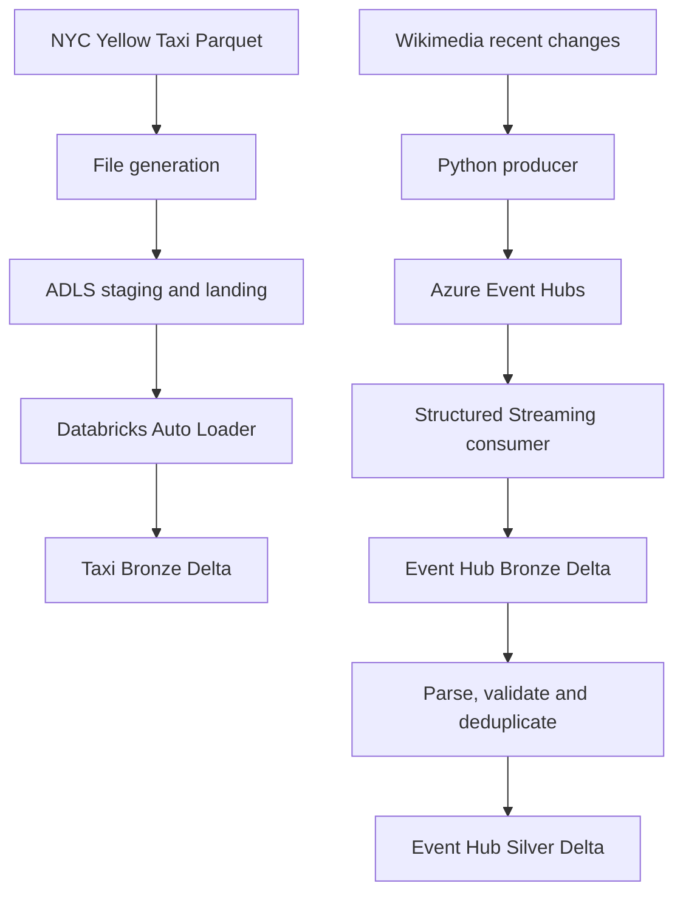

The Databricks Job runs the Auto Loader and Event Hubs branches in parallel
after the shared setup task.

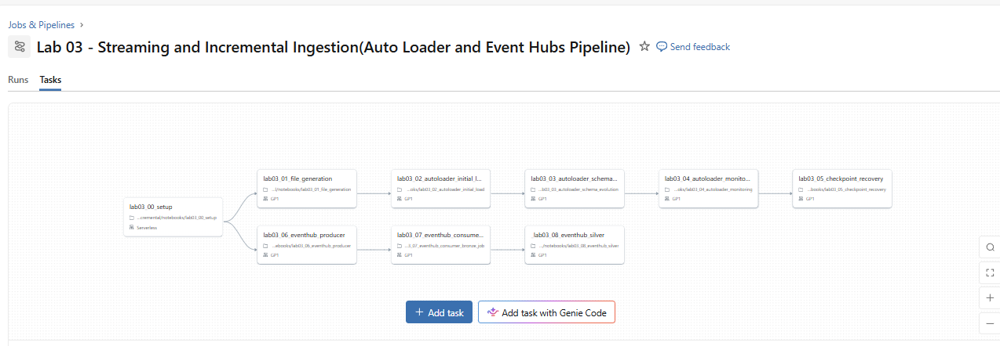

## Data sources

### NYC Yellow Taxi trips

The file-ingestion branch uses
[`yellow_tripdata_2026-01.parquet`](https://www.nyc.gov/site/tlc/about/tlc-trip-record-data.page).
NYC TLC publishes monthly Parquet files containing pickup and drop-off times,
locations, trip distances, itemized fares, payment types, rate types, and
passenger counts.

The source file is split into approximately 1,000 smaller files:

| File group | Approximate count | Purpose |
|---|---:|---|
| Initial | 800 | Baseline schema |
| Evolved | 100 | Adds a new column |
| Renamed | 50 | Simulates a renamed field |
| Malformed | 50 | Tests unexpected values and rescued data |

### Wikimedia recent changes

The live-data branch reads events from the
[Wikimedia recent-change stream](https://stream.wikimedia.org/v2/stream/recentchange).
Each event is enriched with `producer_id = parvinbadalov` before it is sent to
Azure Event Hubs.

## Technology stack

- Azure Databricks
- Apache Spark Structured Streaming
- Databricks Auto Loader
- Delta Lake
- Unity Catalog
- Azure Data Lake Storage Gen2
- Azure Event Hubs
- Azure Key Vault-backed Databricks secret scope
- Databricks Jobs and Asset Bundles
- Python and PySpark

## Environment

| Setting | Value |
|---|---|
| Catalog | `dbr_dev` |
| Schema | `parvinbadalov` |
| External volume | `lab03_streaming` |
| Event Hubs namespace | `evhpl24databricks` |
| Event Hub | `parvinbadalov_evh` |
| Consumer group | `parvinbadalov` |
| Secret scope | `default2` |
| Secret key | `parvinbadalov-eventhub-cs` |
| Default file trigger | `availableNow` |
| Default maximum files per trigger | `50` |
| Rescued-data column | `_rescued_data` |

The Event Hubs connection string is retrieved at runtime with
`dbutils.secrets.get(...)`. No secret value or connection string is stored in
the notebooks or this README.

The Unity Catalog external volume maps the Databricks namespace to the
student-specific ADLS location.

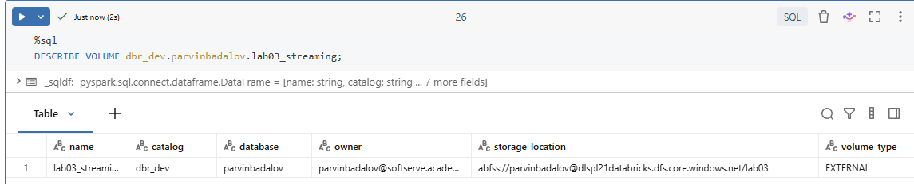

## Volume layout

```text
/Volumes/dbr_dev/parvinbadalov/lab03_streaming/
├── source/
├── staging/
│   ├── initial/
│   ├── evolved/
│   ├── renamed/
│   └── malformed/
├── landing/
└── system/
    ├── schema/
    │   └── autoloader/
    └── checkpoints/
        ├── autoloader/
        ├── eventhub_bronze/
        └── eventhub_silver/
```

## Notebook execution order

| Order | Notebook | Responsibility |
|---:|---|---|
| 0 | `lab03_00_setup` | Creates the volume, widgets, paths, folders, checkpoints, and table names |
| 1 | `lab03_01_file_generation` | Inspects the source and creates the staged file groups |
| 2 | `lab03_02_autoloader_initial_load` | Copies the initial batch to landing and loads Taxi Bronze |
| 3 | `lab03_03_autoloader_schema_evolution` | Tests added, renamed, and malformed fields |
| 4 | `lab03_04_autoloader_monitoring` | Compares file limits and trigger behavior |
| 5 | `lab03_05_checkpoint_recovery` | Tests restart recovery and controlled replay |
| 6 | `lab03_06_eventhub_producer` | Sends enriched Wikimedia events to Event Hubs |
| 7A | `lab03_07_eventhub_consumer_bronze` | Runs a continuous consumer with a 10-second processing-time trigger for interactive monitoring and recovery tests |
| 7B | `lab03_07_eventhub_consumer_bronze_job` | Runs a bounded `availableNow` consumer for Databricks Job execution |
| 8 | `lab03_08_eventhub_silver` | Parses, validates, filters, watermarks, and deduplicates events |

`lab03_config` contains the shared configuration used by the notebooks.

Only notebook `7B` is included in the Databricks Job. Notebook `7A` intentionally
continues running until it is stopped manually; placing it in the Job would
prevent the dependent Silver task from starting.

## Auto Loader implementation

Auto Loader monitors the landing directory with `cloudFiles` and persists:

- inferred schema in the configured schema location;
- processed-file state in a checkpoint;
- source filename metadata;
- ingestion timestamps;
- unexpected values in `_rescued_data`.

### Incremental processing

The initial run processes the 800 baseline files. Reusing the same checkpoint
means that subsequent runs process only newly arrived files. This behavior is
also used for the checkpoint-recovery test: files added while the stream is
stopped are processed after restart without replaying files already recorded in
the checkpoint.

### Schema evolution

- An added source column is detected as a schema change and becomes available
  in the Bronze table after the stream restarts with the evolved schema.
- A renamed source field is treated as a different column. Auto Loader does not
  infer rename intent.
- The old and new field names must therefore be normalized explicitly in a
  downstream Silver transformation, for example with `coalesce(old_name,
  new_name)`.
- Unexpected values are retained in `_rescued_data` instead of being silently
  discarded.

The following screenshots show the expected first-stop behavior when Auto
Loader discovers a new column. The stream updates its schema information and is
then restarted with the same checkpoint.

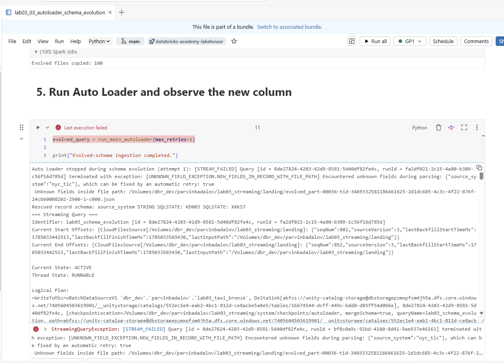

The renamed source field is detected as another new field rather than as a
rename.

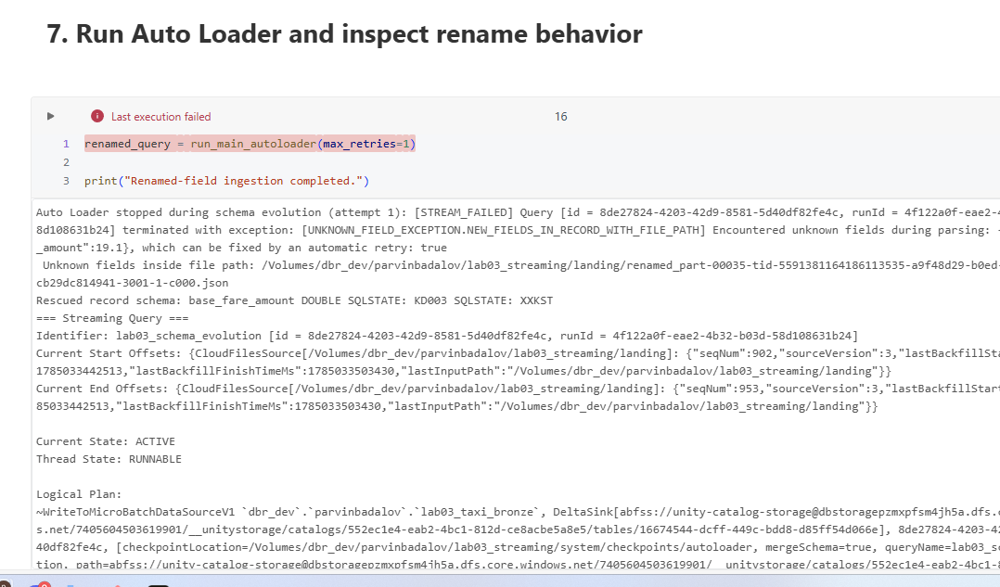

### Trigger comparison

Both trigger types processed the same 800 files and 79,901 output rows:

| Trigger | Micro-batches | Files | Output rows |
|---|---:|---:|---:|
| `availableNow` | 16 | 800 | 79,901 |
| `once` | 1 | 800 | 79,901 |

With `maxFilesPerTrigger = 50`, `availableNow` respected the per-batch file
limit and created multiple micro-batches. The legacy `once` trigger completed
the finite backlog as one batch. `availableNow` is the preferred finite trigger
for scheduled incremental workloads.

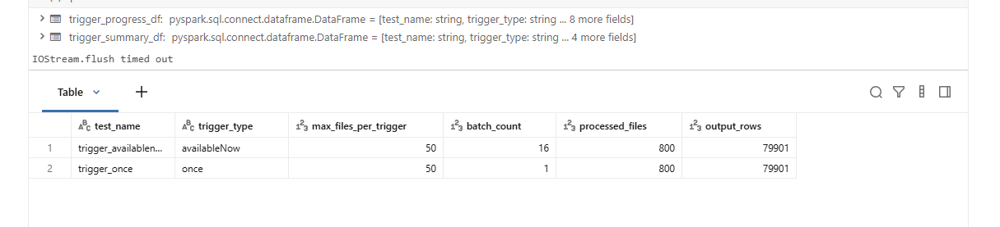

## Event Hubs implementation

The Event Hub, consumer group, partition count, and retention settings were
created in the shared academy namespace.

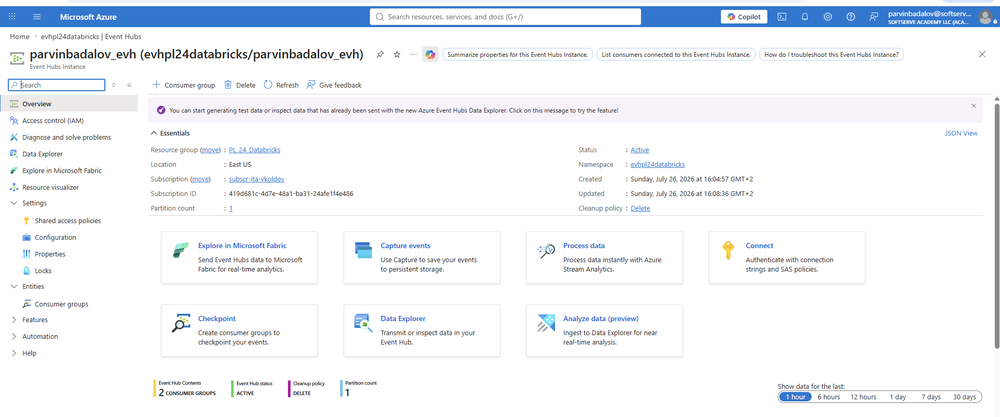

### Producer

The Python producer reads the Wikimedia SSE endpoint, adds the configured
producer ID, serializes each event as JSON, and sends it to the assigned Event
Hub. A producer run successfully received and sent 100 events.

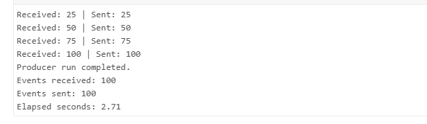

### Bronze

The Structured Streaming consumer connects through the Event Hubs-compatible
Kafka endpoint. Bronze preserves the raw payload together with:

- Event Hub name;
- partition;
- offset;
- enqueued timestamp;
- ingestion timestamp;
- expected producer ID.

The validated table contains 200 raw events from the executed producer runs.

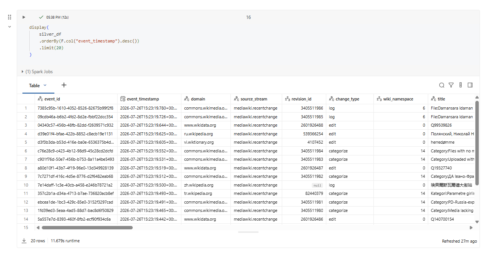

The streaming dashboard and `lastProgress` output provide the batch ID, row
count, offsets, processing rate, and batch duration.

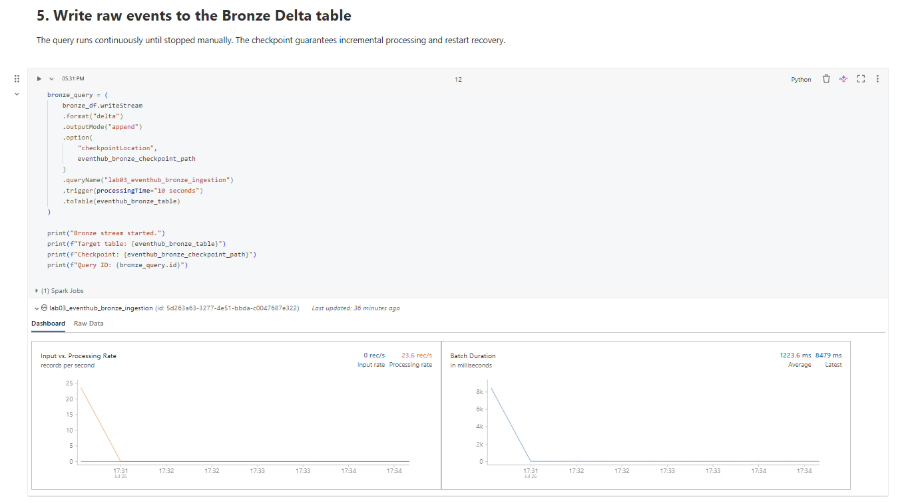

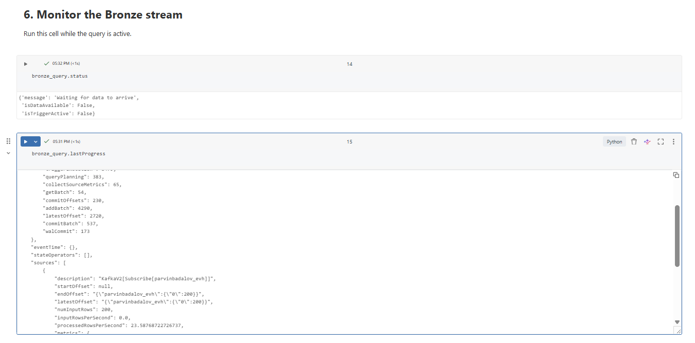

### Silver

The Silver stream:

1. Parses the Bronze JSON payload.
2. Converts the event timestamp.
3. Filters events to the configured producer.
4. Validates required fields.
5. Removes invalid rows.
6. Applies a watermark to bound streaming state.
7. Deduplicates by `event_id`.
8. Writes clean records to a Delta table with its own checkpoint.

Final quality checks passed:

| Metric | Result |
|---|---:|
| Silver rows | 200 |
| Distinct event IDs | 200 |
| Null event IDs | 0 |
| Null event timestamps | 0 |
| Null titles | 0 |

The cleaned and structured Silver records are available for downstream
analysis:

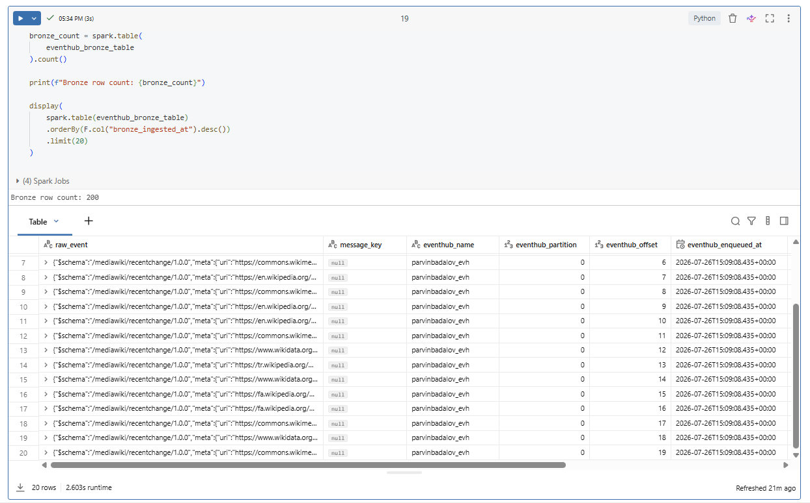

The uniqueness and required-field checks confirm the expected result:

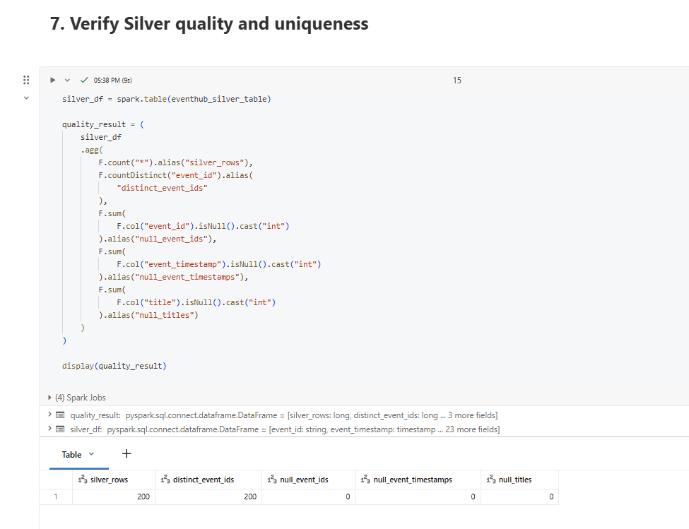

## Checkpoint recovery and replay

Two separate behaviors are demonstrated:

- **Recovery:** restarting with the original checkpoint resumes from saved file
  or Event Hub offsets and processes only unseen input.
- **Controlled replay:** using a new checkpoint and a separate target table
  intentionally reprocesses all available input without corrupting the
  original result.

Checkpoint and target-table pairs must remain isolated. Reusing one checkpoint
for a different query or table can create incorrect progress tracking.

## Delivery semantics and fault tolerance

- Auto Loader tracks discovered files in its checkpoint and writes to Delta
  transactionally, providing exactly-once file-processing semantics for the
  configured query.
- Structured Streaming records Event Hub offsets in its checkpoint and commits
  each successful Delta micro-batch transactionally.
- Sending events to Event Hubs can be at-least-once when producer retries occur.
- Silver deduplication by `event_id`, together with the watermark, protects the
  curated table from duplicate producer deliveries while bounding state.
- A failed micro-batch can be restarted from its last committed checkpoint
  without manually reconstructing offsets.

## Job orchestration

The workflow is defined under `resources/lab03_streaming_job.yml` and contains
two dependency branches:

```text
Auto Loader: 00 → 01 → 02 → 03 → 04 → 05
Event Hubs:  00 → 06 → 07 → 08
```

The schedules remain paused during development. The Event Hubs branch runs only
long enough to collect evidence, limiting cluster and streaming-service cost.

The final repaired Job run completed successfully across both branches.

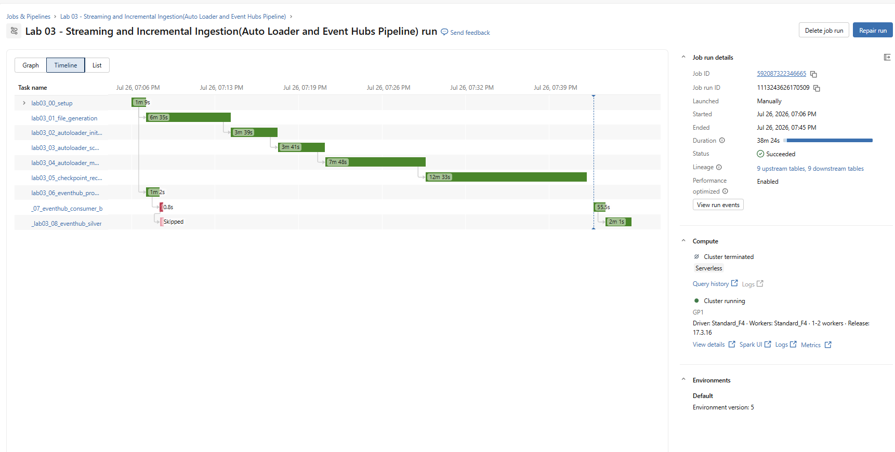

## Asset Bundle deployment

The workflow is managed as a Databricks Asset Bundle (now called a
Declarative Automation Bundle). The root `databricks.yml` includes
`resources/lab03_streaming_job.yml`, while the existing cluster ID is supplied
through the `lab03_cluster_id` bundle variable.

The bundle resource `lab03_streaming_job` was bound to the existing Databricks
Job before deployment. Binding allowed the bundle to update the tested Job
instead of creating a duplicate. After binding, the deployment plan reported:

| Planned action | Count |
|---|---:|
| Add | 0 |
| Change | 1 |
| Delete | 0 |
| Unchanged | 1 |

Development mode used a source-linked deployment, so the deployed Job
references the source notebooks in the Databricks Git folder. The bundle
deployment completed successfully, and the post-deployment execution finished
with `TERMINATED SUCCESS` across both branches.

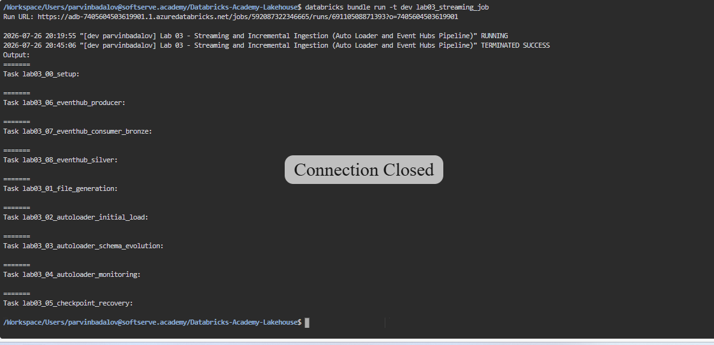

Once bound and deployed, the Job configuration is managed by the bundle.
Changes should be made in the YAML files and deployed again rather than edited
directly in the Job UI.

## Validated results

| Validation | Result |
|---|---|
| External Unity Catalog volume | Passed |
| Initial Auto Loader ingestion | Passed |
| Added-column schema evolution | Passed |
| Renamed-field behavior | Passed |
| Trigger comparison | Passed |
| File checkpoint recovery and replay | Passed |
| Wikimedia producer | Passed |
| Event Hubs Bronze ingestion | Passed |
| Event Hubs Silver transformation | Passed |
| Silver uniqueness and required-field checks | Passed |
| End-to-end Databricks Job | **Succeeded** |
| Asset Bundle validation | Passed with no warnings |
| Existing Job binding | Passed; no duplicate created |
| Asset Bundle deployment | **Succeeded** |
| Post-deployment Job run | **TERMINATED SUCCESS** |

## Running the project

### Asset Bundle deployment

From the repository root, configure the environment-specific bundle values,
including the existing cluster ID, and then run:

```bash
databricks bundle validate -t dev
databricks bundle deployment bind \
  lab03_streaming_job <existing-job-id> -t dev
databricks bundle plan -t dev
databricks bundle deploy -t dev
databricks bundle run -t dev lab03_streaming_job
```

The `bind` command is required only when adopting an existing Job. Subsequent
updates require validation, planning, and deployment but do not require
rebinding. Keep schedules disabled while testing and stop any continuous
development stream after collecting evidence.

### Manual execution

Run `lab03_00_setup`, then execute either branch in notebook-number order.
Always reuse the intended checkpoint for recovery tests and use a new
checkpoint plus a new target table for controlled replay.

## Security check before committing

Run the following from the repository root:

```bash
git grep -nEi \
  'Endpoint=sb://|SharedAccessKey=|AccountKey=|password\s*=|connection_string\s*='
```

Review every match before pushing. Secret scope names and secret-key names may
be committed; secret values and connection strings must never be committed.

## Cost awareness

- Use `availableNow` for bounded Job runs rather than leaving streams active.
- Keep development schedules paused.
- Stop the Event Hubs consumer after enough evidence is collected.
- Use a small Event Hub partition count and short retention for the lab.
- Avoid regenerating or replaying all files unless testing recovery behavior.
- Reuse checkpoints for normal incremental runs.

## Repository layout

```text
labs/lab_03_streaming_incremental/
├── README.md
├── images/
├── notebooks/
├── src/
├── tests/
└── requirements.txt

resources/
└── lab03_streaming_job.yml
```

The optional `dbc_notebooks` export is required only when requested by the
supervisor.
