# Lab 04 — Silver Data Quality, SCD, Schema Governance & Delta Maintenance

Lab 04 builds a production-style **Silver reliability pipeline in Databricks** using the UCI Online Retail dataset.

The lab focuses on the engineering controls that make a data pipeline safe to rerun and easier to govern: source profiling, Bronze lineage, reusable data-quality rules, quarantine, idempotent Delta `MERGE`, Slowly Changing Dimensions, versioned data contracts, controlled schema evolution, Delta column mapping, table maintenance, automated testing, and Databricks Asset Bundle deployment.

---

## Final status

| Area | Result |
|---|---|
| Production Job | ✅ 12/12 tasks succeeded |
| Final validation | ✅ Passed |
| Quality-rule tests | ✅ 7 passed |
| MERGE/idempotency tests | ✅ 6 passed |
| Contract tests | ✅ 9 passed |
| Total automated tests | ✅ 22 passed |
| Bundle validation | ✅ Passed |
| Selective Lab 4 bundle deployment | ✅ Completed |
| Bundle Job execution | ✅ `TERMINATED SUCCESS` |
| Compute | Databricks Serverless |

---

## Architecture

Structural setup is separated from production execution.

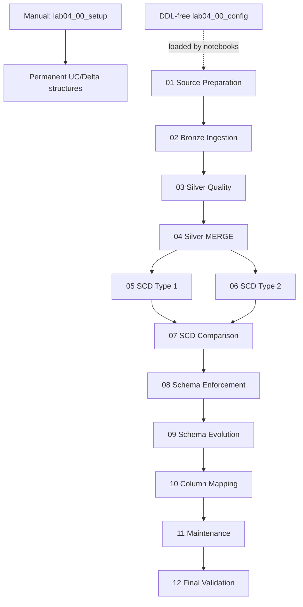

`lab04_00_setup` is intentionally **not a Job task**. It owns structural DDL and is run manually when the environment is created or intentionally rebuilt.

`lab04_00_config` is DDL-free and supplies widgets, paths, table names, schema definitions, and loaded contracts to the runtime notebooks.

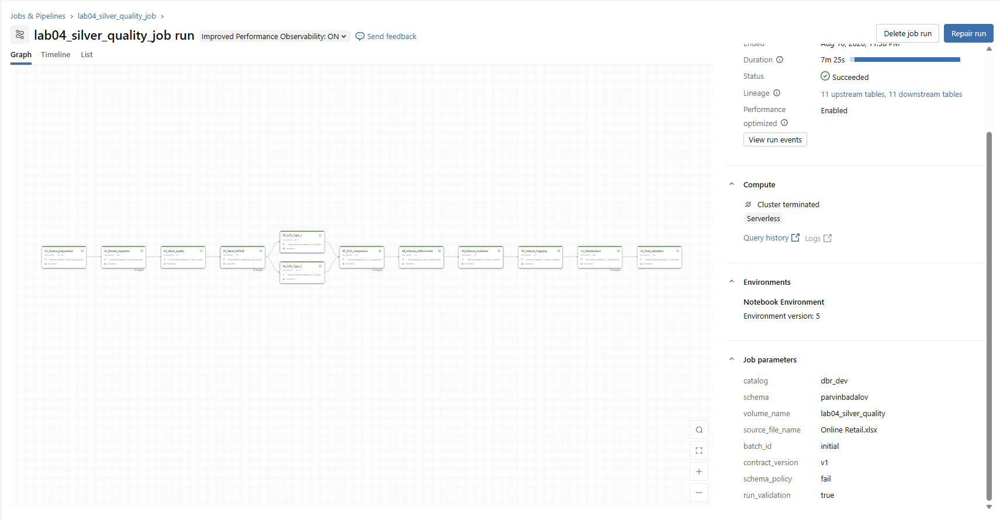

---

## Repository design

```text
lab_04_silver_quality/
├── README.md
├── contracts/
│   ├── online_retail_v1.yml
│   └── online_retail_v2.yml
├── schemas/
│   ├── source_schema.json
│   ├── bronze_schema.json
│   ├── silver_schema.json
│   ├── product_scd1_schema.json
│   └── product_scd2_schema.json
├── src/
│   ├── __init__.py
│   ├── quality_rules.py
│   └── merge_utils.py
├── tests/
│   ├── test_quality_rules.py
│   ├── test_merge_idempotency.py
│   └── test_contracts.py
├── notebooks/
│   ├── lab04_00_setup
│   ├── lab04_00_config
│   ├── lab04_01_source_preparation
│   ├── lab04_02_bronze_ingestion
│   ├── lab04_03_silver_quality
│   ├── lab04_04_silver_merge
│   ├── lab04_05_scd_type1
│   ├── lab04_06_scd_type2
│   ├── lab04_07_scd_comparison
│   ├── lab04_08_schema_enforcement
│   ├── lab04_09_schema_evolution
│   ├── lab04_10_column_mapping
│   ├── lab04_11_maintenance
│   ├── lab04_12_validation
│   └── Run_Test
└── images/
```

At bundle level the Job is defined under `resources/` by the Lab 4 Job YAML resource file.

---

# 1. Source profiling

The source-preparation notebook profiles the Online Retail workbook before downstream processing.

Observed baseline:

| Metric | Result |
|---|---:|
| Raw rows | 541,909 |
| Business columns | 8 |
| Exact duplicate rows | 5,268 |
| Null `Description` values | 1,454 |
| Null `CustomerID` values | 135,080 |

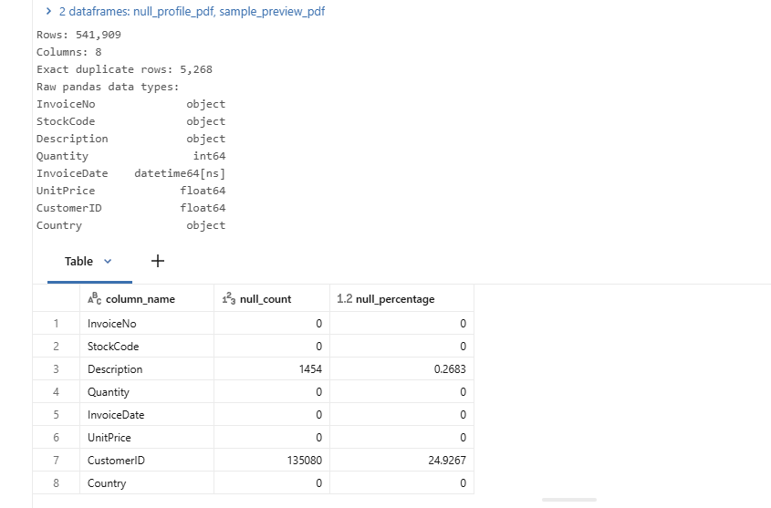

---

# 2. Bronze ingestion and technical lineage

Bronze preserves incoming values and adds technical metadata for traceability and replay safety.

Examples of lineage fields include:

- `_source_row_number`
- `_source_file`
- `_source_sheet`
- `_record_hash`
- `_input_file_path`
- `_bronze_record_id`
- `_batch_id`
- `_source_system`
- `_contract_version`
- `_bronze_ingested_at`
- `_bronze_ingestion_date`

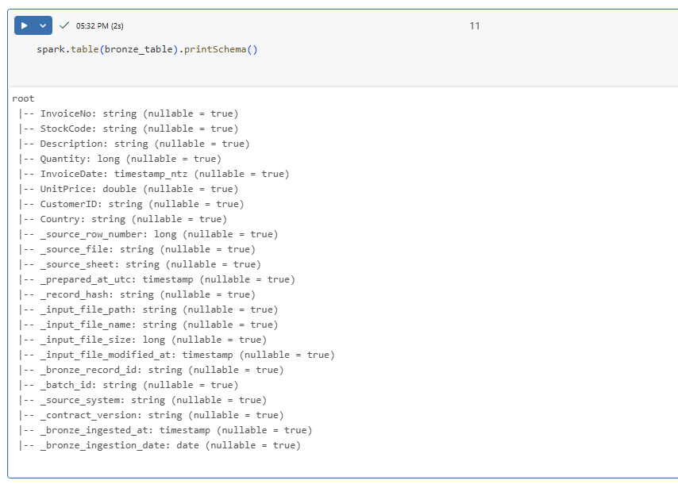

The permanent Bronze table structure is created by `lab04_00_setup`. The production ingestion notebook validates the pre-created target and performs an insert-only, idempotent load.

---

# 3. Reusable Silver data-quality rules

Quality logic is centralized in:

```text
src/quality_rules.py
```

The notebook calls reusable helpers rather than maintaining a second copy of the rule logic.

Main rules include:

| Rule | Meaning |
|---|---|
| `MISSING_INVOICE_NO` | Invoice number missing |
| `MISSING_STOCK_CODE` | Product code missing |
| `MISSING_DESCRIPTION` | Description missing |
| `NON_POSITIVE_QUANTITY` | Quantity null, zero, or negative |
| `MISSING_INVOICE_DATE` | Invoice timestamp missing |
| `NON_POSITIVE_UNIT_PRICE` | Price null, zero, or negative |
| `MISSING_CUSTOMER_ID` | Customer ID missing |
| `MISSING_COUNTRY` | Country missing |
| `CANCELLED_INVOICE` | Cancellation invoice |
| `DUPLICATE_BUSINESS_ROW` | Exact business duplicate after first retained row |

Initial batch results:

| Metric | Result |
|---|---:|
| Bronze rows evaluated | 433,737 |
| Valid rows | 315,101 |
| Rejected rows | 118,636 |
| Duplicate rows rejected | 3,427 |
| Cancelled rows | 7,430 |
| Missing-customer rows | 108,107 |

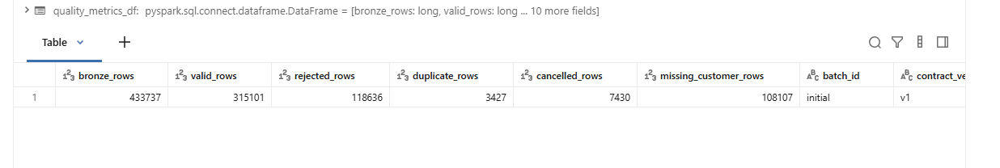

Rejected records retain all applicable reason codes instead of being silently discarded.

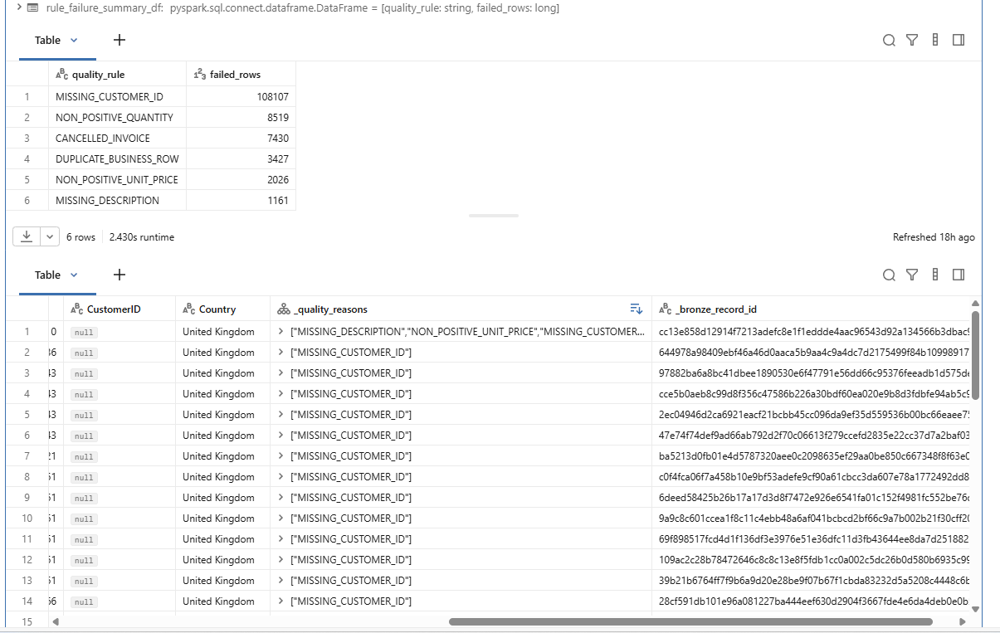

Exact-business-row deduplication excludes technical lineage fields from the duplicate key.

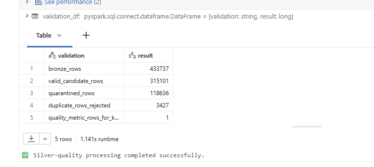

---

# 4. Idempotent Silver MERGE

Reusable MERGE logic lives in:

```text
src/merge_utils.py
```

The Silver notebook uses reusable action classification and upsert helpers to distinguish:

- `INSERT`
- `UPDATE`
- `UNCHANGED`

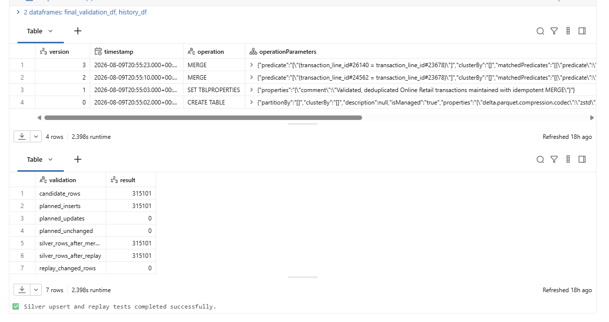

The same candidate can be replayed without creating additional rows or leaving pending changes.

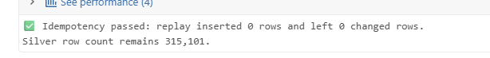

---

# 5. SCD Type 1

SCD Type 1 keeps one current product record and overwrites tracked attributes when they change.

The controlled test proves that description and price values are replaced while the product remains one current record.

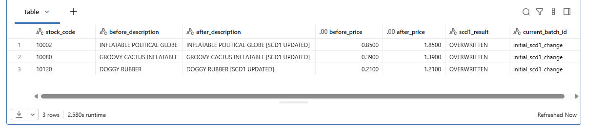

The implementation uses reusable `merge_scd_type1()` behavior from `src/merge_utils.py`.

---

# 6. SCD Type 2

SCD Type 2 preserves historical versions using fields such as:

- `product_version_sk`
- `version_number`
- `effective_from`
- `effective_to`
- `is_current`

The corrected implementation is rerun-safe:

- baseline seeding is insert-only for missing product keys;
- existing history is not rewritten during baseline seeding;
- controlled changes close the current version and insert the next version;
- replay produces no additional history;
- temporal validation requires exactly one current row and valid adjacent boundaries.

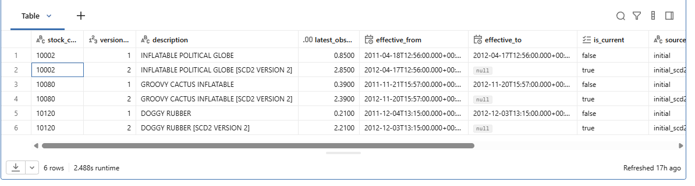

---

# 7. SCD comparison

The comparison notebook demonstrates the semantic difference between the two dimension strategies.

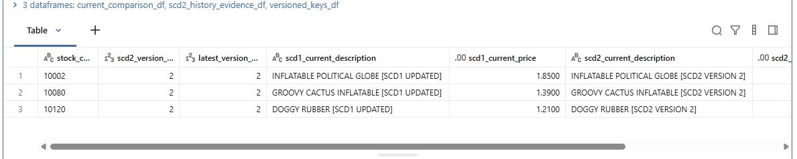

| Requirement | Type 1 | Type 2 |
|---|---|---|
| Latest state | ✅ | ✅ |
| Historical values | ❌ | ✅ |
| One current row per product | ✅ | ✅ |
| Multiple historical versions | ❌ | ✅ |
| Point-in-time analysis | Limited | ✅ |

---

# 8. Versioned data contracts

The repository contains:

```text
contracts/
├── online_retail_v1.yml
└── online_retail_v2.yml
```

These are **runtime governance artifacts**, not Databricks bundle resource files.

`lab04_00_config` loads both reference contracts and exposes one runtime-selected contract.

### Contract v1

Baseline governance contract:

- version `1`
- governance status `active`
- 8 source columns
- no arbitrary additional columns

### Contract v2

Controlled evolution contract:

- version `2`
- governance status `proposed`
- supersedes v1
- 10 source columns
- adds `loyalty_tier`
- adds `sales_channel`
- widens `Quantity` from `integer` to `long`

The runtime Job continues to use `contract_version=v1` for the baseline pipeline. Notebook 09 explicitly demonstrates the governed v1 → v2 transition.

---

# 9. Schema enforcement

Notebook 08 uses contract v1 as the strict baseline.

An incompatible type is deliberately rejected:

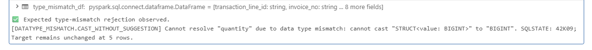

A future v2-style field such as `loyalty_tier` is also rejected while v1 is enforced:

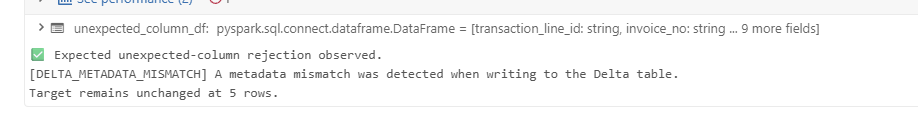

Rejected payloads can be represented in controlled rescue/quarantine form.

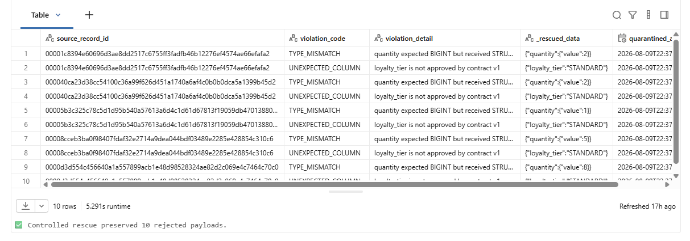

Contract-v1 validation evidence:

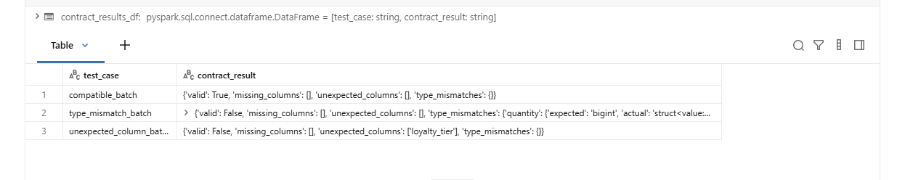

---

# 10. Controlled schema evolution

Notebook 09 compares v1 and v2 from the actual YAML contract files.

Approved evolution includes:

- adding `loyalty_tier`;
- adding `sales_channel`;
- widening `Quantity` from integer to long.

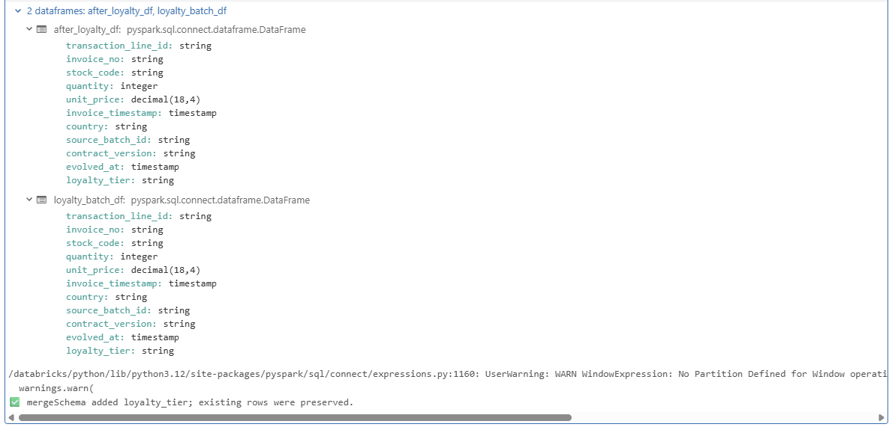

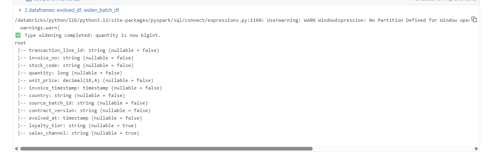

Contract-v2 validation confirms the evolved state:

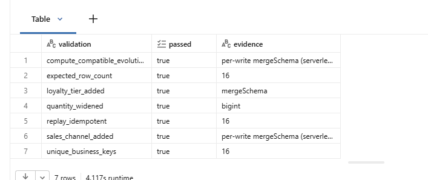

---

# 11. Delta column mapping

The column-mapping demonstration uses name-based Delta column mapping for metadata-safe changes.

A metadata-only rename is demonstrated:

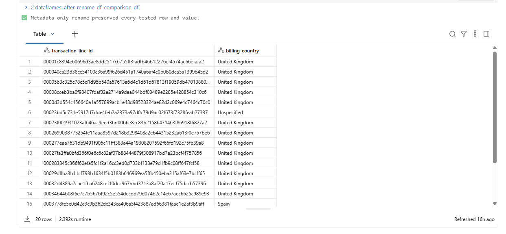

A disposable column is then dropped while retained data is validated:

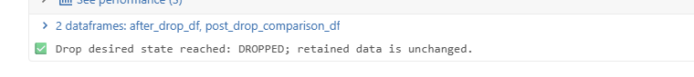

---

# 12. Delta maintenance

The maintenance notebook demonstrates modern Delta table maintenance.

### OPTIMIZE

Business invariants are checked before and after the operation.

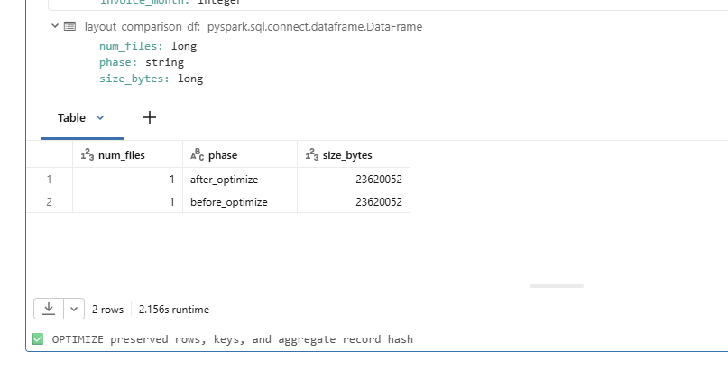

### VACUUM

The lab uses a safe retention period and validates completion.

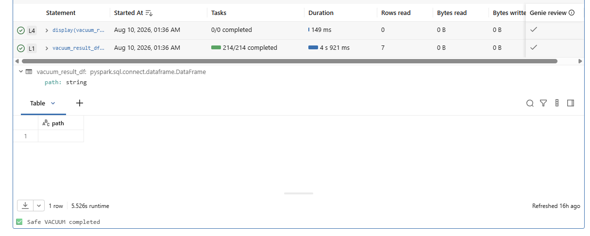

### Liquid Clustering

The maintenance table is clustered by:

```text
invoice_date, country
```

without classic partition columns.

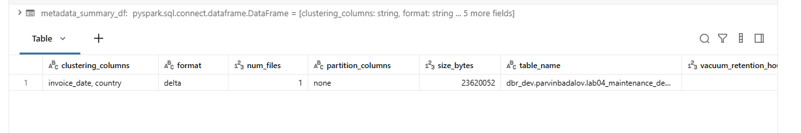

---

# 13. Job parameters

The production Job exposes the main runtime controls:

| Parameter | Baseline value |
|---|---|
| `catalog` | `dbr_dev` |
| `schema` | `parvinbadalov` |
| `volume_name` | `lab04_silver_quality` |
| `source_file_name` | `Online Retail.xlsx` |
| `batch_id` | `initial` |
| `contract_version` | `v1` |
| `schema_policy` | `fail` |
| `run_validation` | `true` |

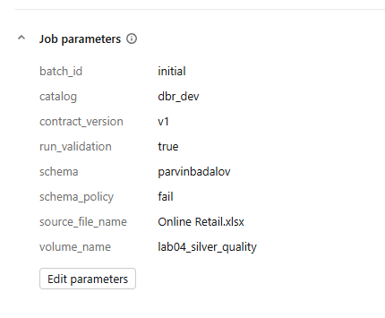

---

# 14. Production Job

The final production Job contains **12 tasks**. `00_Config` is no longer a separate task because each notebook loads the DDL-free runtime config itself.

The SCD1 and SCD2 branches run after the Silver MERGE and converge at the comparison task.


The final Serverless Job run succeeded end to end.

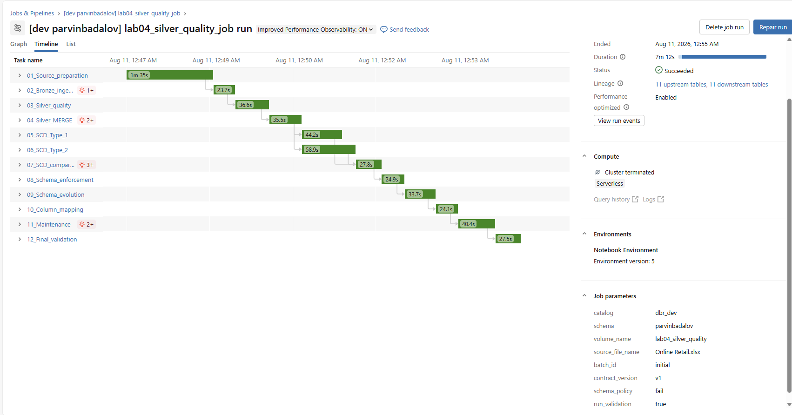

---

# 15. Automated testing

`Run_Test` executes all reusable-module and contract tests on Databricks Serverless.

Test coverage:

| Test file | Tests |
|---|---:|
| `test_quality_rules.py` | 7 |
| `test_merge_idempotency.py` | 6 |
| `test_contracts.py` | 9 |
| **Total** | **22** |

The final test run completed with:

```text
22 passed
```

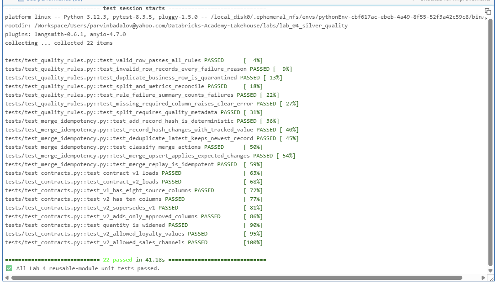

The contract tests verify, among other things:

- v1 and v2 load correctly;
- v1 has 8 columns;
- v2 has 10 columns;
- v2 supersedes v1;
- only approved fields are added;
- `Quantity` changes from integer to long;
- allowed values for `loyalty_tier` and `sales_channel`.

---

# 16. Databricks Asset Bundle deployment

The root bundle supports multiple deployment targets, including a personal development workspace.

Because the root bundle also contains Lab 2, Lab 3, and demo resources that depend on workspace-specific compute, Lab 4 is selectively planned/deployed in the personal workspace with its resource key:

```text
jobs.lab04_silver_quality_job
```

### Validate

```bash
databricks bundle validate -t personal_dev
```

Validation completed successfully.

### Plan only Lab 4

```bash
databricks bundle plan -t personal_dev \
  --select jobs.lab04_silver_quality_job
```

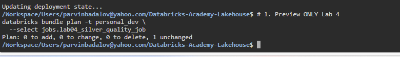

### Deploy only Lab 4

```bash
databricks bundle deploy -t personal_dev \
  --select jobs.lab04_silver_quality_job
```

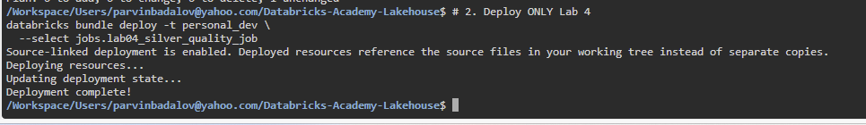

### Execute the deployed resource

```bash
databricks bundle run -t personal_dev \
  lab04_silver_quality_job
```

The CLI run finished with:

```text
TERMINATED SUCCESS
```

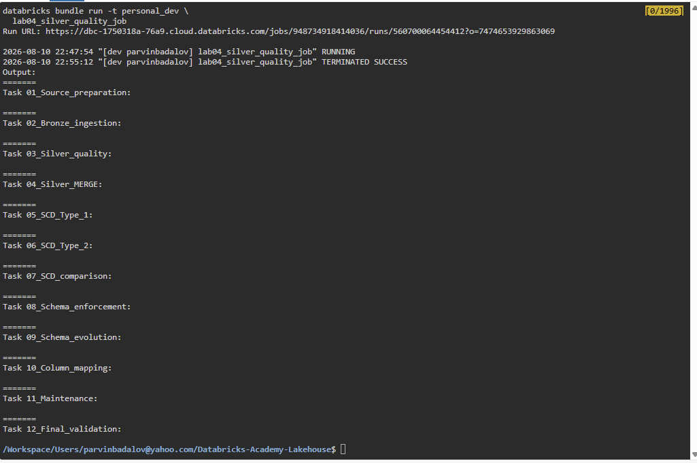

### Deployment summary

```bash
databricks bundle summary -t personal_dev
```

The final summary confirms that the Lab 4 Job has a deployed URL, while unrelated Lab 2/Lab 3/demo resources are not deployed to this target.

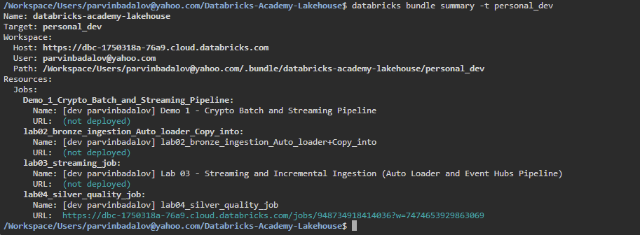

---

# 17. Schemas vs contracts

The project intentionally separates technical structure from governance policy.

## JSON schemas

```text
schemas/
├── source_schema.json
├── bronze_schema.json
├── silver_schema.json
├── product_scd1_schema.json
└── product_scd2_schema.json
```

These describe Spark/Delta technical structures.

## YAML contracts

```text
contracts/
├── online_retail_v1.yml
└── online_retail_v2.yml
```

These describe governance expectations, lifecycle/version relationships, approved evolution, and allowed values.

The contract files are loaded by Python code and tested by `test_contracts.py`; they are **not added to the bundle `include` list as resource YAML**.

---

# 18. Setup and execution

## One-time/manual structural setup

Run:

```text
lab04_00_setup
```

This creates/verifies structural objects such as:

- catalog/schema;
- volume and directories;
- Bronze;
- quarantine;
- quality metrics;
- final Silver;
- SCD1 target;
- SCD2 target.

The setup notebook is not part of the production Job.

## Production execution

The Job begins with:

```text
01_Source_preparation
```

and finishes with:

```text
12_Final_validation
```

The runtime config is loaded by the notebooks and is not a separate Job task.

---

# 19. Key reliability decisions

### Quarantine instead of silent data loss
Rejected data retains explicit failure reasons and lineage.

### Immutable/replay-safe Bronze
Technical identities prevent duplicate ingestion during retries.

### Idempotent Silver MERGE
Replaying the same candidate produces no additional changes.

### Reusable logic
Quality and MERGE/SCD behavior live in Python modules instead of being duplicated across notebooks.

### Governed schema evolution
Contract v1 rejects unapproved changes; contract v2 explicitly documents approved evolution.

### Correct SCD2 rerun behavior
Baseline seeding only fills missing keys. Existing history is never rewritten by the seed step.

### DDL separated from the production Job
Permanent structural DDL is centralized in `lab04_00_setup`.

### Automated evidence
The final project has 22 passing unit/contract tests plus a successful 12-task integration run.

### Selective bundle deployment
Lab 4 can be deployed independently even when the root bundle contains resources for other workspaces.

---

# 20. Final result

Lab 04 demonstrates a governed, testable, rerunnable Silver-layer architecture using:

- Databricks
- PySpark
- Delta Lake
- Unity Catalog
- reusable Python modules
- versioned YAML data contracts
- JSON schemas
- SCD Type 1 and Type 2
- Delta schema enforcement/evolution
- name-based column mapping
- Liquid Clustering
- automated pytest tests
- Databricks Jobs
- Databricks Asset Bundles

The final pipeline, test suite, bundle deployment, and bundle-triggered execution all completed successfully.
