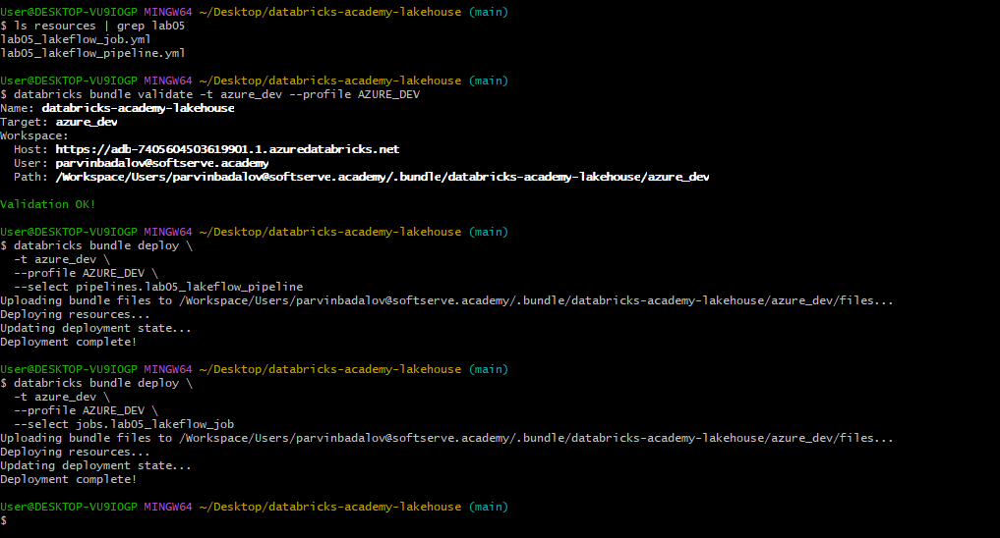

# Lab 05 — Lakeflow Spark Declarative Pipelines

## Overview

This lab compares **Lakeflow Spark Declarative Pipelines** with classic Spark / Structured Streaming by building an end-to-end Citi Bike GBFS pipeline.

The implementation demonstrates:

- a **streaming JSON source** using Citi Bike `station_status`
- a **batch/reference JSON source** using Citi Bike `station_information`
- Bronze, Silver, enriched Silver, and Gold datasets
- Lakeflow **expectations** for data quality
- a stream-static join on `station_id`
- automatic lineage / dependency visualization
- safe reruns without duplicate ingestion
- incremental ingestion of newly arriving JSON files
- deployment as a Databricks bundle pipeline resource
- optional Lakeflow Job orchestration: producer → pipeline → validation

The final development pipeline completed successfully with all validation checks passing.

---

## Goal

The Lab 05 requirements are covered as follows:

| Requirement | Implementation |
|---|---|
| Declarative pipeline from a streaming source | `station_status_bronze` via Auto Loader |
| Declarative pipeline from CSV / JSON source | `station_information_bronze` from JSON |
| Expectations in Silver | `@dp.expect_all` and `@dp.expect_all_or_drop` |
| Analyze lineage | Lakeflow pipeline graph |
| Reload safely | normal rerun kept 11 source files = 11 Bronze documents |
| Incremental ingestion | one new file increased 11 → 12 Bronze documents |
| Compare declarative vs classic Spark | `CLASSIC_VS_LAKEFLOW.md` |
| Deploy using Databricks Asset Bundles | `lab05_lakeflow_pipeline` bundle resource |
| Passing pipeline | completed successfully |
| Visible expectations | 6 expectations on each Silver dataset |
| Final validation | 20/20 validation checks passed |
| Optional orchestration Job | producer → pipeline → validation completed successfully |

---

## Architecture

```text
Citi Bike GBFS
│
├── station_information.json
│       │
│       ▼
│   station_information_bronze
│   Materialized View
│       │
│       ▼
│   station_information_silver
│   Materialized View + Expectations
│       │
│       └──────────────┐
│                      │ station_id
│                      ▼
│              station_status_enriched_silver
│                      │
│                      ▼
│              station_summary_gold
│              Materialized View
│
└── station_status snapshots
        │
        ▼
    External Volume
        │
        ▼
    Auto Loader
        │
        ▼
    station_status_bronze
    Streaming Table
        │
        ▼
    station_status_silver
    Streaming Table + Expectations
        │
        └──────────────► enriched Silver
```

---

## Storage design

Lab 05 intentionally uses two Unity Catalog volumes.

### Managed volume

```text
/Volumes/dbr_dev/parvinbadalov/lab05_lakeflow
```

Used for:

```text
reference/
└── station_information.json

test_data/
```

### External streaming volume

```text
/Volumes/dbr_dev/parvinbadalov/lab05_lakeflow_streaming
```

Used for:

```text
landing/
└── station_status/
    ├── station_status_<timestamp>.json
    ├── station_status_<timestamp>.json
    └── ...
```

The separation keeps the reference/test data in managed storage while the Auto Loader landing source is backed by external storage.

---

## Project structure

```text
labs/
└── lab_05_lakeflow/
    ├── README.md
    ├── CLASSIC_VS_LAKEFLOW.md
    │
    ├── pipeline/
    │   ├── bronze.py
    │   ├── silver.py
    │   └── gold.py
    │
    ├── src/
    │   ├── __init__.py
    │   ├── config.py
    │   └── quality_rules.py
    │
    ├── tools/
    │   └── citibike_status_producer.py
    │
    ├── notebooks/
    │   ├── lab05_00_setup.ipynb
    │   ├── lab05_01_source_preparation.ipynb
    │   └── lab05_02_validation.ipynb
    │
    ├── tests/
    │   ├── test_quality_rules.py
    │   └── test_pipeline.py
    │
    ├── schemas/
    │   ├── station_status_schema.json
    │   └── station_information_schema.json
    │
    └── images/
        └── ...
```

Bundle resource:

```text
resources/
├── lab05_lakeflow_pipeline.yml
└── lab05_lakeflow_job.yml
```

---

# Implementation evidence

## 1. Environment setup

The setup notebook prepares:

- the managed Lab 05 volume
- the external streaming volume
- streaming landing folder
- reference folder
- test-data folder


---

## 2. Source profiling

The source-preparation notebook profiles both Citi Bike feeds.

`station_information` contains one current record per station, while `station_status` contains repeated station observations across multiple snapshots.


At the source-preparation capture point, the notebook had:

- **2,509** reference stations
- **9** status snapshots
- **22,581** status rows

The dataset later grew further during incremental pipeline testing.

---

## 3. Natural join-key validation

`station_id` is the relationship between status observations and reference station metadata.

The source-preparation check confirmed:

```text
distinct status station IDs : 2,509
matched station IDs         : 2,509
unmatched station IDs       : 0
join coverage               : 100.00%
```


---

## 4. Source preparation

The source-preparation notebook validates:

- reference file exists
- status snapshot exists
- both sources contain rows
- both sources contain non-null `station_id`
- join has matches


---

## 5. Reusable quality-rule tests

Expectation definitions are stored in:

```text
src/quality_rules.py
```

and tested independently with pure `pytest`.

The test suite validates:

- expectation dictionaries
- unique rule names
- required join-key checks
- non-negative operational counts
- coordinate validation
- capacity validation
- malformed expectation configuration


---

# Lakeflow pipeline

## 6. Successful pipeline execution

The deployed development pipeline completed successfully and produced all six declared datasets.


Datasets:

```text
station_information_bronze
station_information_silver
station_status_bronze
station_status_silver
station_status_enriched_silver
station_summary_gold
```

---

## 7. Declarative DAG / lineage

Lakeflow infers execution dependencies from dataset reads instead of requiring manual Job-task ordering.


The graph demonstrates both branches joining at enriched Silver:

```text
station_information_bronze
        ↓
station_information_silver
        ┐
        │
        ├──► station_status_enriched_silver
        │              ↓
        │      station_summary_gold
        │
station_status_bronze
        ↓
station_status_silver
        ┘
```

---

# Expectations

## 8. `station_status_silver`

Six expectations are applied to the streaming Silver dataset.

The rules include:

- non-null `station_id`
- non-negative bike count
- non-negative dock count
- last-reported monitoring
- renting-flag monitoring
- returning-flag monitoring

The successful captured update shows:

```text
Written       100% (2,509)
Dropped       0% (0)
Failed rows   0
```


---

## 9. `station_information_silver`

Six expectations are also applied to the reference Silver dataset.

They cover:

- `station_id`
- station name
- capacity
- latitude range
- longitude range
- non-negative capacity

The successful captured update shows:

```text
Written       100% (2,509)
Dropped       0% (0)
Failed rows   0
```


---

# Safe reload and incremental processing

## 10. Safe rerun

The pipeline was run normally again **without creating a new status file**.

The result remained:

```text
Status source files      : 11
Bronze status documents  : 11
Silver status rows       : 27,599
Reference stations       : 2,509
Enriched rows            : 27,599
Join coverage            : 100.00%
Gold station rows        : 2,509
```


This proves a normal pipeline rerun did not duplicate already processed source files.

---

## 11. Incremental ingestion

The single-shot producer was then run exactly once to create one new immutable JSON snapshot.

After the next normal Lakeflow update:

```text
Before                       After
------                       -----
Source files       11   →    12
Bronze documents   11   →    12
Silver rows        27,599 →  30,108
Enriched rows      27,599 →  30,108
Gold rows          2,509  →  2,509
Join coverage      100%   →  100%
```


This demonstrates that Auto Loader processed only the newly arriving file and propagated the new observations through Silver and Gold.

---

# Final validation

## 12. Final validation summary

The final validation notebook completed successfully:

```text
LAB 05 VALIDATION PASSED

Status source files      : 12
Bronze status documents  : 12
Silver status rows       : 30,108
Reference stations       : 2,509
Enriched rows            : 30,108
Join coverage            : 100.00%
Gold station rows        : 2,509
```


---

## 13. Validation matrix

The final notebook checks 20 end-to-end invariants, including:

- every expected pipeline dataset exists
- one Bronze row per source file
- Silver contains rows
- no invalid station IDs
- bike and dock counts are valid
- status record IDs are unique
- coordinates and capacity are valid
- reference station IDs are unique
- station join coverage is 100%
- Gold observation counts are valid
- Gold reference matches are valid
- Gold availability band is populated

All checks passed.


---

# Bronze layer

## `station_status_bronze`

Type:

```text
Streaming Table
```

Source:

```text
external volume
→ landing/station_status/*.json
→ Auto Loader
```

Lakeflow owns the streaming-table state, so the pipeline source does not manually call:

```text
writeStream
checkpointLocation
start()
awaitTermination()
```

## `station_information_bronze`

Type:

```text
Materialized View
```

Source:

```text
managed volume
→ reference/station_information.json
```

Bronze preserves the raw GBFS envelope and source-file metadata.

---

# Silver layer

## `station_status_silver`

Transforms each GBFS status document into one row per station observation.

Important derived fields include:

```text
last_reported_at
snapshot_last_updated_at
status_record_id
```

`status_record_id` is derived from:

```text
_source_file + station_id
```

which gives one deterministic observation identifier per station per source snapshot.

## `station_information_silver`

Transforms the reference document into one row per station.

Important fields include:

```text
station_id
station_name
short_name
latitude
longitude
region_id
capacity
rental_uris
```

## `station_status_enriched_silver`

Performs the stream-static enrichment:

```text
station_status_silver
        +
station_information_silver
        |
        | station_id
        v
station_status_enriched_silver
```

The final validation confirmed **100% join coverage**.

---

# Gold layer

`station_summary_gold` is a materialized view that summarizes station history.

Metrics include:

- observation count
- first / last observation timestamp
- average / min / max bikes available
- average / min / max docks available
- average bike availability %
- average dock availability %
- average e-bikes available
- renting / returning outage observations
- unmatched-reference observations
- availability band

Availability bands:

```text
VERY_LOW
LOW
BALANCED
HIGH
VERY_HIGH
UNKNOWN
```

---

# Single-shot Citi Bike producer

`tools/citibike_status_producer.py` performs exactly one cycle:

```text
poll Citi Bike GBFS
        ↓
validate payload
        ↓
write one immutable timestamped JSON file
        ↓
exit
```

This makes new-file arrival explicit and easy to test.

Example destination:

```text
/Volumes/dbr_dev/parvinbadalov/
lab05_lakeflow_streaming/
landing/station_status/
station_status_<timestamp>.json
```

---

# Classic Spark vs Lakeflow

A detailed comparison is available in:

```text
CLASSIC_VS_LAKEFLOW.md
```

The main distinction is:

### Classic Spark

The developer typically manages:

```text
streaming query lifecycle
checkpoint paths
writeStream
output mode
triggers
orchestration
quality metrics
recovery logic
```

### Lakeflow

The developer declares:

```text
streaming tables
materialized views
transformations
expectations
dataset dependencies
```

while Lakeflow manages the execution graph, dataset lifecycle, streaming state, expectation metrics, and lineage.

---

# Databricks Asset Bundle

Lab 05 is defined through two bundle resources:

```text
resources/
├── lab05_lakeflow_pipeline.yml
└── lab05_lakeflow_job.yml
```

The declarative data pipeline was deployed selectively to the development target as:

```text
pipelines.lab05_lakeflow_pipeline
```

The optional orchestration Job was also deployed selectively as:

```text
jobs.lab05_lakeflow_job
```

Selective deployment keeps Lab 05 isolated from unrelated Lab 2 / Lab 3 / demo resources in the same repository.

---

# Optional Lakeflow Job orchestration

The core Lab 05 requirement is satisfied by the Lakeflow declarative pipeline itself.

An additional Lakeflow Job was created to demonstrate end-to-end process orchestration:

```text
produce_status_snapshot
        ↓
run_lakeflow_pipeline
        ↓
validate_pipeline
```

The tasks perform:

1. **Producer task** — runs `citibike_status_producer.py` and creates exactly one new immutable `station_status` JSON snapshot.
2. **Pipeline task** — triggers `lab05_lakeflow_pipeline` with a normal incremental update (`full_refresh: false`).
3. **Validation task** — runs `lab05_02_validation.ipynb` after the pipeline succeeds.

The Job completed successfully in the development workspace.


The successful timeline shows all three dependent tasks completed in sequence.


This demonstrates the difference between the two orchestration levels:

```text
Lakeflow Spark Declarative Pipeline
= data dependencies
  Bronze → Silver → Enriched Silver → Gold

Lakeflow Job
= process dependencies
  Produce source file → Run pipeline → Validate
```

---

# Recommended execution order

## One-time / manual setup

Run:

```text
notebooks/lab05_00_setup.ipynb
```

This prepares storage only and is intentionally not part of the production pipeline.

## Source preparation

Run:

```text
notebooks/lab05_01_source_preparation.ipynb
```

This:

- fetches / prepares reference data
- seeds status snapshots
- profiles the sources
- validates `station_id`
- proves join compatibility

## Unit tests

Run:

```text
tests/test_quality_rules.py
```

## Deploy pipeline

Deploy the bundle pipeline resource to the desired target.

## Run Lakeflow pipeline

Run a normal triggered update.

## Validate

Run:

```text
notebooks/lab05_02_validation.ipynb
```

## Optional end-to-end orchestration

Instead of manually running producer → pipeline → validation, the optional bundle Job can orchestrate all three steps:

```text
Lab 05 - Citi Bike Lakeflow Orchestration
```

This Job is an additional demonstration and is not required for the declarative pipeline itself.

---

# Design decisions

## Setup is separate from the pipeline

Infrastructure creation is intentionally kept in `lab05_00_setup.ipynb`.

The Lakeflow source files focus on dataflow definitions rather than embedding environment DDL inside normal pipeline execution.

## Triggered rather than continuous

The pipeline is configured as triggered:

```yaml
continuous: false
```

because the lab deliberately creates periodic Citi Bike snapshots rather than requiring an always-on streaming service.

## Reusable expectations

Quality expressions live in:

```text
src/quality_rules.py
```

The same rules can be tested independently rather than duplicating expressions across pipeline files and tests.

## External source vs managed reference storage

Streaming file arrival uses an external volume, while stable reference and test data remain in the managed Lab 05 volume.

---

# Completion status

Core Lab 05 requirements are complete:

```text
Streaming source                       PASS
JSON/reference source                  PASS
Silver expectations                    PASS
Lineage / DAG                          PASS
Safe rerun                             PASS
Incremental ingestion                  PASS
Classic Spark comparison               PASS
Asset Bundle development deployment    PASS
Pipeline completed                     PASS
Final validation                       PASS
Optional orchestration Job             PASS
Shared Azure deploy-only handoff        PASS
```

The development implementation is complete and tested.

The ready Lab 05 pipeline and orchestration Job were also deployed successfully to the shared Azure target **without running either resource**, completing the supervisor handoff requirement.

---

# Shared Azure deployment

The final Lab 05 resources were validated and selectively deployed to the Azure target from the local repository using the Azure CLI profile.

Validation:

```text
databricks bundle validate -t azure_dev --profile AZURE_DEV
→ Validation OK!
```

Selective deployment:

```text
pipelines.lab05_lakeflow_pipeline
→ Deployment complete!

jobs.lab05_lakeflow_job
→ Deployment complete!
```

No Azure pipeline or Job run was triggered after deployment.



This satisfies the supervisor instruction to deploy the ready resources to the shared environment without running them.

---

# Evidence index

| Screenshot | Evidence |
|---|---|
| `01_environment_setup.png` | managed + external volume setup |
| `02_source_profile.png` | source schemas and sample data |
| `03_join_validation.png` | 100% natural-key coverage |
| `04_source_preparation_passed.png` | source-preparation validation |
| `05_quality_rules_tests.png` | reusable quality tests |
| `06_pipeline_success.png` | successful Lakeflow run |
| `07_pipeline_dag.png` | declarative DAG / lineage |
| `08_expectation_results_status.png` | status Silver expectations |
| `09_expectation_results_information.png` | information Silver expectations |
| `10_safe_rerun.png` | idempotent normal rerun |
| `11_incremental_ingestion.png` | one-new-file incremental update |
| `12_final_validation.png` | final metrics and PASS |
| `13_validation_matrix.png` | 20/20 validation checks |
| `14_job_orchestration_dag.png` | producer → pipeline → validation Job DAG |
| `15_job_timeline.png` | successful three-task Job execution timeline |
| `16_azure_deployment.png` | Azure validation + deploy-only evidence |

---

## Result

Lab 05 demonstrates an end-to-end Lakeflow declarative pipeline that combines streaming and batch JSON sources, applies declarative quality expectations, enriches live station observations with reference metadata, produces a Gold analytical materialized view, reloads safely, processes new files incrementally, and is packaged for bundle-based deployment. An optional Lakeflow Job additionally proves automated producer → pipeline → validation orchestration. The final pipeline and Job were then selectively deployed to the shared Azure target without execution.
