# Lab 05 — Lakeflow Spark Declarative Pipelines

## Overview

This lab compares **Lakeflow Spark Declarative Pipelines** with classic Spark / Structured Streaming by building an end-to-end Citi Bike GBFS pipeline.

The implementation demonstrates:

- a **streaming JSON source** using Citi Bike `station_status`
- a **batch/reference JSON source** using Citi Bike `station_information`
- Bronze, Silver, enriched Silver, and Gold datasets
- Lakeflow **expectations** for data quality
- a stream-static join on `station_id`
- automatic lineage / dependency visualization
- safe reruns without duplicate ingestion
- incremental ingestion of newly arriving JSON files
- deployment as a Databricks bundle pipeline resource
- production-ready Lakeflow Job orchestration: source preparation → producer → pipeline → validation

The final Lab 05 implementation was validated in development and in the personal production-style target. The shared Azure production target is kept as a clean runnable environment, so Azure production run results are intentionally not included in this README.

---

## Goal

The Lab 05 requirements are covered as follows:

| Requirement | Implementation |
|---|---|
| Declarative pipeline from a streaming source | `station_status_bronze` via Auto Loader |
| Declarative pipeline from CSV / JSON source | `station_information_bronze` from JSON |
| Expectations in Silver | `@dp.expect_all` and `@dp.expect_all_or_drop` |
| Analyze lineage | Lakeflow pipeline graph |
| Reload safely | normal rerun kept 11 source files = 11 Bronze documents |
| Incremental ingestion | one new file increased 11 → 12 Bronze documents |
| Compare declarative vs classic Spark | `CLASSIC_VS_LAKEFLOW.md` |
| Deploy using Databricks Asset Bundles | `lab05_lakeflow_pipeline` bundle resource |
| Passing pipeline | completed successfully |
| Visible expectations | 6 expectations on each Silver dataset |
| Final validation | 20/20 validation checks passed |
| Orchestration Job | source preparation → producer → pipeline → validation completed successfully |

---

## Architecture

```text
Citi Bike GBFS
│
├── station_information.json
│       │
│       ▼
│   station_information_bronze
│   Materialized View
│       │
│       ▼
│   station_information_silver
│   Materialized View + Expectations
│       │
│       └──────────────┐
│                      │ station_id
│                      ▼
│              station_status_enriched_silver
│                      │
│                      ▼
│              station_summary_gold
│              Materialized View
│
└── station_status snapshots
        │
        ▼
    External Volume
        │
        ▼
    Auto Loader
        │
        ▼
    station_status_bronze
    Streaming Table
        │
        ▼
    station_status_silver
    Streaming Table + Expectations
        │
        └──────────────► enriched Silver
```

---

## Storage design

Lab 05 uses target-specific Unity Catalog storage so development and production
do not compete for ownership of the same Lakeflow-managed tables.

### Development

```text
Catalog: dbr_dev
Schema : parvinbadalov
```

The existing development volumes remain:

```text
/Volumes/dbr_dev/parvinbadalov/lab05_lakeflow
/Volumes/dbr_dev/parvinbadalov/lab05_lakeflow_streaming
```

### Production-style targets

The Bundle creates an isolated schema and two **managed Volumes**:

```text
dbr_dev.parvinbadalov_lab05_prod
├── lab05_lakeflow
└── lab05_lakeflow_streaming
```

Runtime folders are created by `lab05_01_source_preparation.ipynb`:

```text
lab05_lakeflow/
├── reference/
└── test_data/

lab05_lakeflow_streaming/
└── landing/
    └── station_status/
```

This keeps schema/Volume DDL out of the operational Job while allowing a fresh
production deployment to be ready for its first Job run.

---

## Project structure

```text
labs/
└── lab_05_lakeflow/
    ├── README.md
    ├── CLASSIC_VS_LAKEFLOW.md
    │
    ├── pipeline/
    │   ├── bronze.py
    │   ├── silver.py
    │   └── gold.py
    │
    ├── src/
    │   ├── __init__.py
    │   ├── config.py
    │   └── quality_rules.py
    │
    ├── tools/
    │   └── citibike_status_producer.py
    │
    ├── notebooks/
    │   ├── lab05_00_setup.ipynb
    │   ├── lab05_01_source_preparation.ipynb
    │   └── lab05_02_validation.ipynb
    │
    ├── tests/
    │   ├── test_quality_rules.py
    │   └── test_pipeline.py
    │
    ├── schemas/
    │   ├── station_status_schema.json
    │   └── station_information_schema.json
    │
    └── images/
        └── ...
```

Bundle / runner resources:

```text
resources/
├── lab05_infrastructure.yml
├── lab05_lakeflow_pipeline.yml
└── lab05_lakeflow_job.yml

tools/
└── run_academy_lab.sh
```

---

# Implementation evidence

## 1. Environment / infrastructure setup

Development keeps the original setup notebook for learning and manual
preparation.

For production-style targets, infrastructure is declarative:

```text
databricks bundle deploy
        ↓
create schema
        ↓
create lab05_lakeflow managed Volume
        ↓
create lab05_lakeflow_streaming managed Volume
        ↓
deploy Lakeflow pipeline
        ↓
deploy orchestration Job
```

The operational Job itself does not contain schema/Volume DDL.

> **New screenshot recommended:** replace the old environment-setup screenshot
> with a Catalog Explorer view of
> `dbr_dev.parvinbadalov_lab05_prod` showing both Lab 05 Volumes.

---

## 2. Source profiling

The source-preparation notebook profiles both Citi Bike feeds.

`station_information` contains one current record per station, while `station_status` contains repeated station observations across multiple snapshots.

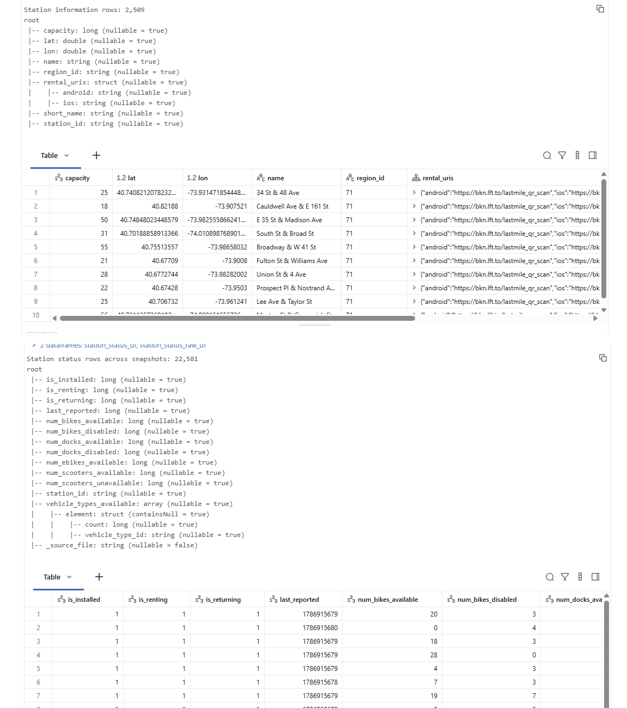

At the source-preparation capture point, the notebook had:

- **2,509** reference stations
- **9** status snapshots
- **22,581** status rows

The dataset later grew further during incremental pipeline testing.

---

## 3. Natural join-key validation

`station_id` is the relationship between status observations and reference station metadata.

The source-preparation check confirmed:

```text
distinct status station IDs : 2,509
matched station IDs         : 2,509
unmatched station IDs       : 0
join coverage               : 100.00%
```

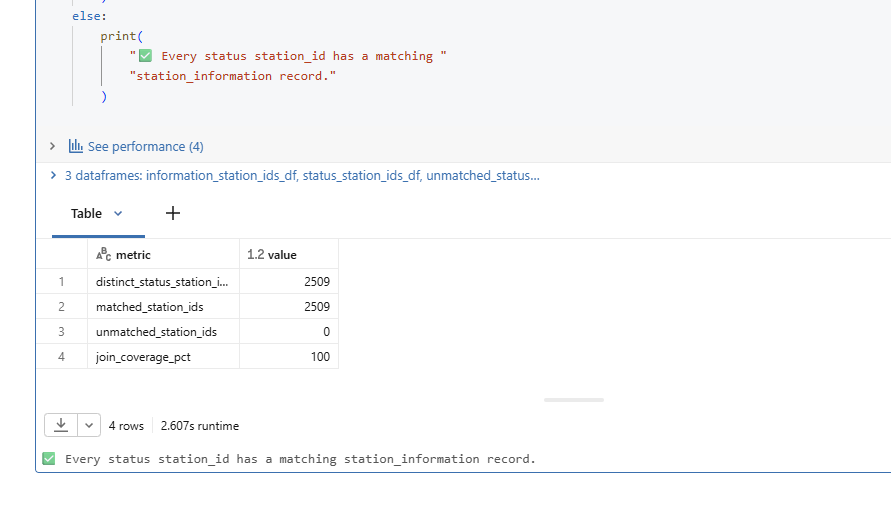

---

## 4. Source preparation

The source-preparation notebook validates:

- reference file exists
- status snapshot exists
- both sources contain rows
- both sources contain non-null `station_id`
- join has matches

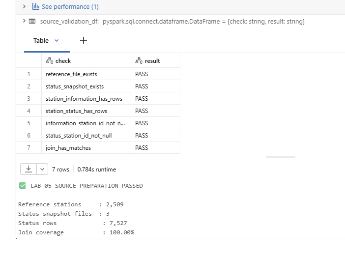

---

## 5. Reusable quality-rule tests

Expectation definitions are stored in:

```text
src/quality_rules.py
```

and tested independently with pure `pytest`.

The test suite validates:

- expectation dictionaries
- unique rule names
- required join-key checks
- non-negative operational counts
- coordinate validation
- capacity validation
- malformed expectation configuration

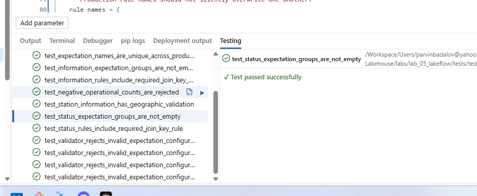

---

# Lakeflow pipeline

## 6. Successful pipeline execution

The deployed development pipeline completed successfully and produced all six declared datasets.

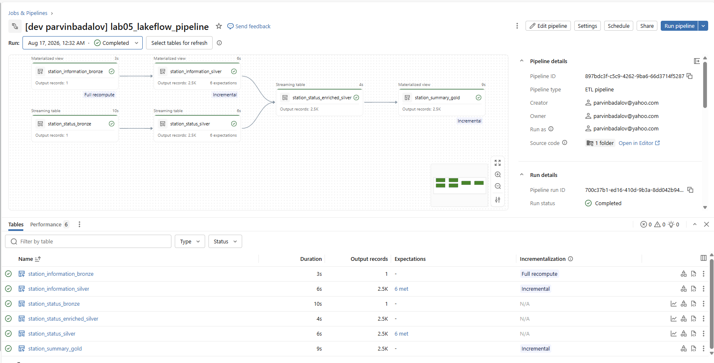

Datasets:

```text
station_information_bronze
station_information_silver
station_status_bronze
station_status_silver
station_status_enriched_silver
station_summary_gold
```

---

## 7. Declarative DAG / lineage

Lakeflow infers execution dependencies from dataset reads instead of requiring manual Job-task ordering.

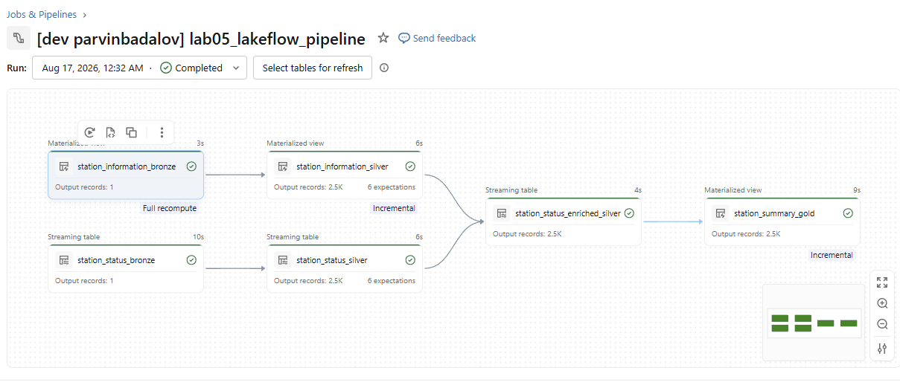

The graph demonstrates both branches joining at enriched Silver:

```text
station_information_bronze
        ↓
station_information_silver
        ┐
        │
        ├──► station_status_enriched_silver
        │              ↓
        │      station_summary_gold
        │
station_status_bronze
        ↓
station_status_silver
        ┘
```

---

# Expectations

## 8. `station_status_silver`

Six expectations are applied to the streaming Silver dataset.

The rules include:

- non-null `station_id`
- non-negative bike count
- non-negative dock count
- last-reported monitoring
- renting-flag monitoring
- returning-flag monitoring

The successful captured update shows:

```text
Written       100% (2,509)
Dropped       0% (0)
Failed rows   0
```

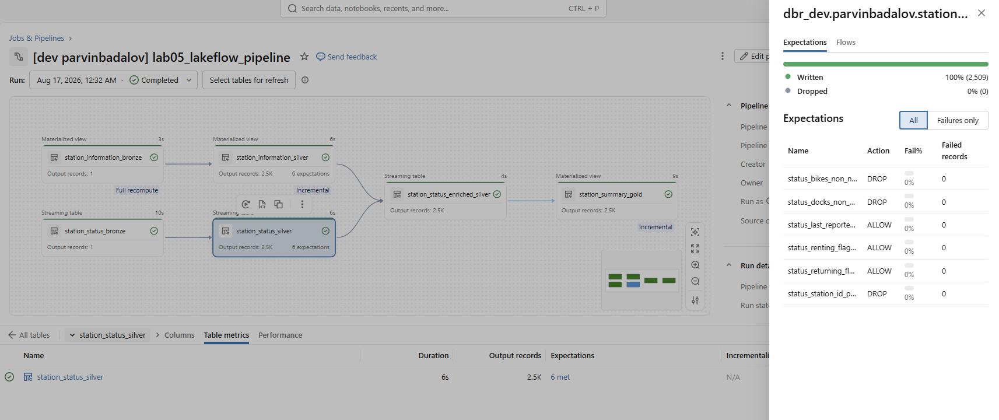

---

## 9. `station_information_silver`

Six expectations are also applied to the reference Silver dataset.

They cover:

- `station_id`
- station name
- capacity
- latitude range
- longitude range
- non-negative capacity

The successful captured update shows:

```text
Written       100% (2,509)
Dropped       0% (0)
Failed rows   0
```

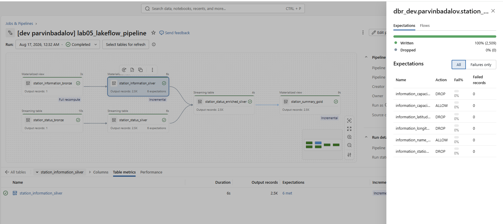

---

# Safe reload and incremental processing

## 10. Safe rerun

The pipeline was run normally again **without creating a new status file**.

The result remained:

```text
Status source files      : 11
Bronze status documents  : 11
Silver status rows       : 27,599
Reference stations       : 2,509
Enriched rows            : 27,599
Join coverage            : 100.00%
Gold station rows        : 2,509
```

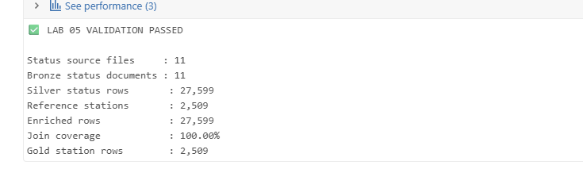

This proves a normal pipeline rerun did not duplicate already processed source files.

---

## 11. Incremental ingestion

The single-shot producer was then run exactly once to create one new immutable JSON snapshot.

After the next normal Lakeflow update:

```text
Before                       After
------                       -----
Source files       11   →    12
Bronze documents   11   →    12
Silver rows        27,599 →  30,108
Enriched rows      27,599 →  30,108
Gold rows          2,509  →  2,509
Join coverage      100%   →  100%
```

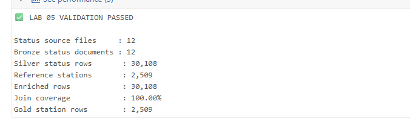

This demonstrates that Auto Loader processed only the newly arriving file and propagated the new observations through Silver and Gold.

---

# Final validation

## 12. Final validation summary

The final validation notebook completed successfully:

```text
LAB 05 VALIDATION PASSED

Status source files      : 12
Bronze status documents  : 12
Silver status rows       : 30,108
Reference stations       : 2,509
Enriched rows            : 30,108
Join coverage            : 100.00%
Gold station rows        : 2,509
```

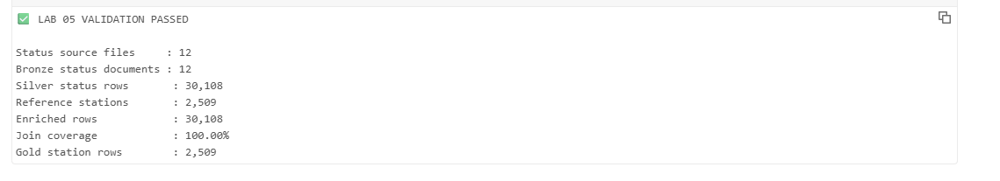

---

## 13. Validation matrix

The final notebook checks 20 end-to-end invariants, including:

- every expected pipeline dataset exists
- one Bronze row per source file
- Silver contains rows
- no invalid station IDs
- bike and dock counts are valid
- status record IDs are unique
- coordinates and capacity are valid
- reference station IDs are unique
- station join coverage is 100%
- Gold observation counts are valid
- Gold reference matches are valid
- Gold availability band is populated

All checks passed.

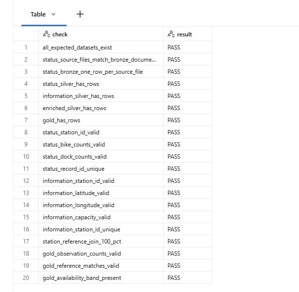

---

# Bronze layer

## `station_status_bronze`

Type:

```text
Streaming Table
```

Source:

```text
external volume
→ landing/station_status/*.json
→ Auto Loader
```

Lakeflow owns the streaming-table state, so the pipeline source does not manually call:

```text
writeStream
checkpointLocation
start()
awaitTermination()
```

## `station_information_bronze`

Type:

```text
Materialized View
```

Source:

```text
managed volume
→ reference/station_information.json
```

Bronze preserves the raw GBFS envelope and source-file metadata.

---

# Silver layer

## `station_status_silver`

Transforms each GBFS status document into one row per station observation.

Important derived fields include:

```text
last_reported_at
snapshot_last_updated_at
status_record_id
```

`status_record_id` is derived from:

```text
_source_file + station_id
```

which gives one deterministic observation identifier per station per source snapshot.

## `station_information_silver`

Transforms the reference document into one row per station.

Important fields include:

```text
station_id
station_name
short_name
latitude
longitude
region_id
capacity
rental_uris
```

## `station_status_enriched_silver`

Performs the stream-static enrichment:

```text
station_status_silver
        +
station_information_silver
        |
        | station_id
        v
station_status_enriched_silver
```

The final validation confirmed **100% join coverage**.

---

# Gold layer

`station_summary_gold` is a materialized view that summarizes station history.

Metrics include:

- observation count
- first / last observation timestamp
- average / min / max bikes available
- average / min / max docks available
- average bike availability %
- average dock availability %
- average e-bikes available
- renting / returning outage observations
- unmatched-reference observations
- availability band

Availability bands:

```text
VERY_LOW
LOW
BALANCED
HIGH
VERY_HIGH
UNKNOWN
```

---

# Single-shot Citi Bike producer

`tools/citibike_status_producer.py` performs exactly one cycle:

```text
poll Citi Bike GBFS
        ↓
validate payload
        ↓
write one immutable timestamped JSON file
        ↓
exit
```

This makes new-file arrival explicit and easy to test.

Example destination:

```text
/Volumes/<catalog>/<schema>/
lab05_lakeflow_streaming/
landing/station_status/
station_status_<timestamp>.json
```

---

# Classic Spark vs Lakeflow

A detailed comparison is available in:

```text
CLASSIC_VS_LAKEFLOW.md
```

The main distinction is **not** whether Auto Loader can be used.

### Classic Spark / Jobs

Classic Spark Jobs can also use Auto Loader:

```python
spark.readStream.format("cloudFiles")
```

The developer still explicitly manages more of the streaming application
lifecycle:

```text
writeStream
checkpoint/state location
output mode
trigger
query startup / termination
orchestration
quality metrics
recovery logic
```

### Lakeflow

The same Auto Loader source can feed a declarative streaming table:

```text
@dp.table
+ spark.readStream.format("cloudFiles")
```

while Lakeflow manages the execution graph, dataset lifecycle, streaming state,
expectation metrics, and lineage.

This clarification reflects review feedback: **Auto Loader is available in
classic Jobs too; the procedural-versus-declarative lifecycle is the important
difference.**

---

# Databricks Asset Bundle

Lab 05 is deployed through three Bundle resources plus one reusable runner:

```text
resources/
├── lab05_infrastructure.yml
├── lab05_lakeflow_pipeline.yml
└── lab05_lakeflow_job.yml

tools/
└── run_academy_lab.sh
```

The production infrastructure resource creates the isolated schema and managed
Volumes before the Job is run.

Target model:

```text
azure_dev      → dbr_dev.parvinbadalov + GP1/GP2 for Job tasks
azure_prod     → dbr_dev.parvinbadalov_lab05_prod + GP1/GP2
personal_dev   → dbr_dev.parvinbadalov + serverless Job tasks
personal_prod  → dbr_dev.parvinbadalov_lab05_prod + serverless Job tasks
```

The Lakeflow pipeline itself remains serverless in all targets. Azure Job
notebook/Python tasks can use GP1/GP2 through `tools/run_academy_lab.sh`.

Execution evidence in this README uses **Personal Prod**. The Azure production
target is intentionally kept as a clean shared run environment and its
run results are not documented here.

---

# Lakeflow Job orchestration

The final Job contains four operational tasks:

```text
01_source_preparation
        ↓
produce_status_snapshot
        ↓
run_lakeflow_pipeline
        ↓
validate_pipeline
```

The tasks perform:

1. **Source preparation** — creates runtime folders, prepares the reference
   file, and seeds source snapshots; it contains no schema/Volume DDL.
2. **Producer task** — creates exactly one new immutable `station_status`
   snapshot.
3. **Pipeline task** — triggers `lab05_lakeflow_pipeline` with
   `full_refresh: false`.
4. **Validation task** — verifies the final pipeline outputs and invariants.

## Personal Prod execution

The Personal Prod target provides a clean production-style execution proof
without using the shared Azure run environment.

```text
Target  : personal_prod
Catalog : dbr_dev
Schema  : parvinbadalov_lab05_prod
Compute : serverless
Status  : SUCCESS
```

All four tasks completed successfully.

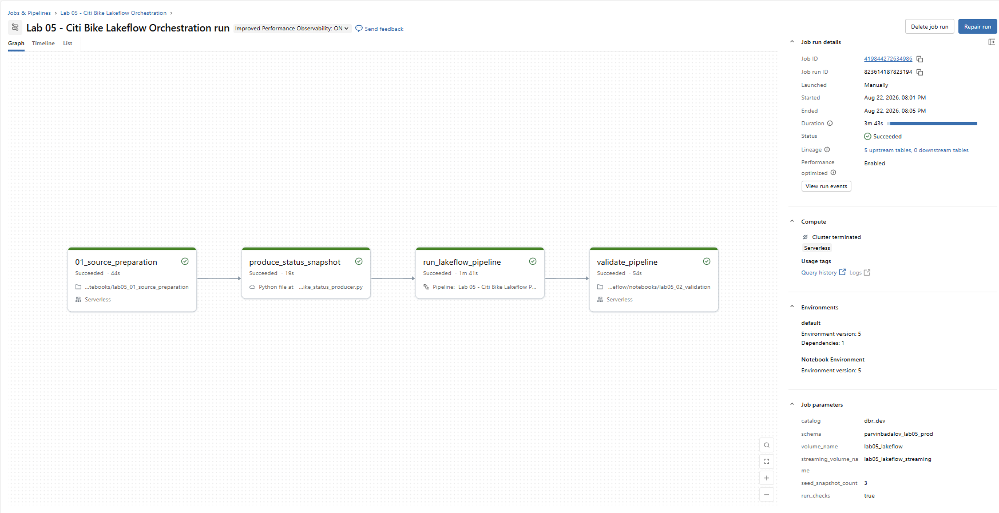

The timeline shows the four dependent tasks completing in sequence.

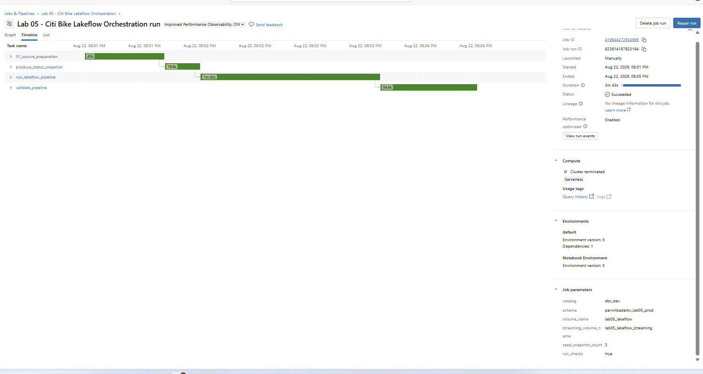

The production-style schema contains the six Lakeflow datasets and the two
managed Lab 05 Volumes.

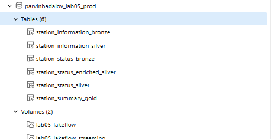

The workspace Jobs view shows the separate development and production-style
Lab 05 Jobs.

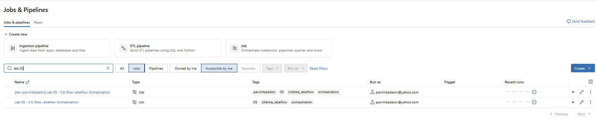

> Azure production run screenshots are intentionally excluded. The shared Azure
> target is kept clean for the person who runs or reviews the project.

---

# Recommended execution order

## Development / learning flow

The original setup notebook can still be used when learning or preparing the
development environment manually:

```text
notebooks/lab05_00_setup.ipynb
```

## Production-style flow

For a fresh production-style target, deploy first:

```text
databricks bundle deploy -t <prod-target>
```

The Bundle creates/manages:

```text
Lab 05 production schema
lab05_lakeflow Volume
lab05_lakeflow_streaming Volume
Lakeflow pipeline
orchestration Job
```

Then the Job can run directly:

```text
01_source_preparation
→ produce_status_snapshot
→ run_lakeflow_pipeline
→ validate_pipeline
```

No separate schema/Volume DDL task is required inside the Job.

## Clean run handoff

The Personal Prod target is used as the documented execution proof.

The shared Azure production target is intended to remain ready for the next
person who runs or reviews the project. After validation/deployment it should be
left clean rather than adding Azure production run screenshots to the project
documentation.

---

# Design decisions

## Infrastructure is separate from the operational Job

Schema and managed Volume creation are handled by
`resources/lab05_infrastructure.yml` for production-style targets.

`lab05_00_setup.ipynb` remains useful for development/learning, but the final
operational Job contains no schema/Volume DDL.

## Runtime directories belong to source preparation

`lab05_01_source_preparation.ipynb` creates:

```text
reference/
test_data/
landing/station_status/
```

inside already-created Volumes.

## Dev and Prod are isolated

Lakeflow-managed tables cannot be owned by two pipelines at the same time.
Therefore production uses:

```text
dbr_dev.parvinbadalov_lab05_prod
```

instead of sharing `dbr_dev.parvinbadalov` with development.

## Triggered rather than continuous

The pipeline is configured as triggered:

```yaml
continuous: false
serverless: true
```

because the lab deliberately creates periodic Citi Bike snapshots rather than
requiring an always-on streaming service.

## Reusable expectations

Quality expressions live in:

```text
src/quality_rules.py
```

The same rules can be tested independently rather than duplicating expressions
across pipeline files and tests.

## Auto Loader is available in both approaches

Classic Structured Streaming Jobs and Lakeflow can both use Auto Loader
(`cloudFiles`). The comparison focuses on how much lifecycle/state/orchestration
logic is managed explicitly by the developer versus declaratively by Lakeflow.

---

# Completion status

Core Lab 05 requirements are complete:

```text
Streaming source                         PASS
JSON/reference source                    PASS
Silver expectations                      PASS
Lineage / DAG                            PASS
Safe rerun                               PASS
Incremental ingestion                    PASS
Classic Spark comparison                 PASS
Auto Loader review clarification          PASS
Asset Bundle deployment                  PASS
Bundle-managed production infrastructure PASS
Development execution                    PASS
Personal production execution            PASS
Final validation                         PASS
Clean deploy-only handoff design         PASS
```

The operational Job contains four tasks with no schema/Volume DDL.

Personal Prod is the production-style execution evidence used in this README.
Azure production execution results are intentionally excluded.

---

# Shared Azure run environment

The repository supports the shared Azure targets through the same Bundle
configuration and reusable runner.

For the final shared state, Azure production is treated as a
**clean runnable environment**, not as documentation evidence.

This README therefore does **not** include:

```text
Azure Prod run IDs
Azure Prod success/failure history
Azure Prod execution screenshots
Azure Prod timing results
```

The documented production-style proof comes from `personal_prod`, while the
Azure target remains available for the next person to review and run.

---

# Evidence index

The original Lab 05 evidence remains useful for the core implementation. Keep
the existing repository screenshots `02` through `13` where they are still
accurate.

| Screenshot | Evidence |
|---|---|
| `01_environment_setup.png` | Personal Prod schema with six pipeline datasets and two managed Volumes |
| `02_source_profile.png` | existing source-profile evidence — keep from the repository |
| `03_join_validation.png` | 100% `station_id` join coverage |
| `04_source_preparation_passed.png` | source-preparation validation PASS |
| `05_quality_rules_tests.png` | reusable expectation/unit tests passing |
| `06_pipeline_success.png` | existing Lakeflow pipeline success evidence — keep |
| `07_pipeline_dag.png` | existing declarative lineage/DAG evidence — keep |
| `08_expectation_results_status.png` | existing status Silver expectation evidence — keep |
| `09_expectation_results_information.png` | existing information Silver expectation evidence — keep |
| `10_safe_rerun.png` | existing safe-rerun evidence — keep |
| `11_incremental_ingestion.png` | existing one-new-file incremental-ingestion evidence — keep |
| `12_final_validation.png` | existing final validation PASS evidence — keep |
| `13_validation_matrix.png` | existing validation-matrix evidence — keep |
| `14_job_orchestration_dag.png` | **Personal Prod** four-task successful Job DAG |
| `15_job_timeline.png` | **Personal Prod** successful four-task timeline |
| `16_personal_prod_jobs.png` | Personal workspace showing separate dev and production-style Lab 05 Jobs |

No Azure production execution screenshot is included.

---

## Result

Lab 05 demonstrates an end-to-end Lakeflow declarative pipeline that combines
streaming and batch JSON sources, applies declarative expectations, enriches
station observations with reference metadata, produces a Gold materialized
view, reloads safely, and processes newly arriving files incrementally.

The final project also demonstrates:

- Auto Loader in both classic Structured Streaming and Lakeflow
- Bundle-managed production-style schema and managed Volumes
- isolated Dev/Prod Lakeflow table ownership
- target-specific compute behavior
- serverless Lakeflow pipeline execution
- a four-task operational Job with no schema/Volume DDL
- successful **Personal Prod** execution
- a clean shared Azure run environment without publishing Azure Prod run evidence
