# Lab 06 — Gold Analytics, Governance & AI/BI

## Overview

Lab 06 builds a business-facing Gold analytics solution in Databricks using the **Synthea synthetic healthcare dataset**.

The project covers:

- Gold-layer **fact and dimension tables**
- star-schema design
- business aggregate tables
- AI/BI Dashboard
- Genie Agent
- Unity Catalog governance with **GRANTs, Row-Level Security (RLS), and Column-Level Security (CLS)**
- data-volume monitoring with a Databricks SQL Alert and email notification
- reusable PySpark transformation and quality logic
- automated pytest validation
- Databricks Asset Bundle deployment
- serverless multi-task Gold Job orchestration

The implementation intentionally separates recurring data processing from one-time setup, governance demonstrations, alert simulation, dashboard creation, and Genie configuration.

---

## Source Data — Synthea Healthcare

The source is the **Synthea 1K synthetic patient sample**, distributed as CSV files.

The Lab 06 source-preparation notebook downloads the November 2021 Synthea sample archive from the Synthea sample-data GitHub repository:

```text
synthea_sample_data_csv_nov2021.zip
```

The archive contains multiple synthetic healthcare CSV datasets. Lab 06 models these six primary files:

| Source file | Role | Observed rows |
|---|---|---:|
| `patients.csv` | patient master data | 1,163 |
| `encounters.csv` | healthcare encounters | 61,459 |
| `providers.csv` | healthcare providers | 5,056 |
| `organizations.csv` | healthcare organizations | 1,127 |
| `payers.csv` | insurance / payer reference | 10 |
| `conditions.csv` | patient condition events | 38,094 |

The data is **synthetic**, so it is suitable for demonstrating healthcare analytics and privacy controls without using real patient records.

The encounter history spans from **1912-09 through 2021-11**. Only observed months are materialized in the monthly landing structure.

### Storage

Lab 06 uses a Unity Catalog **EXTERNAL volume** backed by ADLS Gen2:

```text
dbr_dev.parvinbadalov.lab06_gold_analytics
```

Storage location:

```text
abfss://parvinbadalov@dlspl21databricks.dfs.core.windows.net/lab06_gold_analytics
```

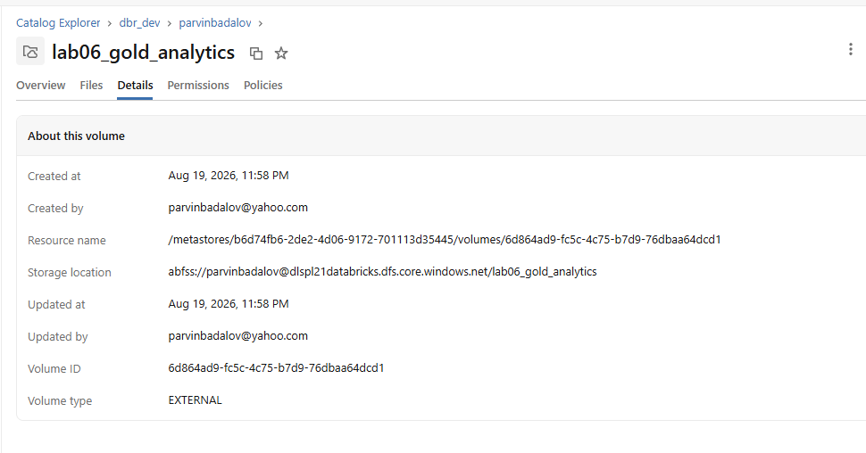

---

## Source Preparation

`lab06_00_source_preparation`:

1. validates the external volume,
2. downloads and extracts the Synthea CSV archive,
3. confirms required files,
4. validates required columns,
5. stages reference datasets,
6. validates source/reference paths.

All required source-preparation checks passed.

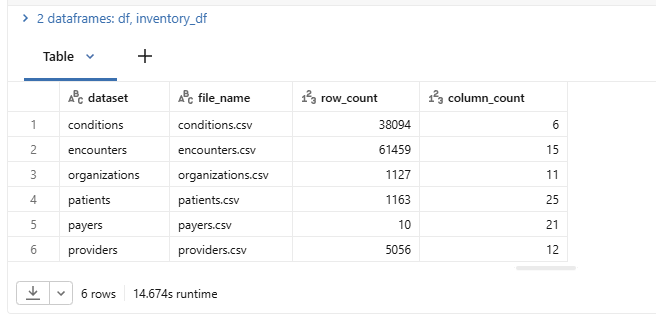

---

## Monthly Encounter Batching

The encounter data is written to a month-partitioned landing area using one Spark write operation.

```text
/Volumes/dbr_dev/parvinbadalov/lab06_gold_analytics/landing/encounters/
└── encounter_month=YYYY-MM/
```

Validation result:

| Check | Result |
|---|---:|
| Source encounter rows | 61,459 |
| Landing encounter rows | 61,459 |
| Observed monthly partitions | 1,121 |
| First month | 1912-09 |
| Last month | 2021-11 |
| Invalid START rows | 0 |
| Duplicate encounter IDs | 0 |

No Python loop is used to write individual months; Spark handles the partitioned write directly.

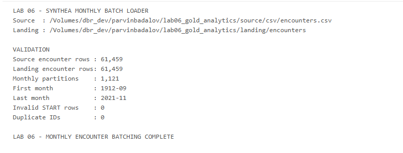

---

# Gold Star Schema

## Dimensions

Six Gold dimensions are created:

```text
dim_date
dim_patient
dim_provider
dim_organization
dim_payer
dim_condition
```

`dim_date` is generated independently from a configured date range rather than being derived from distinct fact dates.

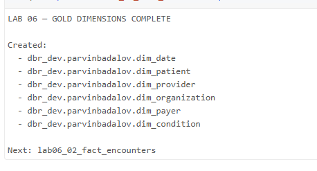

## `fact_encounters`

**Grain:** one healthcare encounter.

Major measures include:

- encounter duration
- base encounter cost
- total claim cost
- payer coverage
- patient responsibility

The fact contains foreign keys to date, patient, provider, organization, and payer dimensions.

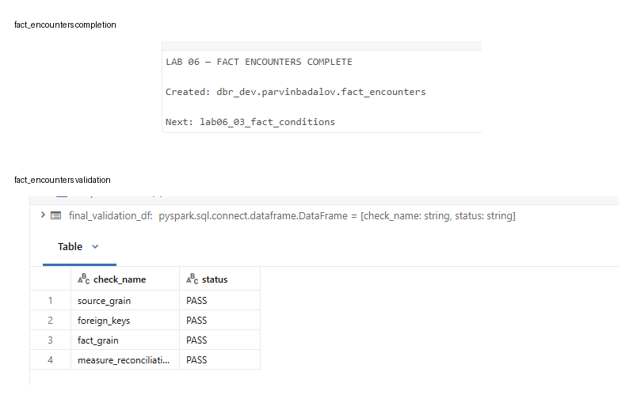

## `fact_conditions`

**Grain:** one patient-condition occurrence/event.

The fact connects condition events to:

- patient
- condition
- encounter
- condition start date

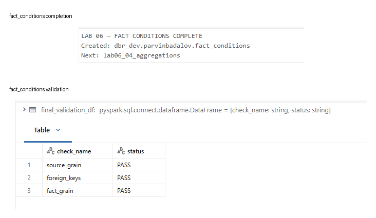

---

## Gold Aggregates

Business-facing aggregate tables:

```text
agg_daily_encounters
agg_organization_performance
agg_payer_performance
agg_condition_summary
```

These aggregates support dashboard and Genie workloads while avoiding repeated business calculations.

Validation includes encounter, condition, and financial reconciliation.

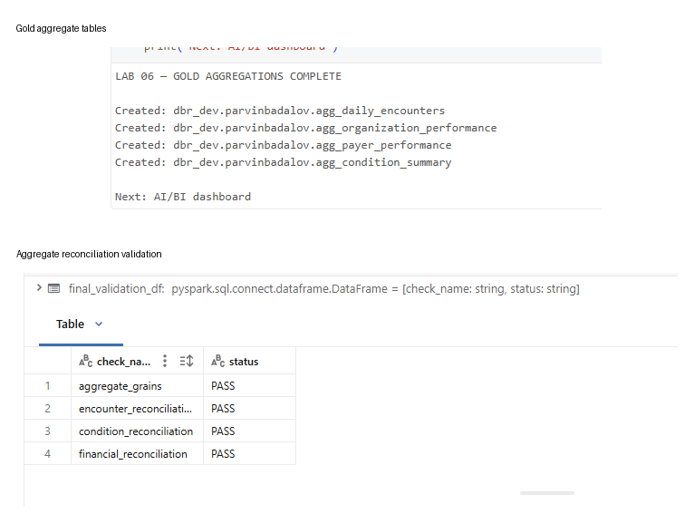

---

# Runtime Parameter Design

Recurring Gold notebooks do not duplicate visible widget definitions.

The production flow is:

```text
resources/lab06_gold_job.yml
            ↓
      Job parameters
            ↓
   src/runtime_config.py
            ↓
      src/config.py
            ↓
 processing notebooks
```

Job-level parameters include:

```text
catalog
schema
volume_name
date_start
date_end
rebuild_dim_date
run_validation
```

For manual development, `lab06_00_dev_runner` supplies the same parameters and can execute one notebook or the complete Gold chain.

This keeps the production notebooks focused on transformation logic while keeping environment/runtime values at the Job level.

---

# Governance

## Row-Level Security

Organization-based RLS is demonstrated on `fact_encounters`.

A user-to-organization access mapping controls which organization rows are visible.

Validation result:

```text
baseline rows             = 61,459
expected restricted rows  = 2,184
actual restricted rows    = 2,184
status                    = PASS
```

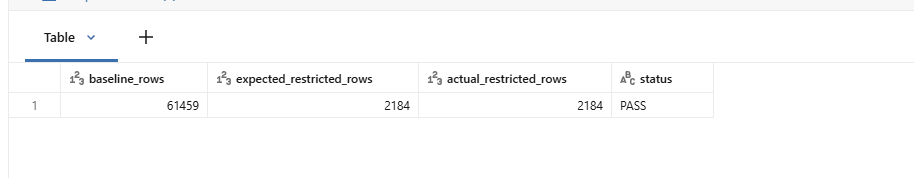

## Column-Level Security

Patient-identifying synthetic columns are masked for non-privileged access.

Masked fields include:

```text
ssn
first_name
last_name
address
```

Example restricted values:

```text
***MASKED***
```

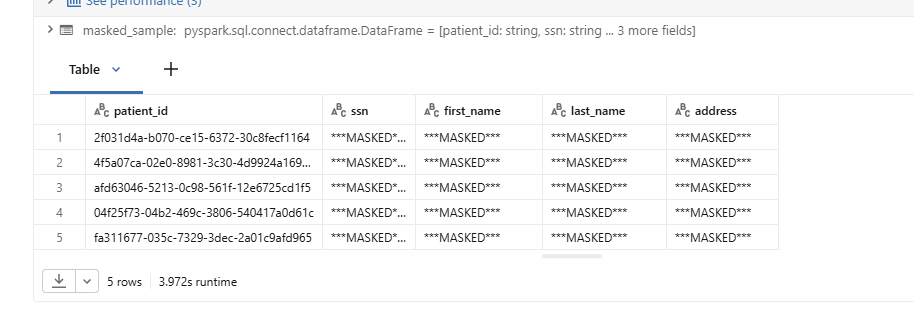

The governance notebook also validates restoration of full-access and privileged behavior after the restricted demonstrations.

---

# AI/BI Dashboard

Dashboard:

## Healthcare Operations & Cost Analytics

The dashboard provides:

### KPIs

- Total Encounters
- Unique Patients
- Total Claim Cost
- Average Claim Cost
- Emergency Encounter %

### Visuals

- monthly encounter trend
- monthly claim-cost trend
- encounters by class
- organizations by encounter volume
- payer coverage performance
- top medical conditions

The dashboard is source-controlled as a serialized AI/BI Dashboard definition and represented as a bundle resource.

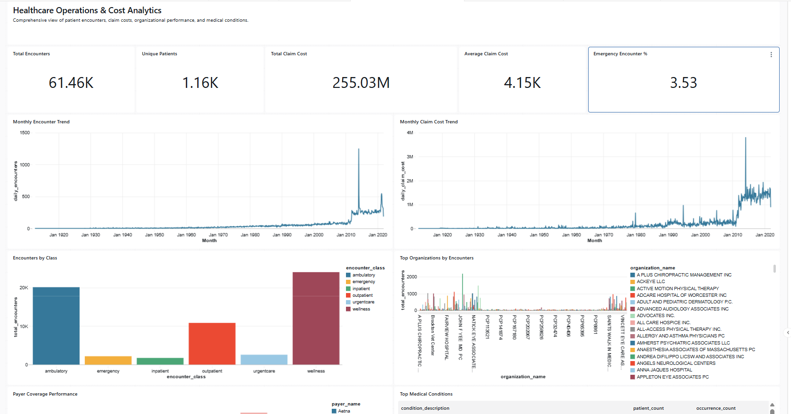

---

# Genie Agent

Genie Agent:

```text
Lab 06 — Healthcare Analytics Genie
```

The Genie Agent is configured with the Gold business model and validated against multiple natural-language questions.

### Organization analysis

Question:

```text
Which organizations had the most encounters?
```

The generated analysis correctly ranked **LAHEY HOSPITAL & MEDICAL CENTER BURLINGTON** first with **2,184 encounters**.

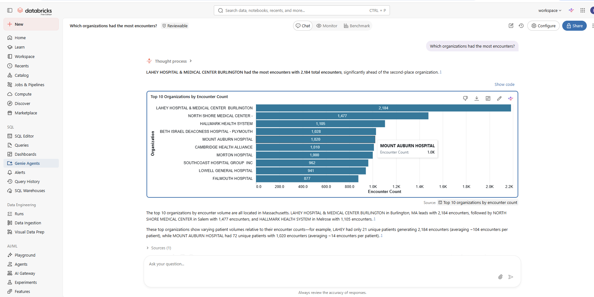

### Medical-condition analysis

The validated query ranks conditions by `condition_event_count`.

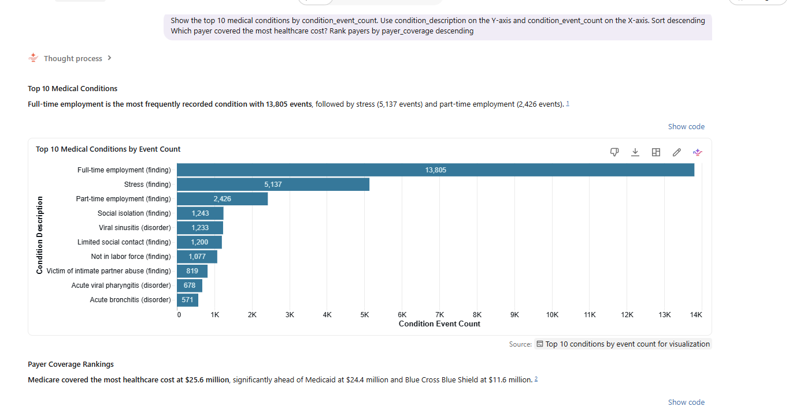

### Payer analysis

The validated payer query ranks payers by `payer_coverage`.

Medicare had the highest payer coverage in the sample.

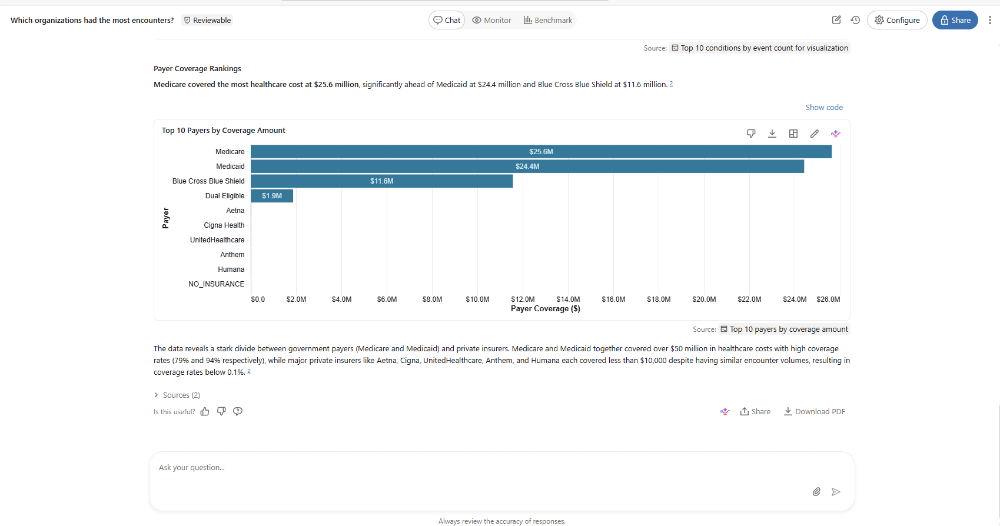

The Genie definition is exported to source control and managed with the Databricks bundle.

---

# Volume-Drop Monitoring

Synthea is a **static historical sample**, not a live feed. Therefore Lab 06 does not pretend that a real production drop occurred.

Instead, the alert demo uses a controlled low-volume test month based on the recent historical baseline.

```text
Baseline months   : 2021-08 → 2021-10
Baseline average  : 326 encounters
Test month        : 2021-12
Simulated count   : 65
Volume drop       : 80.06%
Threshold         : 30%
should_alert      : 1
Status            : TRIGGERED
```

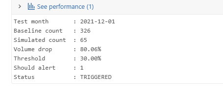

The SQL Alert evaluates:

```text
FIRST_ROW(should_alert) = 1
```

The bundle-managed alert is intentionally left with its automated schedule **PAUSED** after the demonstration because the static simulated metric remains in a triggered state.

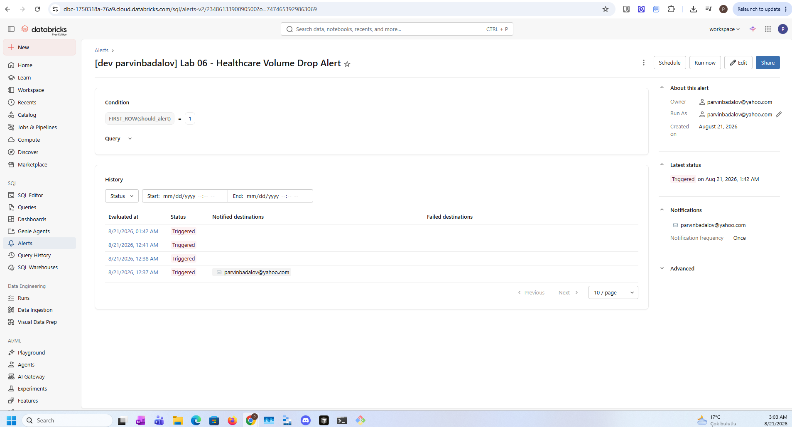

An actual Databricks email notification was successfully delivered.

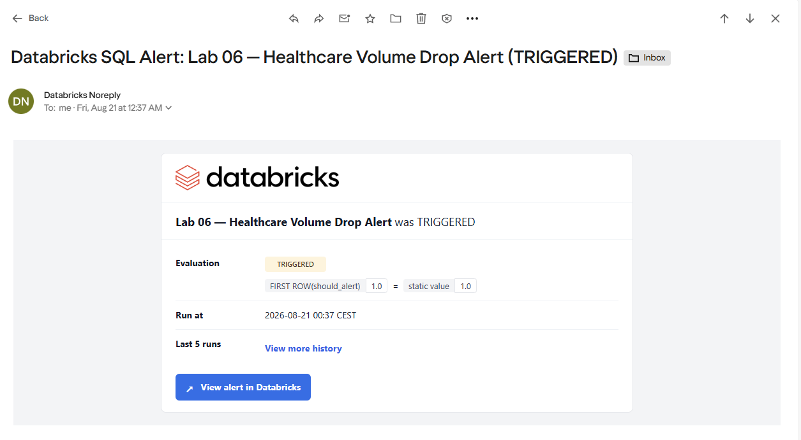

---

# Final Validation

`lab06_07_validation` performs the final recurring Gold checks.

All validation areas passed:

```text
required_tables             PASS
dimension_keys              PASS
fact_grains                 PASS
foreign_keys                PASS
aggregate_grains            PASS
aggregate_reconciliation    PASS
business_sanity             PASS
```

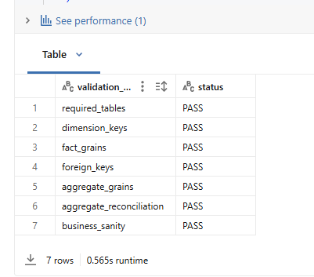

---

# Automated Tests

Reusable PySpark logic is tested with pytest.

Test modules:

```text
tests/
├── test_dimensions.py
├── test_fact_encounters.py
├── test_aggregations.py
└── test_quality_rules.py
```

Test coverage includes:

- independent date-dimension generation
- deterministic date keys
- weekend attributes
- encounter grain
- encounter duration
- patient responsibility
- daily aggregation
- emergency encounter percentage
- financial reconciliation
- duplicate-grain detection
- null-key detection
- reconciliation rules

Final result:

```text
12 passed
pytest exit code: 0
```

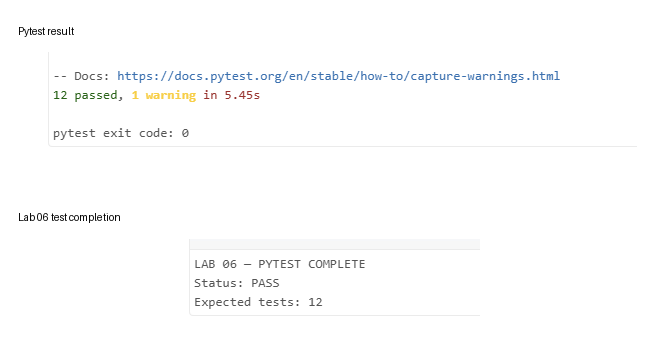

---

# Gold Job

The recurring production DAG contains only normal Gold processing:

```text
01_dimensions
      ↓
02_fact_encounters
      ↓
03_fact_conditions
      ↓
04_aggregations
      ↓
07_validation
```

The full serverless Job completed successfully.

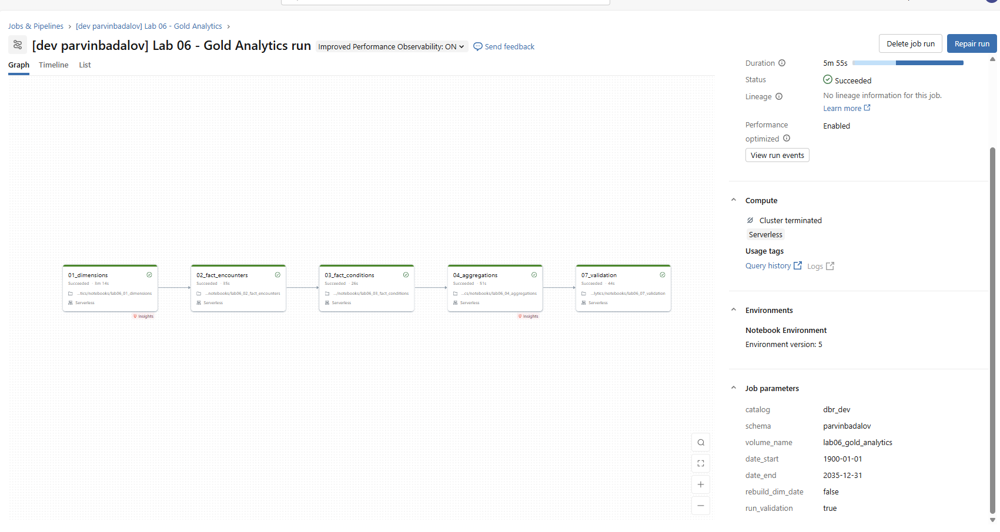

The following are deliberately outside the recurring Job:

- source download/setup
- development runner
- governance policy setup/demo
- alert simulation
- pytest runner
- AI/BI Dashboard creation
- Genie Agent configuration

Retries are configured at the Databricks task level rather than with custom Python retry loops.

---

# Repository Structure

```text
labs/lab_06_gold_analytics/
├── README.md
│
├── notebooks/
│   ├── lab06_00_source_preparation.ipynb
│   ├── lab06_00_dev_runner.ipynb
│   ├── lab06_01_dimensions.ipynb
│   ├── lab06_02_fact_encounters.ipynb
│   ├── lab06_03_fact_conditions.ipynb
│   ├── lab06_04_aggregations.ipynb
│   ├── lab06_05_governance.ipynb
│   ├── lab06_06_alert_simulation.ipynb
│   ├── lab06_07_validation.ipynb
│   └── lab06_08_pytest.ipynb
│
├── src/
│   ├── __init__.py
│   ├── config.py
│   ├── runtime_config.py
│   ├── gold_transformations.py
│   └── quality_rules.py
│
├── tools/
│   └── synthea_batch_loader.py
│
├── sql/
│   ├── dashboard_queries.sql
│   ├── governance_policies.sql
│   └── alert_volume_drop.sql
│
├── tests/
│   ├── test_dimensions.py
│   ├── test_fact_encounters.py
│   ├── test_aggregations.py
│   └── test_quality_rules.py
│
├── dashboards/
│   └── healthcare_operations_cost_analytics.lvdash.json
│
├── genie/
│   ├── genie_space_notes.md
│   └── lab_06_healthcare_analytics_genie.geniespace.json
│
└── images/
```

Bundle resources:

```text
resources/
├── lab06_infrastructure.yml
├── lab06_gold_job.yml
├── lab06_alert.yml
├── healthcare_operations_cost_analytics.dashboard.yml
└── lab_06_healthcare_analytics_genie.genie_space.yml
```

---

# Bundle Configuration

The bundle uses the direct deployment engine:

```yaml
bundle:
  name: databricks-academy-lakehouse
  engine: direct
```

Personal validation:

```bash
databricks bundle validate -t personal_dev
```

Selective Gold Job deployment:

```bash
databricks bundle deploy \
  -t personal_dev \
  --select jobs.lab06_gold_job
```

Gold Job run:

```bash
databricks bundle run \
  -t personal_dev \
  lab06_gold_job
```

The dashboard, Genie Agent, SQL Alert, Job, and infrastructure are all represented as bundle resources.

---

# Key Design Decisions

1. **External ADLS-backed volume** instead of hidden managed file storage.
2. **Independent `dim_date` generation** instead of extracting distinct fact dates.
3. **Single Spark partitioned write** for monthly encounter batching.
4. **Job-level parameters** instead of duplicated widgets in recurring notebooks.
5. **One development runner** for manual execution.
6. **Databricks task retries** instead of Python retry loops.
7. **Governance operations outside the recurring Gold Job**.
8. **Controlled alert simulation** without deleting/corrupting Gold data.
9. **Source-controlled Dashboard and Genie definitions**.
10. **Selective bundle deployment** to avoid redeploying unrelated labs.

---

# Completion Criteria

```text
Gold star schema feeds dashboard     ✅
Fact + dimension tables              ✅
Business aggregate tables            ✅
AI/BI Dashboard                      ✅
Genie Agent                          ✅
GRANT / RLS / CLS                    ✅
Simulated volume-drop alert          ✅
Email notification                   ✅
Final Gold validation                ✅
12 automated tests                   ✅
Successful multi-task Gold Job       ✅
Bundle-managed resources             ✅
```
