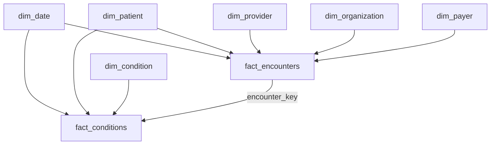

# Lab 06 External V2 — Data Model

## Overview

The Gold model uses a dimensional design with shared dimensions, two fact grains, four BI aggregates, and one monitoring table.

## Tables

| Type | Tables |
|---|---|
| Dimensions | `dim_date`, `dim_patient`, `dim_provider`, `dim_organization`, `dim_payer`, `dim_condition` |
| Facts | `fact_encounters`, `fact_conditions` |
| Aggregates | `agg_daily_encounters`, `agg_organization_performance`, `agg_payer_performance`, `agg_condition_summary` |
| Monitoring | `lab06_data_volume_metrics` |

## Fact grains

### fact_encounters

One row = one healthcare encounter.

Relationships:
- `date_key` → `dim_date`
- `patient_key` → `dim_patient`
- `provider_key` → `dim_provider`
- `organization_key` → `dim_organization`
- `payer_key` → `dim_payer`

Typical measures:
- claim cost
- payer coverage
- patient responsibility
- duration

### fact_conditions

One row = one patient-condition event.

Relationships:
- `patient_key` → `dim_patient`
- `condition_key` → `dim_condition`
- `condition_start_date_key` → `dim_date`
- `encounter_key` → `fact_encounters` when present

## Why two facts?

One encounter can be associated with multiple condition events. Combining both grains in one fact would duplicate encounter-level financial measures.

Separate facts preserve correct grain and aggregation semantics.

## Aggregates

```text
fact_encounters
├── agg_daily_encounters
├── agg_organization_performance
└── agg_payer_performance

fact_conditions
└── agg_condition_summary
```

These aggregates are optimized for BI/Genie consumption and reconcile back to the detailed facts.

## Relationship diagram


