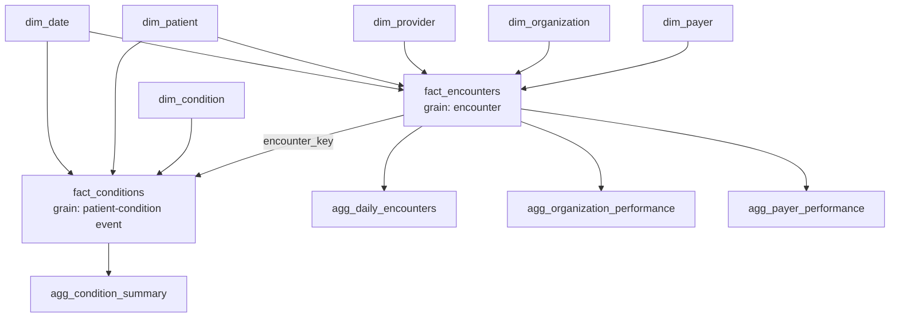

# Lab 06 External V2 — Data Model

## Model type

The Gold layer is a dimensional analytics model with two fact grains, shared dimensions, purpose-built aggregates and a monitoring table.

## Dimensions

| Dimension | Purpose |
|---|---|
| `dim_date` | Calendar attributes |
| `dim_patient` | Patient master |
| `dim_provider` | Healthcare provider master |
| `dim_organization` | Healthcare organization master |
| `dim_payer` | Insurance/payer master |
| `dim_condition` | Condition/diagnosis master |

## Facts

### `fact_encounters`

Grain: **one row per healthcare encounter**.

Key relationships:
- `date_key` → `dim_date`
- `patient_key` → `dim_patient`
- `provider_key` → `dim_provider`
- `organization_key` → `dim_organization`
- `payer_key` → `dim_payer`

Important measures:
- `total_claim_cost`
- `payer_coverage`
- `patient_responsibility`
- `duration_minutes`

### `fact_conditions`

Grain: **one row per patient-condition event**.

Key relationships:
- `patient_key` → `dim_patient`
- `condition_key` → `dim_condition`
- `condition_start_date_key` → `dim_date`
- `encounter_key` → `fact_encounters` when an encounter is available

## Aggregates

| Aggregate | Built from | Purpose |
|---|---|---|
| `agg_daily_encounters` | `fact_encounters` | Daily encounter/cost KPIs and trends |
| `agg_organization_performance` | `fact_encounters` | Organization-level performance |
| `agg_payer_performance` | `fact_encounters` | Payer cost/coverage analytics |
| `agg_condition_summary` | `fact_conditions` | Condition prevalence/activity analytics |

## Monitoring

`lab06_data_volume_metrics` is a single-row alert-support table created by notebook 06.

It is not part of the dimensional business model; it is operational monitoring metadata.

## Relationship diagram

## Why the facts are separate

Merging the two facts would create ambiguous duplication because:
- one patient can have many encounters;
- one encounter can have zero, one or many condition events;
- a condition can also span time independently of encounter cost measures.

Keeping the grains separate preserves correct counting and financial aggregation.
