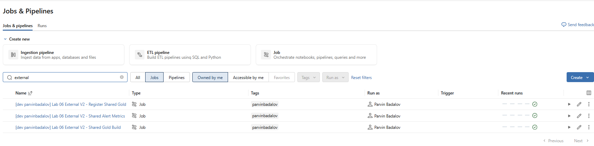
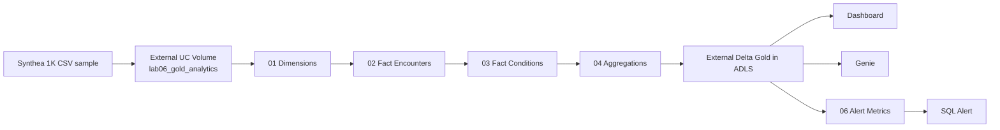
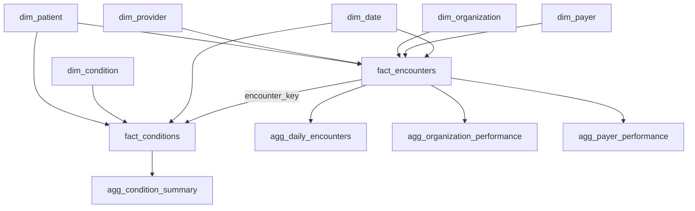
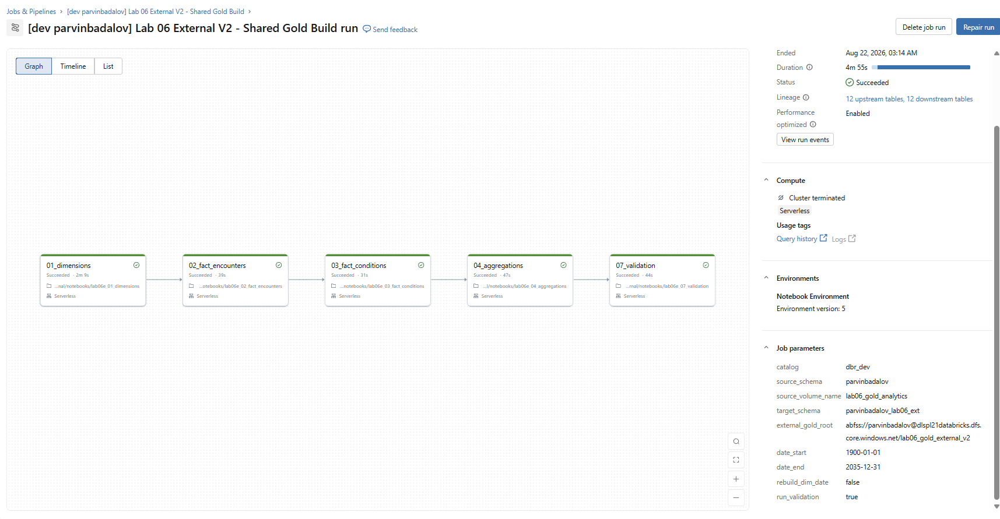
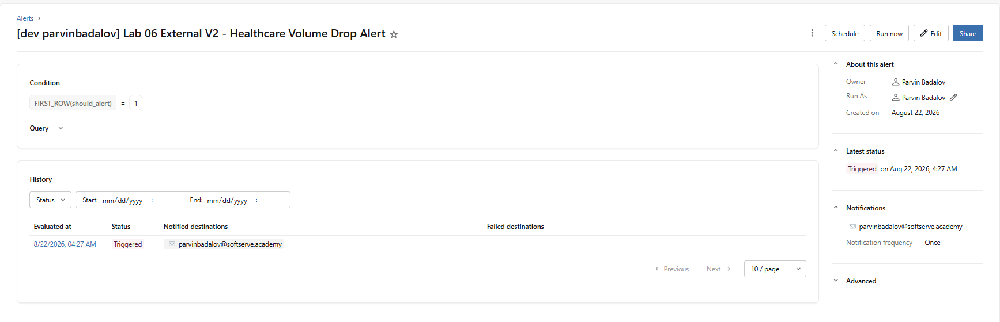
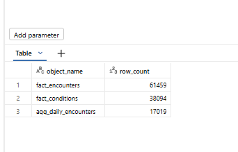
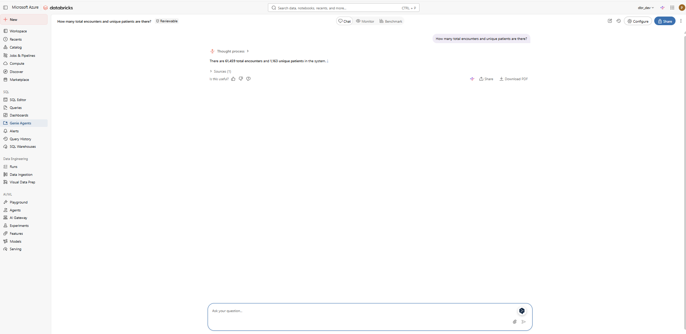
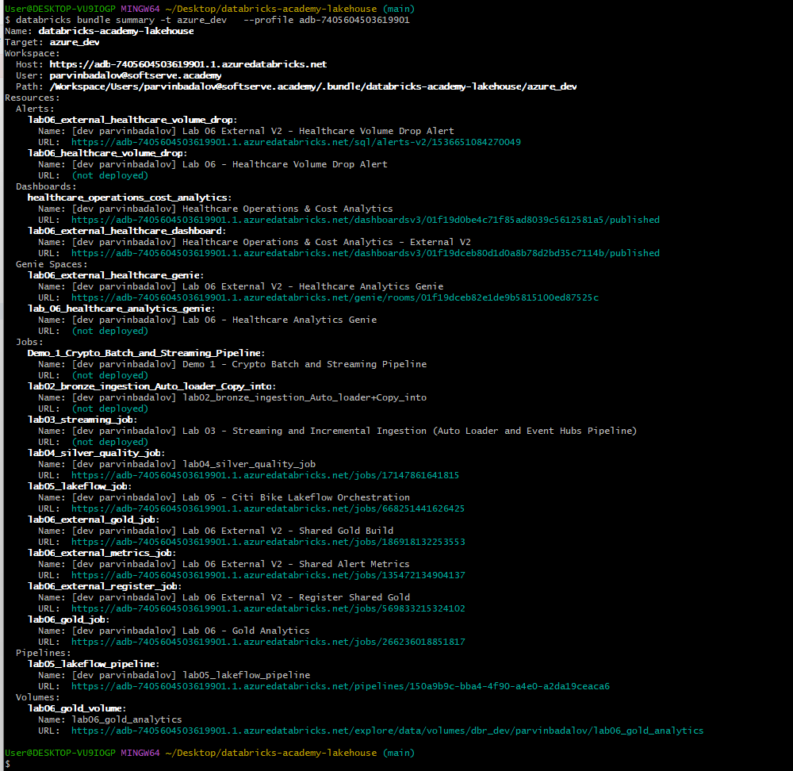

# Lab 06 External V2 — Azure Gold Analytics on External Delta

## Overview

Lab 06 External V2 builds a healthcare Gold analytics model in the **Azure / SoftServe Databricks workspace**, stores the Gold layer as **external Delta tables in Azure Data Lake Storage (ADLS)**, and deploys the analytics experience around that model:

- dimensional Gold model;
- detailed encounter and condition facts;
- pre-aggregated BI tables;
- data-volume monitoring metrics;
- Databricks Dashboard;
- Databricks Genie space;
- Databricks SQL Alert;
- Databricks Asset Bundle deployment.

The final Azure implementation has been deployed and tested end-to-end.



---

## Where the data comes from

The source dataset is the **Synthea Healthcare 1K CSV sample**.

The source-preparation notebook downloads the official sample archive:

`synthea_sample_data_csv_nov2021.zip`

from the Synthea sample-data repository and prepares six required CSV datasets:

| Source CSV | Used for |
|---|---|
| `patients.csv` | Patient dimension and patient relationships |
| `encounters.csv` | Main encounter fact |
| `providers.csv` | Provider dimension |
| `organizations.csv` | Organization dimension |
| `payers.csv` | Payer dimension |
| `conditions.csv` | Condition dimension and condition fact |

The source files are stored under the existing external Unity Catalog Volume:

```text
dbr_dev.parvinbadalov.lab06_gold_analytics
```

with the source CSV path:

```text
/Volumes/dbr_dev/parvinbadalov/lab06_gold_analytics/source/csv
```

The notebook responsible for preparing and validating this source is:

```text
notebooks/lab06_00_source_preparation.ipynb
```

It is a **bootstrap/development notebook**, not a recurring Gold Job task. If the source Volume and CSVs already exist, it does not need to be rerun.

### Source-to-Gold flow



---

## External Delta storage

External V2 writes its Gold model to:

```text
abfss://parvinbadalov@dlspl21databricks.dfs.core.windows.net/lab06_gold_external_v2
```

Each Gold table has its own Delta directory, for example:

```text
.../lab06_gold_external_v2/fact_encounters
.../lab06_gold_external_v2/fact_conditions
.../lab06_gold_external_v2/agg_daily_encounters
.../lab06_gold_external_v2/lab06_data_volume_metrics
```

The registered Azure Unity Catalog schema is:

```text
dbr_dev.parvinbadalov_lab06_ext
```

Example `DESCRIBE DETAIL` evidence for `fact_encounters`:

```text
format   = delta
name     = dbr_dev.parvinbadalov_lab06_ext.fact_encounters
location = abfss://parvinbadalov@dlspl21databricks.dfs.core.windows.net/lab06_gold_external_v2/fact_encounters
```

The complete captured output is included in:

```text
evidence/describe_detail_fact_encounters.txt
```

---

## Gold data model

The schema contains **13 Gold/monitoring tables**:

| Layer | Tables | Count |
|---|---|---:|
| Dimensions | `dim_date`, `dim_patient`, `dim_provider`, `dim_organization`, `dim_payer`, `dim_condition` | 6 |
| Facts | `fact_encounters`, `fact_conditions` | 2 |
| Aggregates | `agg_daily_encounters`, `agg_organization_performance`, `agg_payer_performance`, `agg_condition_summary` | 4 |
| Monitoring | `lab06_data_volume_metrics` | 1 |


### Why there are two fact tables

The two facts represent different business grains.

**`fact_encounters`**
- Grain: one row per healthcare encounter.
- Main relationships: patient, provider, organization, payer, date.
- Measures include claim cost, payer coverage, patient responsibility and encounter duration.

**`fact_conditions`**
- Grain: one row per patient-condition event.
- Main relationships: patient, condition, condition start date and, where available, the related encounter.

They are intentionally separate because an encounter and a condition occurrence are different business events.

### Logical schema



The aggregate tables exist to simplify and accelerate dashboard and Genie analytics. They do **not** replace the fact tables.

---

## Job design — why three jobs?

The current implementation intentionally separates responsibilities into three reusable jobs.

| Job | Main task(s) | Purpose |
|---|---|---|
| `lab06_external_gold_job` | `01 → 02 → 03 → 04 → 07` | Build and validate the Gold model |
| `lab06_external_metrics_job` | `06_alert_metrics` | Recalculate the alert metric without rebuilding Gold |
| `lab06_external_register_job` | `05_register_shared_tables` | Re-register existing external Delta paths in the current workspace without recomputing Gold |

This modular structure is useful because:
- alert metrics can be refreshed independently;
- table registration can be repaired/repeated independently;
- the expensive Gold build does not need to run for every operational action.

For a manager/demo run, use the sequence in `RUNBOOK.md`.



---

## What notebook 06 does

`06_alert_metrics` creates the single-row monitoring table:

```text
dbr_dev.parvinbadalov_lab06_ext.lab06_data_volume_metrics
```

It calculates a historical monthly baseline, compares it with a simulated observed volume, and writes fields such as:

```text
should_alert
alert_status
baseline_encounter_count
observed_encounter_count
volume_drop_pct
drop_threshold_pct
generated_at
```

The test configuration intentionally simulates a large drop so that the SQL Alert can be demonstrated.

Observed test result:

```text
baseline_encounter_count = 326
observed_encounter_count = 65
volume_drop_pct          = 80.06
drop_threshold_pct       = 30
should_alert             = 1
alert_status             = TRIGGERED
```

The **SQL Alert**, not notebook 06, is responsible for evaluating:

```text
FIRST_ROW(should_alert) = 1
```

and sending the notification.



---

## What notebook 07 does

`07_validation` is the final Gold-model quality gate inside the Shared Gold Build Job.

It validates:
- required tables exist;
- tables point to the expected external ADLS locations;
- dimension surrogate/business keys are valid;
- fact grains are unique;
- fact foreign keys resolve;
- aggregate grains are valid;
- aggregate totals reconcile back to facts;
- basic business sanity checks pass.

The Gold Job fails if enabled validation does not pass.

Observed row counts from the final Azure run:

| Object | Row count |
|---|---:|
| `fact_encounters` | 61,459 |
| `fact_conditions` | 38,094 |
| `agg_daily_encounters` | 17,019 |



---

## Azure analytics validation

### Dashboard

The deployed V2 dashboard is:

```text
[dev parvinbadalov] Healthcare Operations & Cost Analytics - External V2
```

Validated KPI results:

| KPI | Result |
|---|---:|
| Total Encounters | 61.46K |
| Total Unique Patients | 1.16K |
| Total Claim Cost | $255.03M |
| Total Payer Coverage | $63.53M |
| Avg Encounter Duration | 400.2 min |
| Total Patient Responsibility | $191.5M |
| Emergency % | 3.5% |


### Genie

The deployed Genie space correctly answers analytical questions against the Gold model.

Validation question:

```text
How many total encounters and unique patients are there?
```

Validated answer:

```text
61,459 total encounters
1,163 unique patients
```



### SQL Alert

The deployed alert is:

```text
[dev parvinbadalov] Lab 06 External V2 - Healthcare Volume Drop Alert
```

The Azure run successfully reached `TRIGGERED` and notified:

```text
parvinbadalov@softserve.academy
```


---

## Asset Bundle deployment

The Azure target is:

```text
azure_dev
```

and points to:

```text
https://adb-7405604503619901.1.azuredatabricks.net
```

The final deployment includes:

- Shared Gold Build Job;
- Shared Alert Metrics Job;
- Register Shared Gold Job;
- External V2 Dashboard;
- External V2 Genie space;
- External V2 SQL Alert.



For exact deployment and execution commands, see **[RUNBOOK.md](RUNBOOK.md)**.

---

## Screenshot index

| Image | Evidence |
|---|---|
| `01_azure_v2_jobs_overview.png` | All three Azure V2 jobs with successful recent runs |
| `02_gold_build_dag_success.png` | Successful 01→02→03→04→07 Gold DAG |
| `03_gold_build_timeline.png` | Gold task timings |
| `04_register_shared_gold_success.png` | Successful registration job |
| `05_external_gold_schema_tables.png` | 13 Gold/monitoring tables in Unity Catalog |
| `06_validation_row_counts.png` | Fact/aggregate row-count validation |
| `07_azure_dashboard.png` | Final Azure dashboard |
| `08_azure_genie.png` | Genie validation response |
| `09_azure_alert_triggered.png` | Triggered Azure SQL Alert |
| `10_bundle_azure_summary.png` | Azure Asset Bundle resource summary |

---

## Final status

Lab 06 External V2 is deployed and validated in the Azure / SoftServe workspace.

```text
Synthea CSV
    ↓
External UC source Volume
    ↓
Dimensions → Facts → Aggregates
    ↓
External Delta Gold on ADLS
    ↓
Validation + Alert Metrics
    ↓
Dashboard + Genie + SQL Alert
```

The same external Delta architecture can also be registered from another Databricks workspace without copying the physical data.
