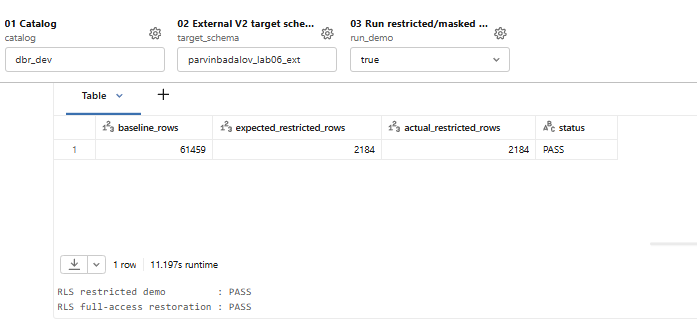
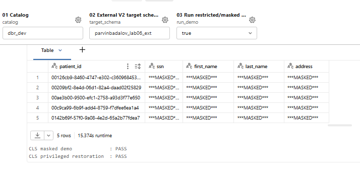
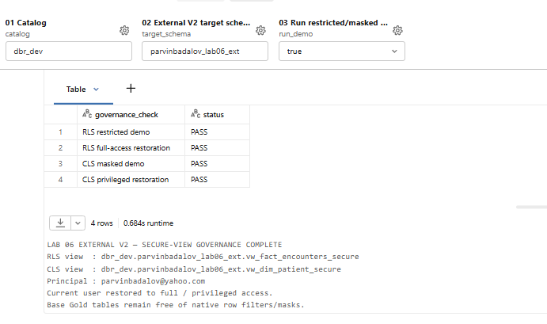
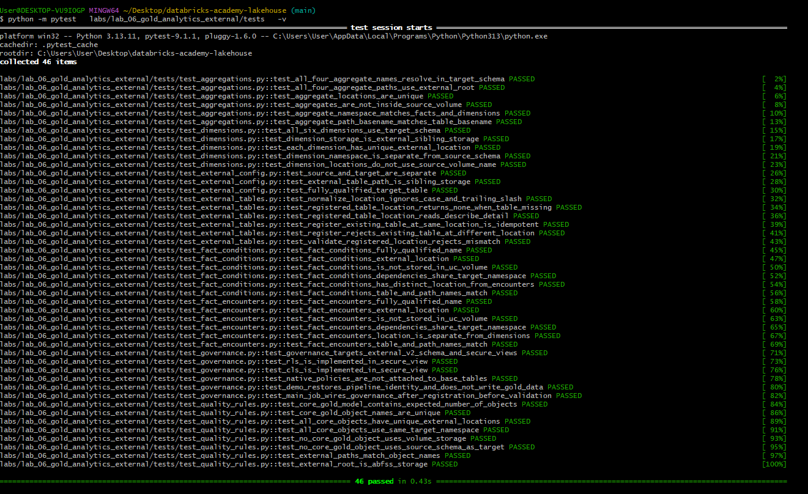
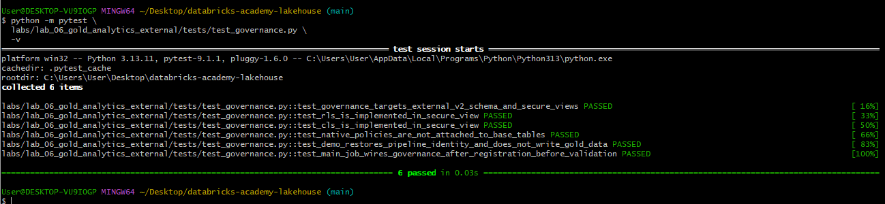
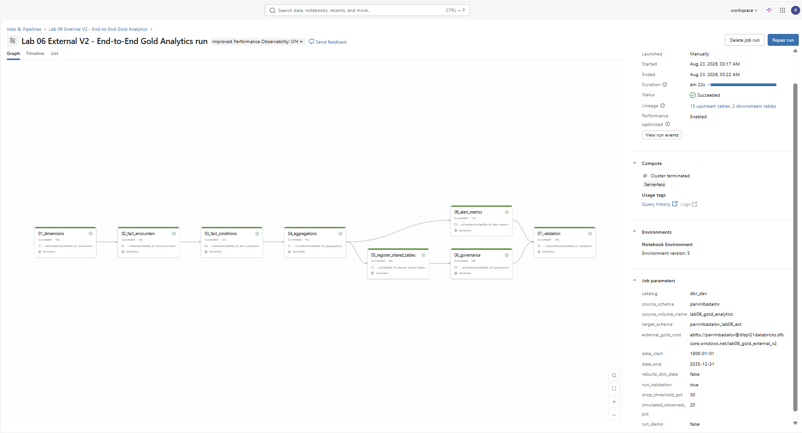
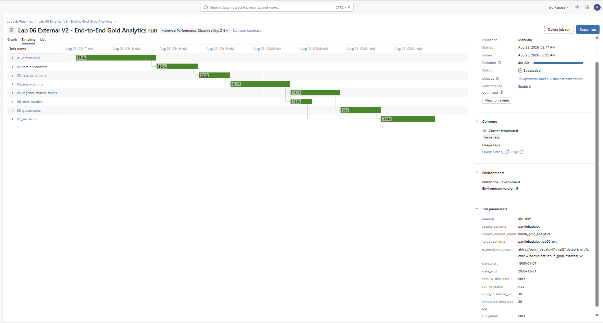
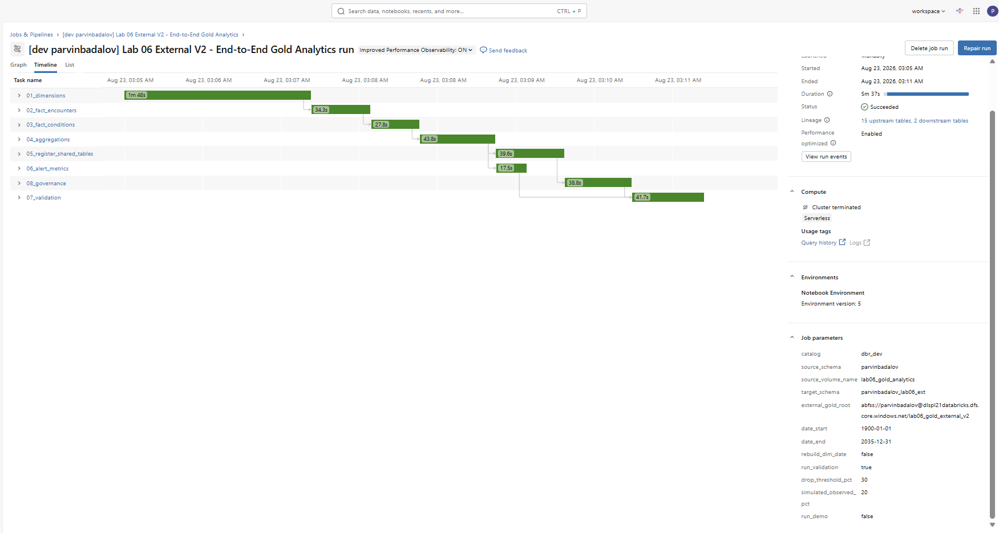
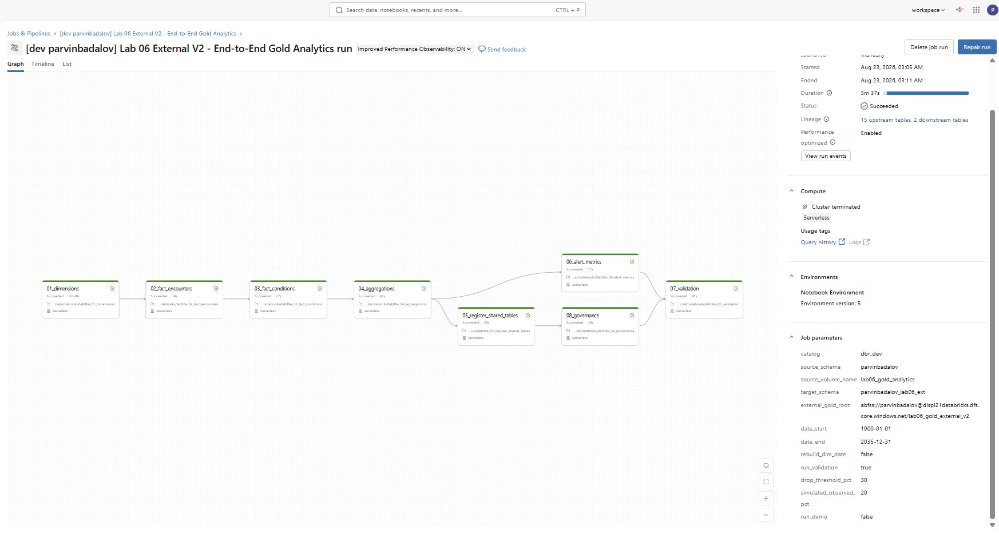

# Lab 06 — Gold Analytics External V2

## Overview

Lab 06 builds a production-style Gold analytics layer in Databricks from the Synthea synthetic healthcare dataset. The implementation combines external ADLS-backed Delta storage, dimensional modeling, Databricks Workflows, Unity Catalog governance, AI/BI analytics, alerting, automated validation, and multi-target Asset Bundle deployment.

The final solution demonstrates:

- an external ADLS-backed Gold layer registered in Unity Catalog;
- dimensional and fact modeling for healthcare analytics;
- reusable aggregate tables for business reporting;
- one end-to-end Databricks Job with eight tasks;
- organization-based row-level security through a secure view;
- dynamic masking of sensitive patient attributes through a secure view;
- an AI/BI Dashboard and Genie space;
- a Databricks SQL data-volume alert;
- Databricks Asset Bundle deployment to Dev and Prod targets;
- Azure all-purpose compute and Personal Serverless execution.

---

## Architecture

```text
Synthea CSV files
        |
        v
External Unity Catalog Volume
        |
        v
Gold transformation notebooks
        |
        v
External Delta tables in ADLS
        |
        v
dbr_dev.parvinbadalov_lab06_ext
        |
        +-----------------------------+
        |                             |
        v                             v
Base Gold model                 Governance layer
(dim/fact/aggregates)           secure views + mappings
        |                             |
        +--------------+--------------+
                       |
          +------------+-------------+
          |            |             |
          v            v             v
      Dashboard      Genie        SQL Alert
```

### Source configuration

```text
Catalog:              dbr_dev
Source schema:        parvinbadalov
Source volume:        lab06_gold_analytics
```

### Gold configuration

```text
Target schema:        dbr_dev.parvinbadalov_lab06_ext
External Gold root:   abfss://parvinbadalov@dlspl21databricks.dfs.core.windows.net/lab06_gold_external_v2
```

Each Gold dataset is written as Delta under the external ADLS root and registered in Unity Catalog.

---

## Gold Data Model

### Dimensions

```text
dim_date
dim_patient
dim_provider
dim_organization
dim_payer
dim_condition
```

### Facts

```text
fact_encounters
fact_conditions
```

### Business aggregates

```text
agg_daily_encounters
agg_organization_performance
agg_payer_performance
agg_condition_summary
```

### Monitoring

```text
lab06_data_volume_metrics
```

See [DATA_MODEL.md](DATA_MODEL.md) for grains, relationships, measures, and the governance-facing views.

---

## Final End-to-End Job

Bundle resource:

```text
jobs.lab06_external_gold_job
```

Job name:

```text
Lab 06 External V2 - End-to-End Gold Analytics
```

### Eight-task DAG

```text
01_dimensions
      |
      v
02_fact_encounters
      |
      v
03_fact_conditions
      |
      v
04_aggregations
   /             \
  v               v
05_register       06_alert_metrics
      |                 |
      v                 |
08_governance           |
      \                 /
       \               /
        v             v
          07_validation
```

Task responsibilities:

| Task | Purpose |
|---|---|
| `01_dimensions` | Build and refresh Gold dimensions. |
| `02_fact_encounters` | Build the encounter fact table. |
| `03_fact_conditions` | Build the conditions fact table. |
| `04_aggregations` | Build business-facing Gold aggregates. |
| `05_register_shared_tables` | Register the external Delta datasets in Unity Catalog. |
| `06_alert_metrics` | Generate controlled data-volume monitoring metrics. |
| `08_governance` | Create/update secure governance views and access mappings. |
| `07_validation` | Validate the final Gold model after both monitoring and governance paths complete. |

### Job parameters

```text
catalog
source_schema
source_volume_name
target_schema
external_gold_root
date_start
date_end
rebuild_dim_date
run_validation
drop_threshold_pct
simulated_observed_pct
run_demo
```

Default governance behavior:

```text
run_demo = false
```

This is the safe recurring mode. The governance task creates or refreshes the secure views and helper mappings without temporarily changing the current execution identity's demonstration access.

For a governance evidence run, `run_demo=true` can be used to execute the RLS/CLS demonstration checks and then restore the invoking user to full-access/privileged mappings.

---

## Unity Catalog Governance

Lab 06 uses secure Unity Catalog views rather than attaching native row filters or column masks directly to the path-written base Gold tables.

### Row-level security

```text
vw_fact_encounters_secure
```

The view restricts encounter rows according to the current user's allowed organization mappings stored in:

```text
lab06_user_organization_access
```

A wildcard organization mapping (`*`) represents full organization access. A user with no organization mapping receives no rows through the secure encounter view.

### Column-level masking

```text
vw_dim_patient_secure
```

Sensitive patient attributes are dynamically masked for non-privileged users, including:

```text
ssn
first_name
last_name
address
```

Privileged users are managed through:

```text
lab06_patient_data_privileged_users
```

Non-privileged users receive `***MASKED***` values from the secure patient view.


### Understanding the masked-view check

A query such as:

```sql
SELECT *
FROM dbr_dev.parvinbadalov_lab06_ext.vw_dim_patient_secure;
```

does **not by itself mean that masking must be visible**. The secure view evaluates the current principal's access mapping.

During a `run_demo=true` governance run, the notebook temporarily removes the invoking user's privileged patient-data mapping, queries `vw_dim_patient_secure`, verifies that the sensitive columns return `***MASKED***`, and then restores the user to the privileged mapping.

Therefore, after the notebook finishes successfully, running the same `SELECT *` as the restored privileged user returns the original values. That is expected behavior and confirms that the restoration step worked. The dedicated masked-demo output is the evidence that CLS masking is enforced for a non-privileged mapping.

### Governance evidence

#### Row-level security demonstration

The governance demo temporarily restricts the current principal to one organization and compares the expected and actual row counts.



Validated demonstration:

```text
baseline rows             61,459
expected restricted rows   2,184
actual restricted rows     2,184
RLS restricted demo        PASS
RLS full-access restoration PASS
```

#### Column-level masking demonstration

The secure patient view masks sensitive values while the current principal is temporarily treated as non-privileged.



The demonstrated masked attributes include:

```text
ssn
first_name
last_name
address
```

and the values are returned as:

```text
***MASKED***
```

The notebook then restores the current principal's privileged mapping.

#### Final governance validation



The final governance check confirms:

```text
RLS restricted demo           PASS
RLS full-access restoration   PASS
CLS masked demo               PASS
CLS privileged restoration    PASS
```

The notebook also confirms that the base external Gold tables remain free of native row filters and masks, while the secure views provide the governed consumption layer.

### Why secure views are used

The Gold pipeline writes external Delta data by explicit ADLS paths. Keeping native row filters and masks off those base tables preserves compatibility with path-based pipeline writes, while secure views provide the governed consumption layer.

For governed consumption, users should be granted access to the secure views and should not receive direct `SELECT` access to the governed base tables.

---

## Validation Results

Validated fact row counts:

```text
fact_encounters     61,459
fact_conditions     38,094
```

Validated aggregate row count:

```text
agg_daily_encounters  17,019
```

The final validation task runs only after both the alert-metrics path and governance path complete.

---

## Dashboard, Genie, and Alert

### AI/BI Dashboard

```text
Healthcare Operations & Cost Analytics - External V2
```

Bundle resource:

```text
dashboards.lab06_external_healthcare_dashboard
```

Validated headline metrics include approximately:

```text
Total Encounters         61,459
Unique Patients           1,163
Total Claim Cost        $255.03M
Payer Coverage           $63.53M
Patient Responsibility  $191.50M
Emergency Encounter %      ~3.5%
```

### Genie

```text
Lab 06 External V2 - Healthcare Analytics Genie
```

Bundle resource:

```text
genie_spaces.lab06_external_healthcare_genie
```

Example questions:

```text
Which organizations had the most encounters?
What were the top 10 medical conditions by number of events?
Which payer covered the most healthcare cost?
```

### SQL alert

```text
Lab 06 External V2 - Healthcare Volume Drop Alert
```

Bundle resource:

```text
alerts.lab06_external_healthcare_volume_drop
```

Controlled alert state:

```text
baseline_encounter_count = 326
observed_encounter_count = 65
volume_drop_pct          = 80.06
drop_threshold_pct       = 30
should_alert             = 1
alert_status             = TRIGGERED
```

The controlled simulation validates alert behavior without deleting or corrupting Gold data.

---


## Automated Tests

The final Lab 06 External V2 implementation includes automated checks for the Gold model, external storage design, quality rules, governance, and Job wiring.

Final local test results:

```text
Complete Lab 06 suite: 46 passed
Governance-only suite:  6 passed
```

The full suite validates, among other things:

- dimension and fact naming/location rules
- external ABFSS storage paths
- aggregate-table placement
- external-table registration behavior
- Gold quality rules
- RLS implementation in the secure encounter view
- CLS masking implementation in the secure patient view
- absence of native row filters/masks on the path-written base Gold tables
- governance demo restoration behavior
- the main Job dependency chain: registration -> governance -> validation

Run the complete suite:

```bash
python -m pytest labs/lab_06_gold_analytics_external/tests -v
```

Run governance tests only:

```bash
python -m pytest   labs/lab_06_gold_analytics_external/tests/test_governance.py   -v
```

### Full test suite — 46 passed



### Governance tests — 6 passed



Detailed terminal output can be kept in:

```text
evidence/pytest_full_suite.txt
evidence/pytest_governance.txt
```

## Deployment Targets

| Target | Compute | Final verification |
|---|---|---|
| `personal_dev` | Serverless | Deployed and 8/8 tasks succeeded |
| `personal_prod` | Serverless | Deployed and 8/8 tasks succeeded |
| `azure_dev` | Existing Azure cluster | Deployed and 8/8 tasks succeeded |
| `azure_prod` | Existing Azure cluster | Final version deployed; execution intentionally skipped |

All targets point to the same external Gold storage root, so Lab 06 targets should be executed sequentially rather than concurrently.

---

## Execution Evidence

### Personal Prod — eight-task DAG



### Personal Prod — successful timeline



### Personal Dev — successful timeline



### Personal Dev — eight-task DAG



The screenshots show the final eight-task job, successful Serverless execution, job parameters, and the governance task integrated into the recurring DAG.

---

## Running Lab 06

The repository runner validates the bundle, deploys the selected Lab 06 Job resource, executes it when requested, and waits for completion.

General form:

```bash
bash tools/run_academy_lab.sh \
  --lab 06 \
  --target <bundle-target> \
  --profile <databricks-cli-profile>
```

Azure target with an existing cluster:

```bash
bash tools/run_academy_lab.sh \
  --lab 06 \
  --cluster <gp1|gp2|auto> \
  --target <azure-target> \
  --profile <databricks-cli-profile>
```

Deploy without running:

```bash
bash tools/run_academy_lab.sh \
  --lab 06 \
  --cluster <gp1|gp2|auto> \
  --target <azure-target> \
  --profile <databricks-cli-profile> \
  --skip-run
```

See [DEPLOYMENT_GUIDE.md](DEPLOYMENT_GUIDE.md) for the complete workflow.

---

## Final Bundle Resources

Normal Lab 06 selective deployment uses:

```text
jobs.lab06_external_gold_job
dashboards.lab06_external_healthcare_dashboard
genie_spaces.lab06_external_healthcare_genie
alerts.lab06_external_healthcare_volume_drop
```

Governance is **not** a separate Job resource. `08_governance` is part of `lab06_external_gold_job`.

---

## Repository Structure

```text
lab_06_gold_analytics_external/
├── Alerts/
├── dashboards/
├── evidence/
├── genie/
├── images/
├── notebooks/
│   ├── lab06_00_dev_runner.ipynb
│   ├── lab06_00_source_preparation.ipynb
│   ├── lab06e_01_dimensions.ipynb
│   ├── lab06e_02_fact_encounters.ipynb
│   ├── lab06e_03_fact_conditions.ipynb
│   ├── lab06e_04_aggregations.ipynb
│   ├── lab06e_05_register_shared_tables.ipynb
│   ├── lab06e_06_alert_metrics.ipynb
│   ├── lab06e_07_validation.ipynb
│   └── lab06e_08_governance.ipynb
├── sql/
├── src/
├── tests/
├── tools/
├── DATA_MODEL.md
├── DEPLOYMENT_GUIDE.md
└── README.md
```

---

## Completion Status

| Requirement | Status |
|---|---|
| External ADLS-backed Gold layer | ✅ |
| Gold star schema | ✅ |
| Dimension and fact tables | ✅ |
| Business aggregates | ✅ |
| Eight-task end-to-end Job | ✅ |
| Secure-view RLS | ✅ |
| Secure-view sensitive-data masking | ✅ |
| Final validation | ✅ |
| AI/BI Dashboard | ✅ |
| Genie | ✅ |
| Volume-drop SQL Alert | ✅ |
| Asset Bundle multi-target deployment | ✅ |
| Personal Dev Serverless execution | ✅ |
| Personal Prod Serverless execution | ✅ |
| Azure Dev execution | ✅ |
| Azure Prod deployment | ✅ |

**Lab 06 External V2 is complete.**
