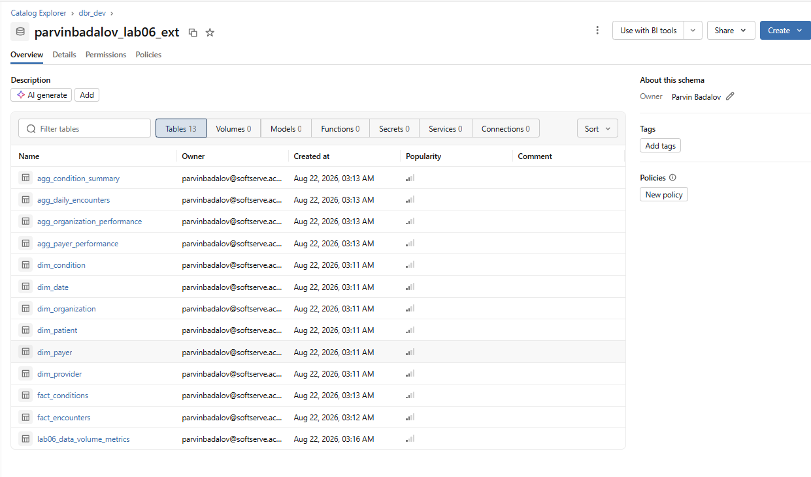
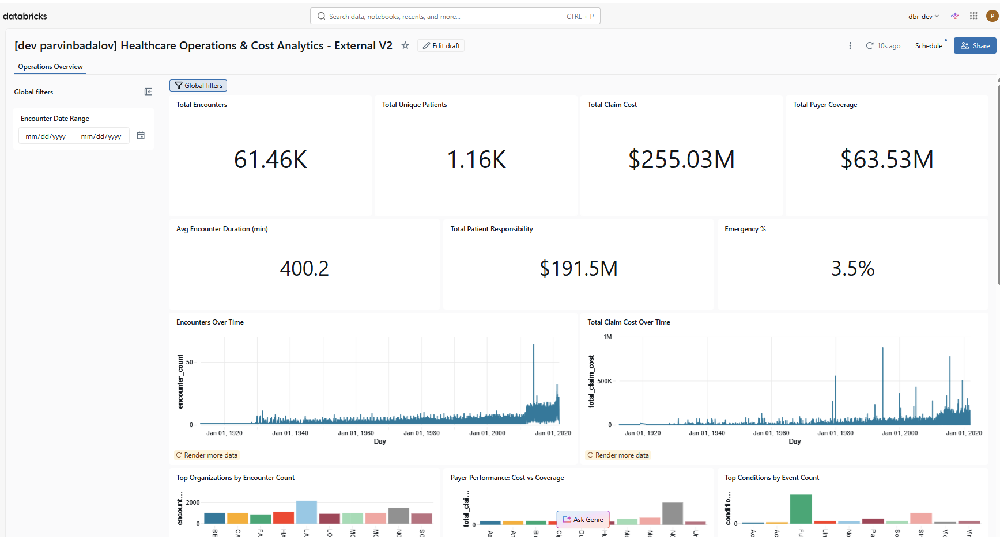
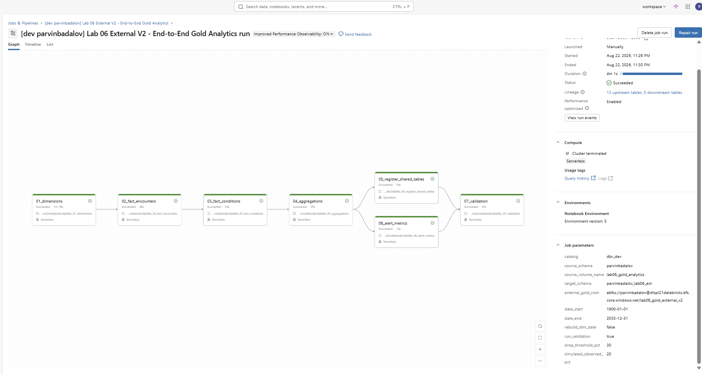
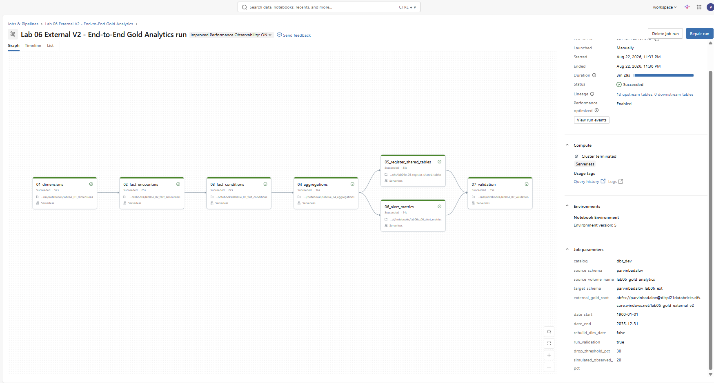

# Lab 06 — Gold Analytics External V2

## Overview

Lab 06 builds a business-facing Gold analytics solution in Databricks using the
Synthea synthetic healthcare dataset.

The final implementation demonstrates:

- an external ADLS-backed Gold layer;
- star-schema modeling with dimensions and facts;
- business aggregate tables;
- a single end-to-end Databricks Job;
- an AI/BI Dashboard;
- a Genie space for natural-language analytics;
- a Databricks SQL volume-drop alert;
- Databricks Asset Bundle deployment across Dev and Prod targets;
- Azure all-purpose compute and Personal Serverless execution.

---

## Architecture

```text
Synthea CSV files
        |
        v
External Unity Catalog Volume
dbr_dev.parvinbadalov.lab06_gold_analytics
        |
        v
Gold transformation notebooks
        |
        v
ADLS External Delta
abfss://parvinbadalov@dlspl21databricks.dfs.core.windows.net/lab06_gold_external_v2
        |
        v
dbr_dev.parvinbadalov_lab06_ext
        |
        +----------------------+----------------------+----------------------+
        |                      |                      |
        v                      v                      v
 AI/BI Dashboard           Genie Space           SQL Alert
```

### Source configuration

```text
Catalog:              dbr_dev
Source schema:        parvinbadalov
Source volume:        lab06_gold_analytics
```

### Gold configuration

```text
Target schema:        dbr_dev.parvinbadalov_lab06_ext
External Gold root:   abfss://parvinbadalov@dlspl21databricks.dfs.core.windows.net/lab06_gold_external_v2
```

The Gold tables are stored as external Delta tables in ADLS and registered in
Unity Catalog.

---

## Gold Data Model

### Dimensions

```text
dim_date
dim_patient
dim_provider
dim_organization
dim_payer
dim_condition
```

### Facts

```text
fact_encounters
fact_conditions
```

### Business aggregates

```text
agg_daily_encounters
agg_organization_performance
agg_payer_performance
agg_condition_summary
```

### Monitoring

```text
lab06_data_volume_metrics
```

See [DATA_MODEL.md](DATA_MODEL.md) for grains, keys, relationships, and measures.

### Gold schema evidence



---

## End-to-End Job

The final implementation uses one Databricks Job:

```text
Lab 06 External V2 - End-to-End Gold Analytics
```

Bundle resource:

```text
jobs.lab06_external_gold_job
```

### Job DAG

```text
01_dimensions
      |
      v
02_fact_encounters
      |
      v
03_fact_conditions
      |
      v
04_aggregations
   /          \
  v            v
05_register   06_alert_metrics
   \          /
      v      v
    07_validation
```

The Job performs the complete Gold workflow:

1. creates the dimensions;
2. builds `fact_encounters`;
3. builds `fact_conditions`;
4. creates the business aggregates;
5. registers the shared external tables;
6. creates the alert metric;
7. validates the final model.

---

## Job Parameters

The Job is parameterized through the Databricks Asset Bundle.

```text
catalog
source_schema
source_volume_name
target_schema
external_gold_root
date_start
date_end
rebuild_dim_date
run_validation
drop_threshold_pct
simulated_observed_pct
```

Current Lab 06 values:

```text
catalog                  = dbr_dev
source_schema            = parvinbadalov
source_volume_name       = lab06_gold_analytics
target_schema            = parvinbadalov_lab06_ext
date_start               = 1900-01-01
date_end                 = 2035-12-31
rebuild_dim_date         = false
run_validation           = true
drop_threshold_pct       = 30
simulated_observed_pct   = 20
```

---

## Validation

The final validation checks the Gold objects, row counts, keys, relationships,
and aggregate reconciliation.

Validated table counts include:

```text
fact_encounters     61,459
fact_conditions     38,094
```

### Validation evidence


Additional raw evidence is stored in:

```text
evidence/describe_detail_fact_encounters.txt
evidence/validation_counts.txt
```

---

## AI/BI Dashboard

Dashboard:

```text
Healthcare Operations & Cost Analytics - External V2
```

Bundle resource:

```text
dashboards.lab06_external_healthcare_dashboard
```

The dashboard is backed by the Gold fact and aggregate tables and includes
business-facing KPIs and visualizations for encounter volume, patients, costs,
organizations, payers, and conditions.

Validated headline metrics include approximately:

```text
Total Encounters         61,459
Unique Patients           1,163
Total Claim Cost        $255.03M
Payer Coverage           $63.53M
Patient Responsibility  $191.50M
Emergency Encounter %      ~3.5%
```

### Dashboard evidence



---

## Genie

Genie space:

```text
Lab 06 External V2 - Healthcare Analytics Genie
```

Bundle resource:

```text
genie_spaces.lab06_external_healthcare_genie
```

Example analytical questions:

```text
Which organizations had the most encounters?

What were the top 10 medical conditions by number of events?

Which payer covered the most healthcare cost?
```

The Genie space is configured to use the Gold facts, dimensions, and business
aggregate tables.

### Genie evidence


---

## Volume-Drop Alert

SQL Alert:

```text
Lab 06 External V2 - Healthcare Volume Drop Alert
```

Bundle resource:

```text
alerts.lab06_external_healthcare_volume_drop
```

The monitoring table is:

```text
dbr_dev.parvinbadalov_lab06_ext.lab06_data_volume_metrics
```

The controlled volume-drop simulation uses:

```text
baseline_encounter_count = 326
observed_encounter_count = 65
volume_drop_pct          = 80.06
drop_threshold_pct       = 30
should_alert             = 1
alert_status             = TRIGGERED
```

The automatic schedule is kept paused after testing so the static simulated
condition does not repeatedly send notifications.

### Alert evidence


---

## Deployment Targets

| Target | Workspace | Job compute | Purpose |
|---|---|---|---|
| `azure_dev` | Shared Azure workspace | GP1 / GP2 | reviewer/shared development execution |
| `azure_prod` | Shared Azure workspace | GP1 / GP2 | production-style deployment |
| `personal_dev` | Personal workspace | Serverless | independent development validation |
| `personal_prod` | Personal workspace | Serverless | independent production-style validation |

The Personal targets were used to independently validate the full seven-task Job
on Serverless compute.

The Azure targets are configured so a reviewer with access to the shared
workspace can deploy and execute the same Job there.

Because the Lab 06 targets reference the same external Gold storage root, they
should be executed sequentially rather than concurrently.

---

## Final Bundle Resources

The final Lab 06 deployment uses:

```text
jobs.lab06_external_gold_job
dashboards.lab06_external_healthcare_dashboard
genie_spaces.lab06_external_healthcare_genie
alerts.lab06_external_healthcare_volume_drop
```

The Lab 06 target schema is intentionally not included in the normal selective
deployment set.

---

## Running the Project

The project can be executed with the repository runner after the appropriate
Databricks CLI profile and bundle target have been configured.

General form:

```bash
bash tools/run_academy_lab.sh \
  --lab 06 \
  --target <bundle-target> \
  --profile <databricks-cli-profile>
```

For Azure targets, an existing all-purpose cluster can be selected explicitly:

```bash
bash tools/run_academy_lab.sh \
  --lab 06 \
  --cluster <gp1|gp2|auto> \
  --target <azure-target> \
  --profile <databricks-cli-profile>
```

For Personal targets, the Job uses Serverless compute and the cluster option is
not required.

The runner validates the bundle, optionally deploys the selected Lab 06
resource, runs `lab06_external_gold_job`, and waits for completion.

Production execution should be intentional. Deploying a production target does
not require immediately running the Job; the target can be left deployment-ready
until a production execution is explicitly requested.

See [DEPLOYMENT_GUIDE.md](DEPLOYMENT_GUIDE.md) for target-specific deployment
and execution commands.

---

## Execution Evidence

### Personal Dev — Serverless

The final seven-task Job completed successfully on Serverless compute.



### Personal Prod — Serverless

The final seven-task Job also completed successfully on Serverless compute in
the Personal Prod target.



These screenshots provide independent execution evidence while the shared Azure
targets remain available for reviewer execution.

---

## Repository Structure

```text
lab_06_gold_analytics_external/
├── Alerts/
├── dashboards/
├── evidence/
│   ├── describe_detail_fact_encounters.txt
│   └── validation_counts.txt
├── genie/
├── images/
│   ├── 04_external_gold_schema_tables.png
│   ├── 05_validation_row_counts.png
│   ├── 06_azure_dashboard.png
│   ├── 07_azure_genie.png
│   ├── 08_azure_alert_triggered.png
│   ├── personal_dev_serverless_job_success.png
│   └── personal_prod_serverless_job_success.png
├── notebooks/
├── sql/
├── src/
├── tests/
├── tools/
├── DATA_MODEL.md
├── DEPLOYMENT_GUIDE.md
└── README.md
```

---

## Key Design Decisions

### External Gold storage

Gold tables are stored directly in ADLS-backed Delta paths instead of relying
only on workspace-managed storage.

### One final Job

The complete transformation, registration, monitoring, and validation workflow
is represented by one seven-task Job.

### Centralized configuration

Runtime values are supplied through Job/Bundle parameters rather than duplicated
across processing notebooks.

### Business-ready Gold layer

The implementation finishes with reusable fact, dimension, aggregate,
Dashboard, Genie, and monitoring assets rather than stopping at raw
transformation output.

### Controlled alert simulation

The volume-drop alert is tested using a controlled metric instead of deleting or
corrupting Gold data.

### Multi-target deployment

The same source-controlled implementation supports both shared Azure targets
and independent Personal targets.

---

## Completion Status

| Requirement | Status |
|---|---|
| External ADLS-backed Gold layer | ✅ |
| Gold star schema | ✅ |
| Dimension tables | ✅ |
| Fact tables | ✅ |
| Business aggregates | ✅ |
| End-to-end seven-task Job | ✅ |
| Final validation | ✅ |
| AI/BI Dashboard | ✅ |
| Genie | ✅ |
| Volume-drop SQL Alert | ✅ |
| Asset Bundle deployment | ✅ |
| Personal Dev Serverless execution | ✅ |
| Personal Prod Serverless execution | ✅ |
| Azure reviewer deployment/run configuration | ✅ |

**Lab 06 External V2 is complete and ready for review.**
