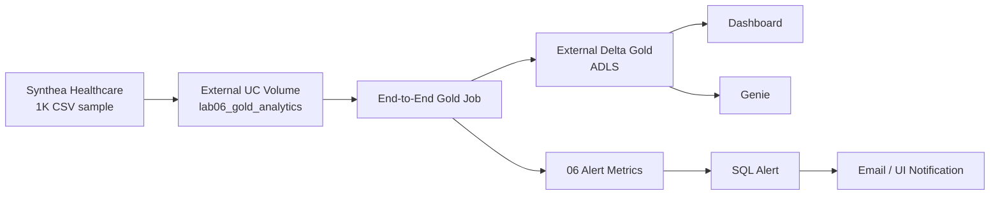
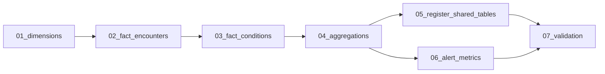
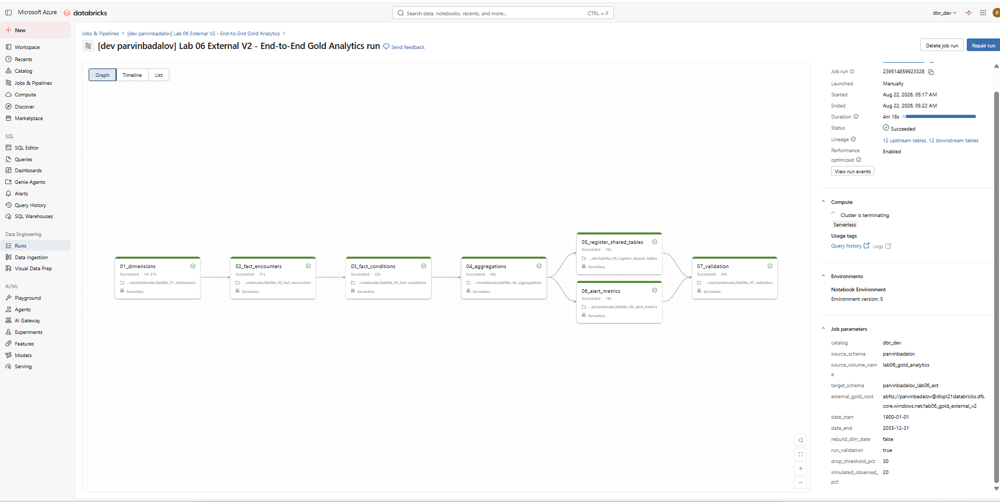
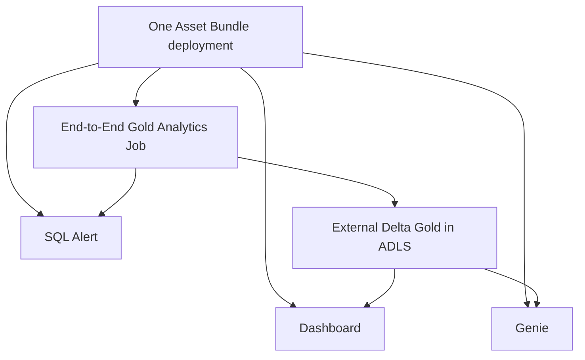

# Lab 06 External V2 — End-to-End Gold Analytics

## Overview

Lab 06 External V2 is the final Azure-deployable version of the healthcare Gold analytics lab.

It uses:

- **one Databricks Asset Bundle deployment** for the Lab 06 V2 resources;
- **one End-to-End Databricks Job** for the complete data workflow;
- external Delta storage in **Azure Data Lake Storage (ADLS)**;
- a Lakeview Dashboard, Genie space, and SQL Alert deployed alongside the Job.

## End-to-End architecture



---

## What the lab builds

The prepared source data is stored in:

```text
dbr_dev.parvinbadalov.lab06_gold_analytics
```

The Gold model is registered in:

```text
dbr_dev.parvinbadalov_lab06_ext
```

and physically stored under:

```text
abfss://parvinbadalov@dlspl21databricks.dfs.core.windows.net/lab06_gold_external_v2
```

The final model contains:

| Layer | Count | Examples |
|---|---:|---|
| Dimensions | 6 | `dim_patient`, `dim_provider`, `dim_organization`, `dim_payer`, `dim_date`, `dim_condition` |
| Facts | 2 | `fact_encounters`, `fact_conditions` |
| Aggregates | 4 | `agg_daily_encounters`, `agg_organization_performance`, `agg_payer_performance`, `agg_condition_summary` |
| Monitoring | 1 | `lab06_data_volume_metrics` |

For the full dimensional model, grains, relationships, and aggregate design, see **[DATA_MODEL.md](DATA_MODEL.md)**.


---

## One End-to-End Job

The manager-facing Azure Job is:

```text
[dev parvinbadalov] Lab 06 External V2 - End-to-End Gold Analytics
```



`05_register_shared_tables` ensures the external Delta locations are registered correctly in Unity Catalog.

`06_alert_metrics` calculates the monitoring row consumed by the SQL Alert.

`07_validation` is the final quality gate and waits for both tasks 05 and 06.



---

## Validation

Observed final Azure counts:

| Object | Rows |
|---|---:|
| `fact_encounters` | 61,459 |
| `fact_conditions` | 38,094 |
| `agg_daily_encounters` | 17,019 |


The physical Delta location for `fact_encounters` was verified with `DESCRIBE DETAIL`:

```text
abfss://parvinbadalov@dlspl21databricks.dfs.core.windows.net/lab06_gold_external_v2/fact_encounters
```

Raw evidence:

```text
evidence/describe_detail_fact_encounters.txt
```

---

## Dashboard

Validated KPI values:

| KPI | Result |
|---|---:|
| Total Encounters | 61.46K |
| Total Unique Patients | 1.16K |
| Total Claim Cost | $255.03M |
| Total Payer Coverage | $63.53M |
| Avg Encounter Duration | 400.2 min |
| Total Patient Responsibility | $191.5M |
| Emergency % | 3.5% |


---

## Genie

Example question:

```text
How many total encounters and unique patients are there?
```

Validated response:

```text
61,459 total encounters
1,163 unique patients
```


---

## SQL Alert

Task `06_alert_metrics` prepares:

```text
dbr_dev.parvinbadalov_lab06_ext.lab06_data_volume_metrics
```

The SQL Alert evaluates:

```text
FIRST_ROW(should_alert) = 1
```

The validated run reached:

```text
TRIGGERED
```


---

## How to test the deployed lab

A reviewer, manager, or teammate does **not** need to validate or redeploy the Bundle just to test the existing Azure deployment.

See **[HOW_TO_RUN.md](HOW_TO_RUN.md)**.

Short version:

```text
Run the End-to-End Job
→ Open Dashboard
→ Ask Genie
→ Run SQL Alert
```

If another workspace user wants to receive the alert, they can temporarily add their own workspace email under the Alert **Notifications** settings before clicking **Run now**.

---

## Deployment / maintenance

Bundle validation and deployment are only needed when setting up or changing the lab from the repository.

See **[DEPLOYMENT_GUIDE.md](DEPLOYMENT_GUIDE.md)**.

One Bundle deployment creates/updates:

```text
1 End-to-End Job
1 Dashboard
1 Genie Space
1 SQL Alert
```

The old standalone Register and Alert Metrics jobs are not part of the final execution path because tasks 05 and 06 are already inside the End-to-End Job.

---

## Final status



The seven-task End-to-End Job has been validated successfully in Azure.
