<h1 align="center">Lab 07 · Data Quality Testing on Databricks</h1>

<p align="center"><strong>Production-style data quality engineering for Chicago Business License data</strong></p>

<p align="center">
  
  
  
  
  
</p>

> [!NOTE]
> This lab demonstrates an end-to-end quality gate with trusted, warning, and quarantine paths; SCD Type 2 history; automated testing; monitoring; dashboards; and controlled Dev/Prod promotion.

### Project Snapshot

| Quality score | Native Lakeflow tests | Local pytest | Chispa | Azure Dev | Azure Prod |
|---:|---:|---:|---:|---|---|
| **99.56%** | **4/4 passed** | **16 passed, 1 deselected** | **3 passed** | ✅ Full run passed | ✅ Deploy-only passed |

**Navigate:** [Architecture](#4-architecture) · [Testing](#11-native-lakeflow-testpipeline---44-passed) · [Monitoring](#15-data-quality-monitoring) · [Dashboard](#16-lakeview-dashboard) · [Deployment](#17-asset-bundle-devprod-deployment) · [Evidence](#19-evidence)

---

## 1. Project Summary

Lab 07 is an end-to-end data quality engineering project built with Databricks Lakeflow, Unity Catalog, PySpark, Delta Lake, SCD Type 2, native Lakeflow `TestPipeline`, Data Quality Monitoring, Lakeview dashboards, and Databricks Asset Bundles.

It implements a production-style quality gate for Chicago Business License data, with deterministic validation, trusted and quarantined outputs, historical tracking, monitoring, reporting, automated tests, and controlled Dev/Prod promotion.

---

## 2. Project Goal

The goal is to demonstrate how data quality becomes an explicit, testable part of a lakehouse workflow instead of a collection of ad hoc checks. Lab 07 covers source preparation, classification, quarantine, SCD2 history, Delta constraints, reconciliation, freshness, schema contracts, monitoring, scorecard generation, and a final quality gate.

---

## 3. Data Source

Lab 07 uses the **City of Chicago Business Licenses** public dataset.

| Property | Value |
|---|---|
| Provider | City of Chicago Data Portal |
| Dataset | Business Licenses |
| Dataset ID | `r5kz-chrr` |
| API style | Socrata / SODA JSON |
| API endpoint | `https://data.cityofchicago.org/resource/r5kz-chrr.json` |
| Default source start date | `2024-01-01` |
| Maximum rows | `300000` |
| Page size | `50000` |
| Sort order | `date_issued ASC, license_id ASC, id ASC` |

The loader adds lineage and provenance metadata to every row:

```text
_source_batch_id
_source_offset
_source_api
_source_dataset_id
_source_dataset_updated_at
_ingested_at
_fixture_kind
```

The Socrata loader can optionally use `CHICAGO_APP_TOKEN`.

---

## 4. Architecture

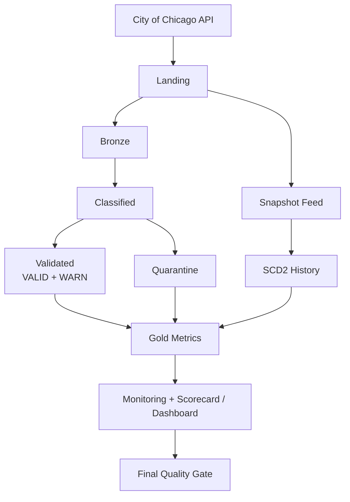

> [!IMPORTANT]
> `VALID` and `WARN` records are trusted. `QUARANTINE` records remain available for diagnosis but are excluded from trusted outputs.

---

## 5. Storage and Unity Catalog

```text
Catalog : dbr_dev
Schema  : parvinbadalov
Volume  : lab07_data_quality
```

Unity Catalog volume path:

```text
/Volumes/dbr_dev/parvinbadalov/lab07_data_quality
```

External ADLS Gen2 location:

```text
abfss://parvinbadalov@dlspl21databricks.dfs.core.windows.net/lab07_data_quality
```

The source-preparation notebook verifies that the object is an **EXTERNAL Volume** before loading data.

> [!NOTE]
> Azure Dev and Azure Prod intentionally reuse this volume for the academy project. The existing volume is bound to Azure Prod deployment state rather than recreated.

---

## 6. Main Lakehouse Objects

| Object | Purpose |
|---|---|
| `business_license_landing` | Prepared source data plus deterministic test records |
| `business_license_bronze` | Bronze ingestion with expectations |
| `business_license_classified` | Normalized records with DQ state, reasons, and dimensions |
| `business_license_validated` | Trusted `VALID` and `WARN` records |
| `business_license_quarantine` | Critical quality failures |
| `business_license_snapshot_feed` | Versioned canonical snapshots |
| `dim_license_scd2` | SCD Type 2 license history |
| `license_quality_daily` | Daily totals and overall quality score |
| `license_quality_by_dimension` | Affected records by quality dimension |
| `license_status_summary` | Trusted licenses by status |
| `license_volume_daily` | Trusted row-volume trend |

---

## 7. Controlled Data Quality Fixtures

The source-preparation step injects deterministic records so key rules can be exercised repeatedly.

| Fixture | Expected outcome |
|---|---|
| Invalid license status | `QUARANTINE` / validity |
| Invalid ZIP | `QUARANTINE` / validity |
| Missing DBA name | `WARN` / completeness |
| Expiration before start date | `QUARANTINE` / consistency |

Artificial source fixtures are excluded from the canonical SCD2 snapshot source. Reusable local fixtures under `tests/fixtures/` cover valid records, snapshot evolution, duplicate merge-source determinism, and late-arriving business states.

---

## 8. Quality Model and Rules

Every classified record receives:

```text
_dq_status
_dq_warn_reasons
_dq_quarantine_reasons
_dq_dimensions
```

### States

- **VALID** - no blocking issue
- **WARN** - trusted, with a non-blocking issue
- **QUARANTINE** - critical failure, excluded from trusted output

### Dimensions

- **Completeness** - missing IDs, license number, legal name, or DBA warning
- **Uniqueness** - duplicate source ID
- **Validity** - invalid application type, status, ZIP, latitude, or longitude
- **Consistency** - invalid term chronology or missing required status-change date

Runtime PySpark rules live in `src/lab07/quality_rules.py`. `config/quality_rules.yml` provides the corresponding declarative rule and threshold catalog used for review and documentation.

---

## 9. Snapshot and SCD Type 2 Design

Configured snapshot cutoffs:

```text
2024-12-31
2025-12-31
2026-08-15
```

`canonical_snapshot` selects the latest business-effective state for each license at a cutoff; ingestion time is a deterministic tie-breaker, not the cutoff axis. The versioned snapshot feed is consumed by Lakeflow AUTO CDC FROM SNAPSHOT using `license_number` as the business key.

The SCD2 output includes Lakeflow system columns `__START_AT` and `__END_AT`. Tests verify history preservation, one current row per license, and correct handling of later-ingested records with older business-effective timestamps.

---

## 10. Lakeflow Pipeline

The deployed pipeline contains only these production source libraries:

```text
pipeline/bronze.py
pipeline/quality.py
pipeline/scd2.py
pipeline/gold.py
```

Important deployed settings:

```yaml
serverless: true
continuous: false
edition: ADVANCED
channel: CURRENT
```

The base resource defines `PREVIEW`; the `personal`, `azure_dev`, and `azure_prod` targets override Lab 07 to `CURRENT`. Native test files under `src/tests/` are not included as production pipeline libraries.

---

## 11. Native Lakeflow TestPipeline - 4/4 Passed

The canonical native tests are:

```text
src/tests/test_expectations.py
src/tests/test_quarantine.py
src/tests/test_gold_quality_flow.py
src/tests/test_scd2_snapshot_flow.py
```

| Test | Intent |
|---|---|
| `test_business_license_validated_expectations` | `VALID`, `WARN`, and trusted-only behavior |
| `test_business_license_quarantine_reasons` | Expected reasons for invalid status, ZIP, and dates |
| `test_license_quality_daily_reconciles` | Trusted, quarantined, warning, and quality-score reconciliation |
| `test_scd2_preserves_snapshot_history` | Historical versions and current-row behavior |

These tests use `pyspark.pipelines.testing.TestPipeline` and `test_spark`. They run in the Databricks Pipeline Editor in Triggered mode with the test-compatible Preview channel; they are not ordinary local pytest tests.

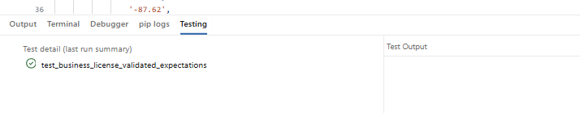

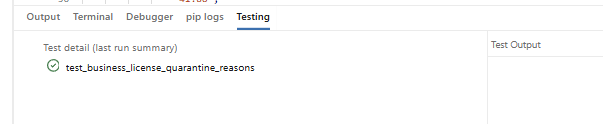

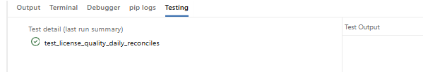

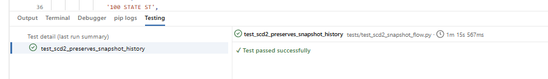

**Native Lakeflow result: `4/4 passed`.**

---

## 12. Local Pytest and Chispa

Local suite:

```bash
PYTHONPATH=labs/lab_07_data_quality_testing/src python -m pytest \
  labs/lab_07_data_quality_testing/tests \
  -m "not remote" \
  -v
```

Result: **`16 passed, 1 deselected`**. The deselected test is `tests/integration/test_deployed_medallion_e2e.py`, which requires a deployed Lab 07 environment.

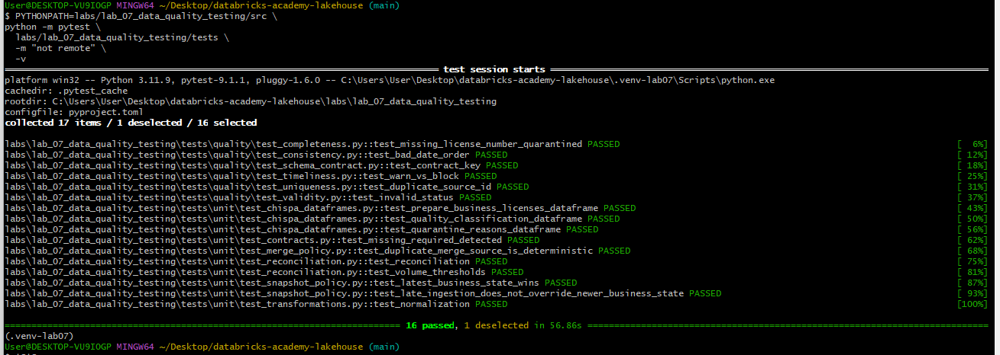

Chispa suite:

```bash
PYTHONPATH=labs/lab_07_data_quality_testing/src python -m pytest \
  labs/lab_07_data_quality_testing/tests/unit/test_chispa_dataframes.py \
  -v
```

Result: **`3 passed`**.

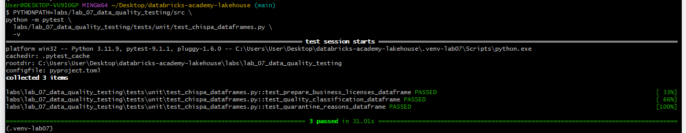

---

## 13. Code Quality

```bash
python -m ruff check \
  labs/lab_07_data_quality_testing/src \
  labs/lab_07_data_quality_testing/tests \
  labs/lab_07_data_quality_testing/tools

python -m ruff check \
  labs/lab_07_data_quality_testing/pipeline \
  --ignore F821

python -m black --check \
  labs/lab_07_data_quality_testing/pipeline \
  labs/lab_07_data_quality_testing/src \
  labs/lab_07_data_quality_testing/tests \
  labs/lab_07_data_quality_testing/tools

python -m pre_commit run \
  --config labs/lab_07_data_quality_testing/pre-commit-config.yaml \
  --all-files
```

`pipeline/*.py` uses the Databricks-provided `spark` global, so local Ruff intentionally ignores `F821` for that directory. Raw Databricks notebooks are not linted as ordinary Python files.

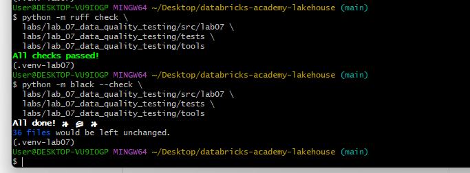

---

## 14. Job Orchestration

```text
00_source_preparation
        |
01_quality_pipeline
        |
02_scd2_validation
        |
03_quarantine_review
        |
04_delta_constraints
        |
05_gx_validation
       / \
06_reconciliation   07_freshness_volume
       \ /
08_schema_contract
        |
09_monitoring_validation
        |
10_quality_scorecard
        |
11_final_gate
```

The validated Azure Dev full run completed every task from `00` through `11` successfully.

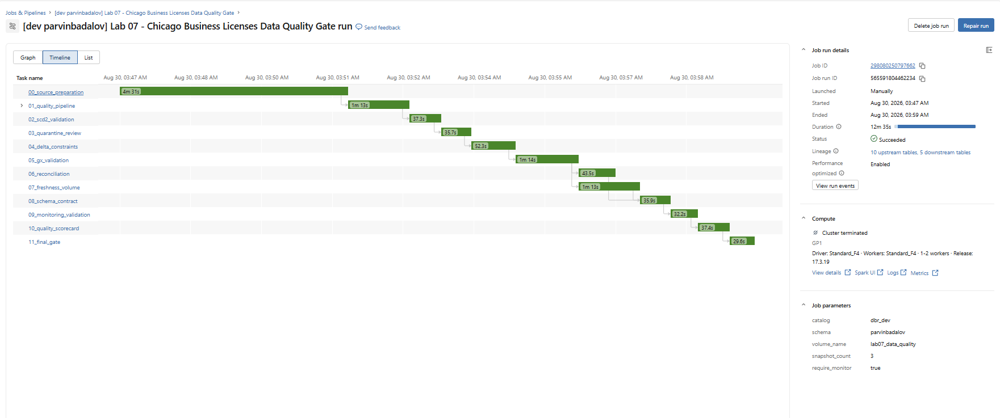

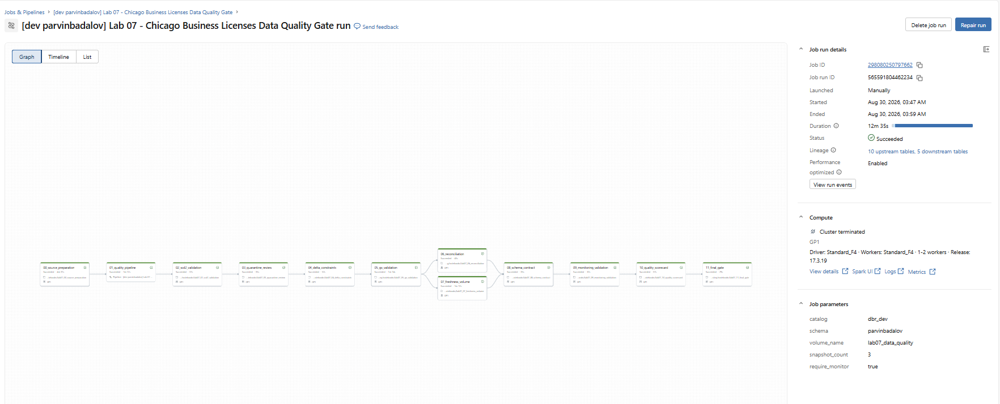

---

## 15. Data Quality Monitoring

Monitored table:

```text
dbr_dev.parvinbadalov.business_license_validated
```

The monitor uses `_ingested_at` with one-day granularity and writes profile and drift metrics into `dbr_dev.parvinbadalov`. A successful Azure Dev refresh generated profile metrics for the validated table.

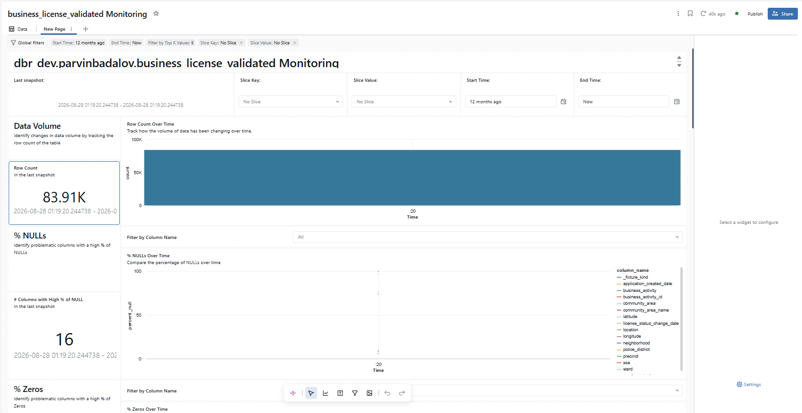

---

## 16. Lakeview Dashboard

Dashboard definition: `dashboards/lab07_dq_scorecard.lvdash.json`

Validated headline results:

| Metric | Result |
|---|---:|
| Overall Quality Score | **99.56%** |
| Total rows/checks | **84,281** |
| Trusted / passed | **83,910** |
| Quarantined / failed | **371** |
| Warning rows | **1** |

The dimension views count affected records only; they do not mislabel unaffected valid records as dimension-level passes.

| Dimension | Records | Status |
|---|---:|---|
| Consistency | 323 | QUARANTINE |
| Validity | 40 | QUARANTINE |
| Uniqueness | 8 | QUARANTINE |
| Completeness | 1 | WARN |

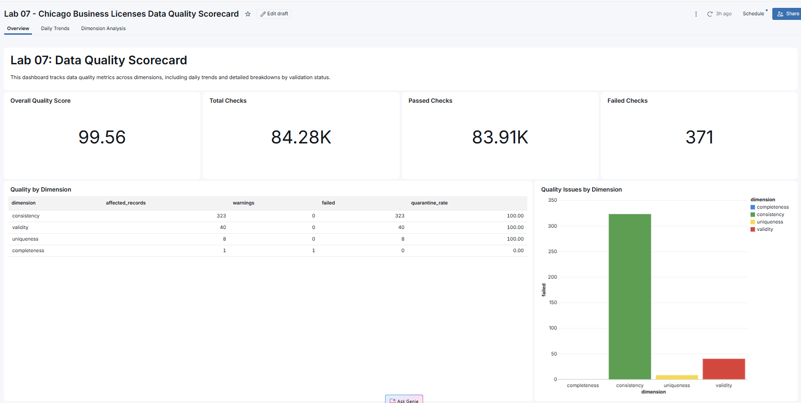

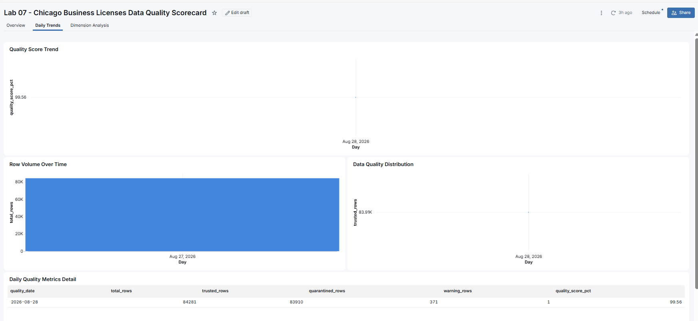

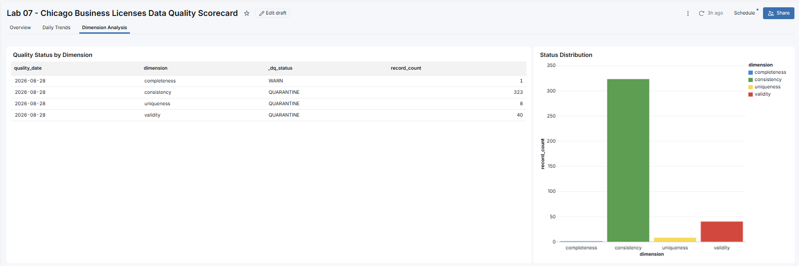

---

## 17. Asset Bundle Dev/Prod Deployment

Lab 07 is defined in the shared root Databricks Asset Bundle. The relevant resource files are:

```text
resources/lab07_infrastructure.yml
resources/lab07_quality_pipeline.yml
resources/lab07_monitoring.yml
resources/lab07_dashboard.yml
resources/lab07_data_quality_job.yml
```

### Azure Dev

Bundle validation, deployment, the full `00`-`11` orchestration, monitoring validation, and dashboard validation all passed.

### Azure Prod

> [!IMPORTANT]
> Azure Prod was **validated and deployed only**. The production job was intentionally **not executed**.

The existing shared external volume was bound to Azure Prod bundle state, and the final selective pipeline plan reported:

```text
Plan: 0 to add, 0 to change, 0 to delete, 2 unchanged
```

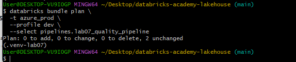

---

## 18. Repository Structure

This tree is derived from the tracked Lab 07 files after cleanup. Repetitive test modules, notebooks, and evidence images are grouped for readability.

<details>
<summary><strong>View repository tree</strong></summary>

```text
labs/lab_07_data_quality_testing/
|-- .gitignore
|-- README.md
|-- pre-commit-config.yaml
|-- pyproject.toml
|-- requirements.txt
|-- requirements-dev.txt
|-- config/
|   `-- quality_rules.yml
|-- contracts/
|   `-- business_license_silver_v1.yml
|-- dashboards/
|   `-- lab07_dq_scorecard.lvdash.json
|-- dq/great_expectations/
|   |-- bronze_license_suite.json
|   |-- silver_license_suite.json
|   `-- gold_license_suite.json
|-- evidence/
|   |-- pytest/generated_static_validation.txt
|   `-- screenshots/ (14 successful validation images, 01 through 14)
|-- notebooks/
|   |-- lab07_00_source_preparation.ipynb
|   |-- lab07_01_source_profile.ipynb
|   `-- lab07_02_scd2_validation.ipynb through lab07_11_final_gate.ipynb
|-- pipeline/
|   |-- bronze.py
|   |-- quality.py
|   |-- scd2.py
|   `-- gold.py
|-- sql/
|   |-- delta_constraints.sql
|   |-- monitoring_queries.sql
|   |-- quarantine_analysis.sql
|   `-- reconciliation_queries.sql
|-- src/
|   |-- lab07/ (10 package modules)
|   `-- tests/ (4 native Lakeflow TestPipeline tests)
|-- tests/
|   |-- conftest.py
|   |-- fixtures/ (valid, snapshot, duplicate, and late-arrival datasets)
|   |-- integration/test_deployed_medallion_e2e.py
|   |-- quality/ (6 quality-rule tests)
|   `-- unit/ (6 unit/chispa test modules)
`-- tools/
    `-- license_batch_loader.py

resources/  # repository root
|-- lab07_dashboard.yml
|-- lab07_data_quality_job.yml
|-- lab07_infrastructure.yml
|-- lab07_monitoring.yml
`-- lab07_quality_pipeline.yml
```

</details>

---

## 19. Evidence

| Screenshot | What it proves |
|---|---|
| `01_azure_dev_job_timeline_success.png` | All Azure Dev job tasks succeeded |
| `02_azure_dev_job_dag_success.png` | Full job DAG and dependencies |
| `03_dashboard_overview.png` | Final quality KPIs |
| `04_dashboard_daily_trends.png` | Quality and volume trends |
| `05_dashboard_dimension_analysis.png` | Issue distribution by dimension |
| `06_data_quality_monitoring.png` | Monitoring profile exists |
| `07_azure_prod_plan_clean.png` | Azure Prod pipeline plan is clean |
| `08_local_pytest_16_passed.png` | Local pytest suite passed |
| `09_chispa_3_passed.png` | Chispa tests passed |
| `10_ruff_black_passed.png` | Code-quality checks passed |
| `11_lakeflow_test_expectations_passed.png` | Native expectations test passed |
| `12_lakeflow_test_quarantine_passed.png` | Native quarantine test passed |
| `13_lakeflow_test_gold_quality_passed.png` | Native Gold test passed |
| `14_lakeflow_test_scd2_passed.png` | Native SCD2 test passed |

`evidence/pytest/generated_static_validation.txt` is retained as the earlier static packaging record; the successful screenshots above are the final execution evidence.

---

## 20. Final Validation Status

**Lab 07 is complete for the agreed academy scope.**

| Area | Result |
|---|---|
| Native Lakeflow `TestPipeline` | ✅ `4/4 passed` |
| Local pytest | ✅ `16 passed, 1 deselected` |
| Chispa | ✅ `3 passed` |
| Ruff and Black | ✅ Passed |
| Azure Dev validation/deployment | ✅ Passed |
| Azure Dev full run | ✅ Passed |
| Monitoring and dashboard | ✅ Passed |
| Azure Prod validation/deployment | ✅ Passed |
| Azure Prod execution | ⏭️ Intentionally not run |

---

## 21. Key Learning Outcomes

Lab 07 demonstrates:

- public API ingestion with provenance metadata,
- external Unity Catalog volumes on ADLS Gen2,
- reusable PySpark quality rules and deterministic fixtures,
- trusted, warning, and quarantined data paths,
- quality dimensions and reason codes,
- business-effective snapshots and late-arriving data handling,
- Lakeflow AUTO CDC and SCD Type 2,
- native Lakeflow `TestPipeline`, pytest, and Chispa testing,
- Delta constraints, reconciliation, schema contracts, freshness, and volume checks,
- Databricks Data Quality Monitoring and Lakeview dashboards,
- Databricks Asset Bundle validation and controlled Dev/Prod promotion.

---

## 22. Conclusion

> [!TIP]
> **Lab 07 is complete for the agreed academy scope.** It has end-to-end proof across source ingestion, transformation, quality controls, historical tracking, automated tests, monitoring, reporting, and deployment.

Azure Dev has been executed successfully; Azure Prod remains intentionally deploy-only.
