# Lab 08 · TravelOps

### From a pull request to an approved Azure production release

**Databricks Asset Bundles · Lakeflow · GitHub Actions · Terraform · Azure OIDC / Databricks PAT**

[](https://github.com/BadalovP/Databricks-Academy-Lakehouse/actions/runs/35485851420)
[](https://github.com/BadalovP/Databricks-Academy-Lakehouse/actions/runs/35483922379)
[](https://github.com/BadalovP/Databricks-Academy-Lakehouse/actions/runs/35481666973)

> **Submission snapshot — 20 September 2026.** Both selectable Azure deployment modes have now completed real manual end-to-end GitHub Actions runs, including the explicitly enabled final Azure application job. The alternate mode remains *skipped* within each run by design. These runs establish successful workflow/job execution, **not** retroactive removal of historical Bronze duplicates or an independent SQL audit of the Azure Gold health row.

**Start here:** [What was built](#1-what-was-built) · [Architecture](#2-data-and-compute-architecture) · [CI/CD stages](#3-cicd-design) · [How to run](#4-how-to-run-the-workflow) · [Evidence](#5-actual-execution-evidence) · [Limitations](#7-known-limitations) · [Submit](#9-submission-links)

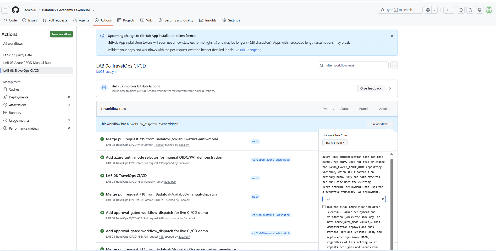

*Figure 1. The Lab 8 workflow overview offers a manually dispatched, approval-gated demonstration from `main`; this is not the same as an individual run's “Re-run all jobs” control.*

---

## 1. What was built

TravelOps is an independently deployable Lab 8 lakehouse. A GitHub pull request runs quality gates; eligible changes merged to `main` can promote an identical Databricks application through **Personal DEV → Personal PROD → Azure PROD**. A manual workflow can demonstrate the entire release with an explicit choice of Azure authentication method.

| Capability | Implemented behavior | Where to inspect |
|:--|:--|:--|
| Source / pipeline | Seven `samples.wanderbricks` sources → file landing → Bronze → Silver → Gold | [`pipeline/`](pipeline/) and [`notebooks/`](notebooks/) |
| Bundle as code | Dedicated bundle with `personal_dev`, `personal_prod`, `azure_prod` | [`databricks.yml`](databricks.yml) and [`resources/`](resources/) |
| Quality on PR | Ruff, Black, Pytest, strict Personal bundle validation; OIDC-mode PR plan is read-only | [Workflow YAML](../../.github/workflows/lab08_cicd.yml) |
| Controlled promotion | DEV validation → Personal PROD approval and validation → Azure release approval | [OIDC run #46](https://github.com/BadalovP/Databricks-Academy-Lakehouse/actions/runs/35485851420) |
| Infrastructure | Terraform-backed raw Volumes / Azure storage and schema; imported remote state and no-change safety gates | [`terraform/`](terraform/) · [Architecture](ARCHITECTURE.md) |
| Azure identity | Choose **OIDC + Terraform** or **temporary PAT**, never both in one run | [OIDC #46](https://github.com/BadalovP/Databricks-Academy-Lakehouse/actions/runs/35485851420) · [PAT #45](https://github.com/BadalovP/Databricks-Academy-Lakehouse/actions/runs/35483922379) |
| Repeatability | Stable write-once raw-file identity for normal same-input reruns; Gold health assertions; deployment plans | [DEV integration results](evidence/lab08_personal_dev_run2_after_results.md) |

**Ownership separation:** Terraform owns raw landing infrastructure and the Azure application schema; the Databricks bundle owns jobs, notebooks, the Lakeflow pipeline, dashboard/alert and application datasets. The older root bundle used by Labs 1–7 is not reassigned to Lab 8.

## 2. Data and compute architecture

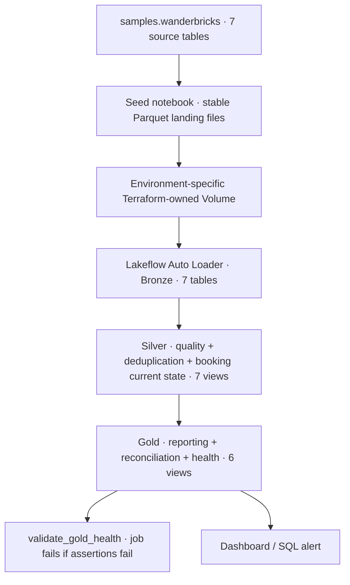

**Input entities:** `bookings`, `booking_updates`, `payments`, `users`, `properties`, `reviews`, `destinations`. The seed notebook writes files into the target's raw Volume, rather than reading the samples database directly from the production pipeline. Stable write-once filenames prevent *ordinary unchanged-input reruns* from appearing as new Auto Loader files; they do **not** remove historical records already ingested by the previous approach. The identity is based on seed metadata and row count, not a comprehensive content hash or concurrency-proof transaction.

| Target | Application schema | Raw storage | Compute arrangement |
|:--|:--|:--|:--|
| `personal_dev` | `dbr_dev.parvinbadalov_lab08_dev` | Managed raw Volume in Personal workspace | Serverless notebook tasks and Lakeflow |
| `personal_prod` | `dbr_dev.parvinbadalov_lab08_prod` in **Personal** workspace | Different managed raw Volume | Serverless notebook tasks and Lakeflow |
| `azure_prod` | `dbr_dev.parvinbadalov_lab08_prod` in **Azure** workspace | External Volume on Terraform-managed ADLS Gen2 | Existing GP2 handles notebook tasks; separate classic **pipeline-managed** `Standard_F4` compute handles Lakeflow |

The matching `personal_prod` / `azure_prod` schema names are not a collision: they live in **different workspaces**. The existing GP2 notebook cluster is **not** the Lakeflow compute cluster. See [ARCHITECTURE.md](ARCHITECTURE.md) for the raw-source migration, resource ownership and compute details.

**Published data:** seven Bronze datasets, seven Silver datasets, and six Gold datasets, including `gold_payment_reconciliation` and `gold_production_health`. The Lakeflow interface shows **20 datasets** across these layers.

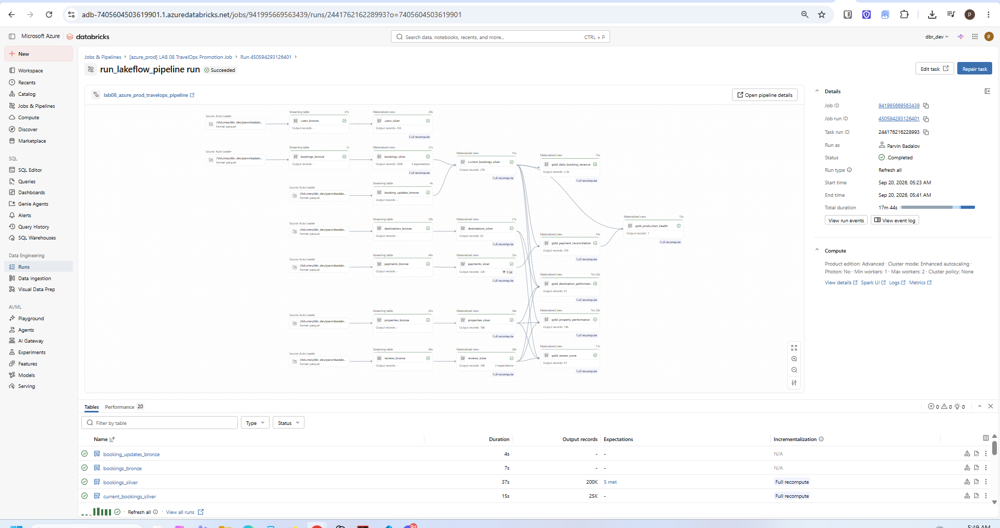

*Figure 2. Run #45's Azure Lakeflow task succeeded; the graph shows the source → Bronze → Silver → Gold lineage, with 20 listed datasets. “Succeeded” is the pipeline update result, not an independent SQL verification of all business measures.*

## 3. CI/CD design

### Release graph

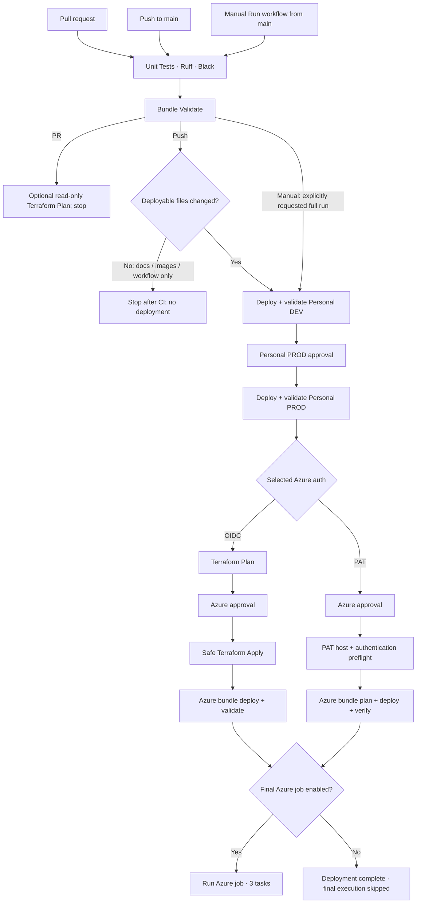

**Branch controls:** PRs do not apply infrastructure or deploy production. An ordinary push to `main` must pass deployable-file detection before DEV starts; docs, evidence screenshots and workflow-only changes do not constitute deployable changes. A *manual* `workflow_dispatch` explicitly bypasses change detection **only to launch the full promotion**; tests and both approval gates still apply.

**Authentication controls:** OIDC uses GitHub-to-Azure identity, Terraform remote state and a guarded Apply; PAT uses a Databricks Azure-workspace PAT, explicitly confirms the CLI's resolved host and job read access, and skips Terraform. Both require Azure release approval. PAT permissions were exercised by the successful run #45; that does not mean the token should be copied into documentation.

**What grey boxes mean:** the unused PAT/OIDC branch shows grey *skipped* jobs by design. Grey is not a failed check, and it is neither possible nor appropriate to run the two alternatives in the **same** execution.

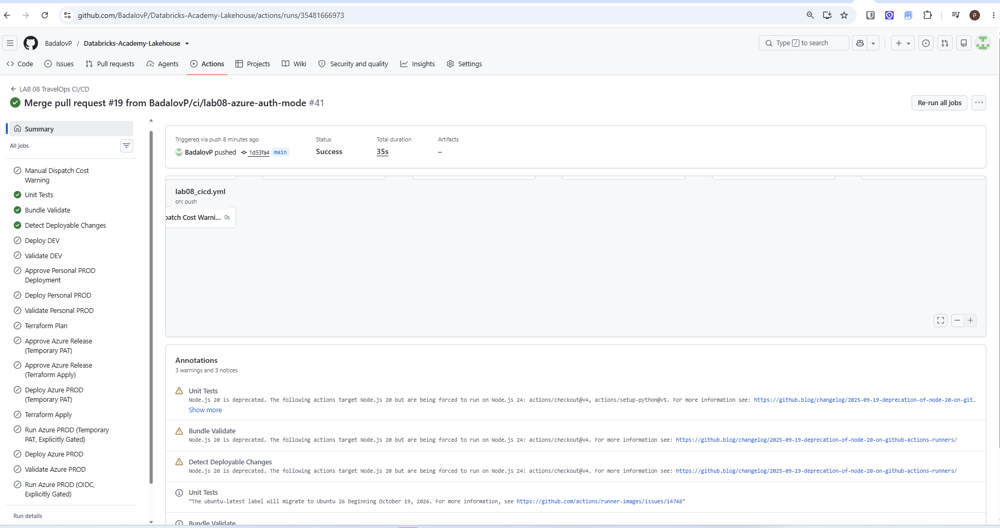

*Figure 3. Run #41 illustrates the docs/workflow-only guard: green quality checks, grey deployment jobs.*

## 4. How to run the workflow

### 4.1 Start a new run (not a retry)

1. Open [GitHub Actions → LAB 08 TravelOps CI/CD](https://github.com/BadalovP/Databricks-Academy-Lakehouse/actions/workflows/lab08_cicd.yml), **the workflow overview page**.
2. Click **Run workflow** above the run list; select **Branch: `main`**. If the green confirmation button is hidden, scroll **inside the dropdown**.
3. Choose `azure_auth_mode`:
   - `oidc` (default): Terraform/OIDC → Azure bundle deployment and validation.
   - `pat`: temporary PAT authentication and bundle deployment; **no Terraform Plan/Apply**.
4. Set **Run the final Azure PROD job** (`run_azure_prod_job`): **unchecked** skips *only* the final Azure application job; **checked** also runs it, after Azure deployment succeeds. Either choice still deploys/runs Personal DEV and Personal PROD and deploys Azure PROD.
5. Check authorization, current active runs and compute budget; press the green **Run workflow** button **once**.


*Figure 4. Actual `workflow_dispatch` controls. The checkbox controls only final Azure job execution; it does not turn deployment stages on/off.*

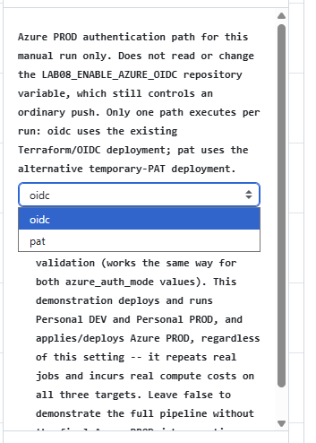

*Figure 5. The two Azure authentication modes are **mutually exclusive**. Changing the selector affects only the **new run**; it cannot alter an already-started run.*

| Demonstration | Azure mode | Final-job checkbox | Expected outcome |
|:--|:--|:--|:--|
| OIDC deployment only | `oidc` | Unchecked | Full DEV/Personal PROD promotion + Azure Terraform and deployment; final Azure job grey/skipped. |
| **Full OIDC end-to-end** | **`oidc`** | **Checked** | Same promotion + final Azure application job; demonstrated by [#46](https://github.com/BadalovP/Databricks-Academy-Lakehouse/actions/runs/35485851420). |
| PAT deployment only | `pat` | Unchecked | Full DEV/Personal PROD promotion + PAT Azure deployment; final Azure job grey/skipped. |
| **Full PAT end-to-end** | **`pat`** | **Checked** | Same promotion + final Azure application job; demonstrated by [#45](https://github.com/BadalovP/Databricks-Academy-Lakehouse/actions/runs/35483922379). |

### 4.2 Approvals and completion

1. **Quality/DEV:** Unit Tests → Bundle Validate → Detect Deployable Changes → Deploy DEV → Validate DEV.
2. **Personal PROD:** GitHub pauses at `personal-prod-approval`. Review the DEV result, then select **Review deployments → Approve and deploy** if authorized. Personal PROD deploys/runs and validates.
3. **Azure PROD:** review the selected path's prerequisite: OIDC runs Terraform Plan **before** `azure-release-approval`; PAT requests this approval **before** PAT preflight and bundle deployment. Approve only if authorized. OIDC then enforces Terraform's imported-state/no-change safeguards before Azure deployment.
4. **Final job:** if checked, verify `Run Azure PROD` succeeded, plus the Databricks tasks `seed_raw_data` → `run_lakeflow_pipeline` → `validate_gold_health`. If unchecked, the final job remains grey by design.
5. Save the exact **GitHub workflow run URL**, the Azure **Databricks job run ID**, and any read-only health query output you actually captured.

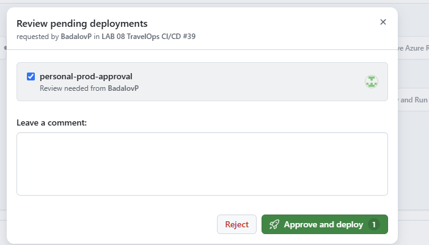

*Figure 6. The checkbox inside **Review pending deployments** chooses an **environment to approve**, not OIDC versus PAT. Each new run needs its own approvals.*

> **Important operational distinction:** For ordinary pushes, `LAB08_ENABLE_AZURE_OIDC` chooses the Azure path and the existing repository-variable gates retain their original semantics; for manual runs, the dropdown/checkbox supply the selection **without changing variables**. The PAT route's automatic push behavior is not identical to manual checkbox behavior; consult the [actual workflow YAML](../../.github/workflows/lab08_cicd.yml) before changing repository variables. Do not use “Re-run all jobs” as a substitute for choosing fresh manual inputs.

> **Costs and safety:** Each manual run executes real DEV/Personal PROD workloads and a real Azure deployment, even if the final-job box is unchecked. Stop and review if another run is active; no retries or checkpoint resets merely to make alternative boxes green. Only authorized operators should approve production stages.

## 5. Actual execution evidence

These links point to **distinct completed runs**, not one combined run or simulated images. For job-level assertions, use the GitHub job outcome; for Databricks task/pipeline outcomes, use the Databricks UI. A green health task means its internal assertions completed, but is not a substitute for an independent SQL result.

### 5.1 OIDC + Terraform: full success — run #46

**[GitHub Actions #46 · 35485851420](https://github.com/BadalovP/Databricks-Academy-Lakehouse/actions/runs/35485851420)** · Manual `workflow_dispatch` from `main` · **Success**, 32m 58s as captured. Confirmed successful stages: tests and bundle validation; DEV deploy/validate; Personal PROD approval/deploy/validate; Terraform Plan; Azure release approval; Terraform Apply; Azure bundle deploy/validate; **Run Azure PROD (OIDC)**. PAT-related jobs were skipped intentionally.

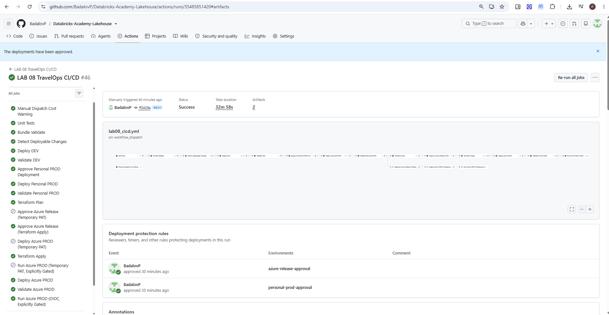

*Figure 7. Run #46: every job in the selected OIDC route completed; the unused PAT route is grey by design. The screenshot also shows two completed approval events and two retained artifacts.*

Earlier **[OIDC #39](https://github.com/BadalovP/Databricks-Academy-Lakehouse/actions/runs/35479987880)** independently completed the full OIDC deployment and Azure job as well. These links can be shown separately to the supervisor as repeated execution evidence.

### 5.2 Temporary PAT: full success — run #45

**[GitHub Actions #45 · 35483922379](https://github.com/BadalovP/Databricks-Academy-Lakehouse/actions/runs/35483922379)** · Manual `workflow_dispatch` from `main` · **Success**, 44m 8s as captured. Tests, DEV, Personal PROD, both human approvals, PAT host/token/job-access preflight, PAT Azure bundle deployment and **Run Azure PROD (Temporary PAT)** all passed. Terraform jobs and the entire OIDC branch were skipped, as designed.

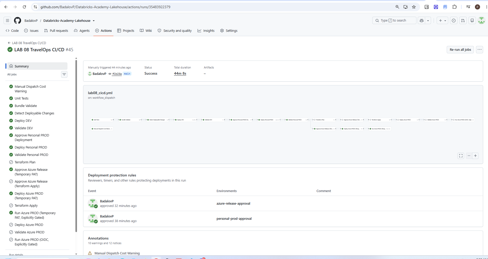

*Figure 8. Run #45: the selected PAT deployment and final PAT-triggered Azure job are green; OIDC/Terraform boxes are expected to be grey.*

The PAT workflow then ran the real Azure Databricks promotion job. Its [pipeline-task screenshot](evidence/images/08_pat_lakeflow_success.png) shows success for `run_lakeflow_pipeline` and 20 lakehouse datasets. The screenshot does not itself show an independently executed health-row SQL query.

### 5.3 Azure application: three-task success

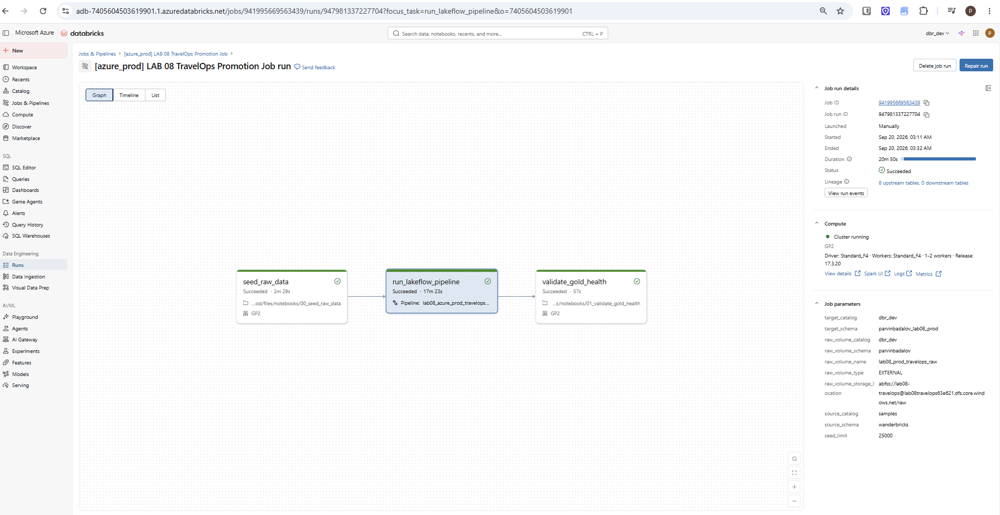

*Figure 9. Earlier completed OIDC application execution: `seed_raw_data`, `run_lakeflow_pipeline` and `validate_gold_health` all show success. The exact corresponding Databricks job is [run `947981337227704`](https://adb-7405604503619901.1.azuredatabricks.net/jobs/941995669563439/runs/947981337227704?o=7405604503619901). This is historical evidence; do not present its run ID as the ID of #45 or #46.*

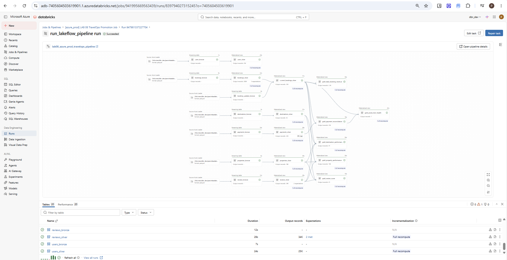

*Figure 10. Earlier successful Azure pipeline update; kept as historical comparative evidence rather than relabeled as #45 or #46.*

### 5.4 Documentation-only safeguard and earlier incident

- **[GitHub Actions #41](https://github.com/BadalovP/Databricks-Academy-Lakehouse/actions/runs/35481666973):** successful quality checks, deployment jobs skipped because only documentation/workflow files changed.
- **[Failed PAT attempt #42](https://github.com/BadalovP/Databricks-Academy-Lakehouse/actions/runs/35482773314):** preflight resolved the Personal workspace host while checking an Azure PAT. This run did *not* deploy Azure PROD. The corrected preflight verifies the host outside the bundle directory; its successful execution is evidenced in #45.
- **[PAT host correction PR #20](https://github.com/BadalovP/Databricks-Academy-Lakehouse/pull/20):** traceable source fix for #42.
- **Earlier standalone monitor:** [retained incident record](evidence/lab08_azure_prod_run_989280124372132.md) distinguishes a successful Databricks run from its failing GitHub post-trigger monitoring. Integrated runs #45 and #46 have passed; this does **not** prove the old standalone monitoring workflow was repaired.

The concise, timestamped run matrix is also retained in **[FINAL_RUNS_2026-09-20.md](evidence/FINAL_RUNS_2026-09-20.md)**. Detailed original logs and migration history remain indexed in [evidence/README.md](evidence/README.md).

## 6. Project layout and non-deploying validation

```text
labs/lab_08_cicd_travelops/
├── README.md                       # This illustrated supervisor walkthrough
├── databricks.yml                  # Lab-specific bundle + three targets
├── pipeline/                       # Bronze, Silver and Gold definitions
├── notebooks/                      # Seed notebook and Gold health assertion
├── resources/                      # Pipeline, promotion job, dashboard, alert
├── tests/                          # Pipeline/application tests
├── terraform/                      # Separate Personal / Azure PROD roots
├── ARCHITECTURE.md                 # Ownership, resource and compute details
├── CICD.md                         # Configuration and historical rollout notes
└── evidence/
    ├── README.md                   # Existing detailed evidence index
    ├── FINAL_RUNS_2026-09-20.md     # Latest PAT/OIDC execution summary
    └── images/                     # 9 original screenshots used here
```

No bundle or production code is modified by this documentation package. Existing detailed `CICD.md` and `ARCHITECTURE.md` are retained rather than overwritten: their *historical status snapshots* may predate the latest successful manual runs; this README and the final-runs note provide the up-to-date **20 September 2026 status**.

For validation from the Lab 8 directory, use the repository's development environment and run non-deploying checks appropriate to its configuration (e.g., `ruff check .`, `black --check .`, `pytest`, and `databricks bundle validate --strict -t personal_dev` with Personal workspace credentials). The workflow runs these gates automatically; **do not** run `bundle deploy`, `bundle run`, `terraform apply` or a manual dispatch simply to update the README.

## 7. Known limitations

| Boundary | Accurate statement |
|:--|:--|
| **Historical Bronze duplicates** | Earlier file overwrites produced duplicate ingestion. Normal rerun protection now exists, but historical Bronze rows remain; the [production remediation plan](evidence/lab08_production_remediation_plan.md) has **not** been executed. No deletion/full refresh is implied by the green CI/CD results. |
| **Independent SQL health audit** | The Azure `validate_gold_health` task passed in recorded successful job executions. Independent, separately captured read-only SQL results for the underlying Azure Gold health-row values were not provided with this screenshot package. Do not invent `health_passed`/mismatch numbers for these exact runs. |
| **Standalone monitoring workflow** | The earlier standalone monitor failed after triggering a successful Databricks job. The newer *integrated* PAT/OIDC workflows succeeded; the standalone monitor's separate post-trigger fix has not been reverified here. |

**Resolved since the previous README:** the PAT preflight host-selection defect reported by #42 was corrected and a *real* PAT path passed in #45. It is no longer accurate to describe PAT as “not live-tested.”

## 8. Troubleshooting and operational notes

- **Run workflow button not visible?** Open the workflow *overview* via the link above, not an individual run. Refresh after a merged change that adds `workflow_dispatch`.
- **Two Azure paths, many grey jobs?** Choose exactly one auth mode; all jobs in the other mode are intentionally skipped. Do not run both just to obtain green icons.
- **PAT reports an invalid access token?** Read the host in its log first. In #42 the CLI incorrectly used the Personal host; the newer preflight checks the resolved Azure host before testing the token. If it fails *after* confirming the Azure host, treat it as a separate credential or permission issue; do not disclose/rotate credentials in a PR.
- **Lakeflow says “waiting for resources”?** Inspect its event log and compute provisioning; avoid repeated job triggers. A slow pipeline is not proof of failure.
- **GitHub workflow failed after triggering Databricks?** Inspect the actual job and task run ID before attempting recovery. The old monitoring failure was not the same as a failed Databricks job.
- **Want a second demonstration?** Wait until the current run is terminal; review cost and production approvals again. For a docs-only update, push only README and files under `evidence/` on a review branch so deployments remain skipped.

## 9. Submission links

| Resource | Link |
|:--|:--|
| **Repository project** | [Lab 8 source directory](https://github.com/BadalovP/Databricks-Academy-Lakehouse/tree/main/labs/lab_08_cicd_travelops) |
| Workflow definition | [`.github/workflows/lab08_cicd.yml`](../../.github/workflows/lab08_cicd.yml) |
| **Latest OIDC end-to-end success** | [Actions #46](https://github.com/BadalovP/Databricks-Academy-Lakehouse/actions/runs/35485851420) |
| **PAT end-to-end success** | [Actions #45](https://github.com/BadalovP/Databricks-Academy-Lakehouse/actions/runs/35483922379) |
| Earlier OIDC demonstration | [Actions #39](https://github.com/BadalovP/Databricks-Academy-Lakehouse/actions/runs/35479987880) |
| Source bug fix | [PR #20](https://github.com/BadalovP/Databricks-Academy-Lakehouse/pull/20) |
| Run-level evidence note | [Final run matrix](evidence/FINAL_RUNS_2026-09-20.md) |
| Detailed migration and historical evidence | [Evidence index](evidence/README.md) |

---

*Screenshots are original evidence from this project, dated 20 September 2026, and represent specific executions rather than a promise about future runs. Nine screenshots are placed under `evidence/images/` because this directory is classified as evidence by the current deployment-change guard; creating a new top-level `images/` directory inside this lab would not have the same documented exemption. No credentials, Terraform state, or plan binaries are included.*
