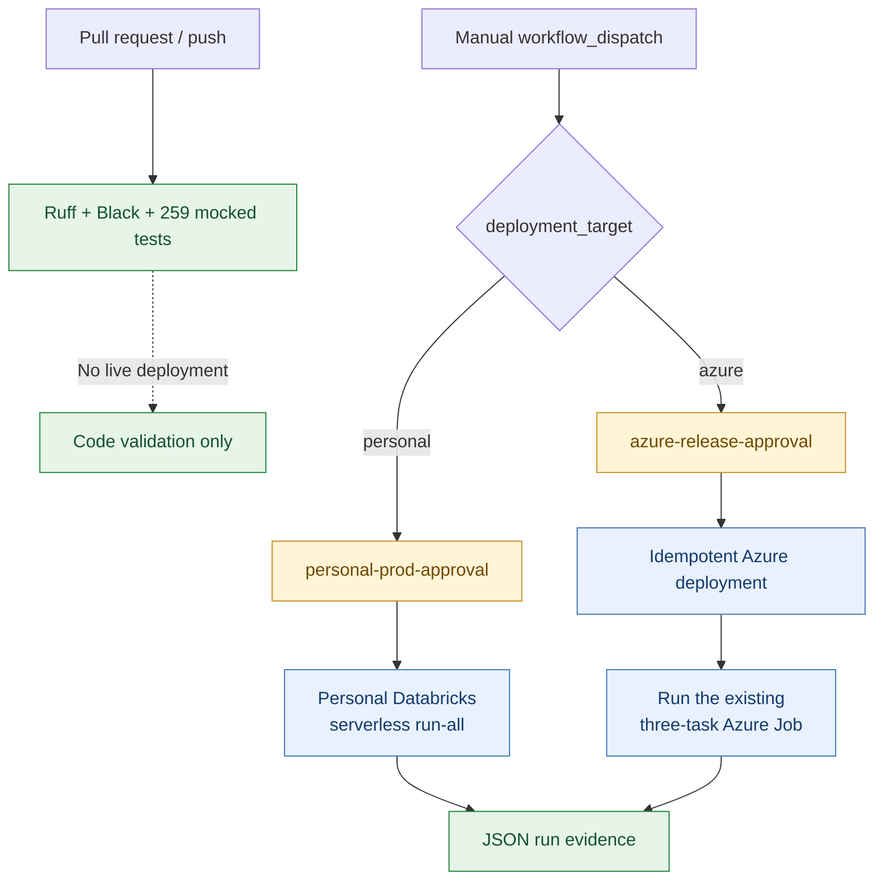
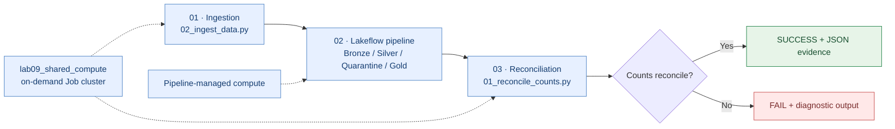
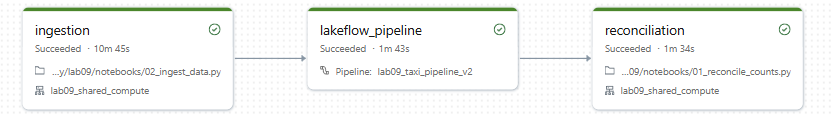
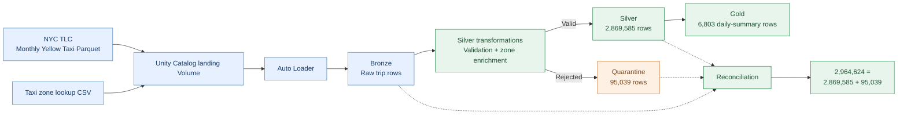
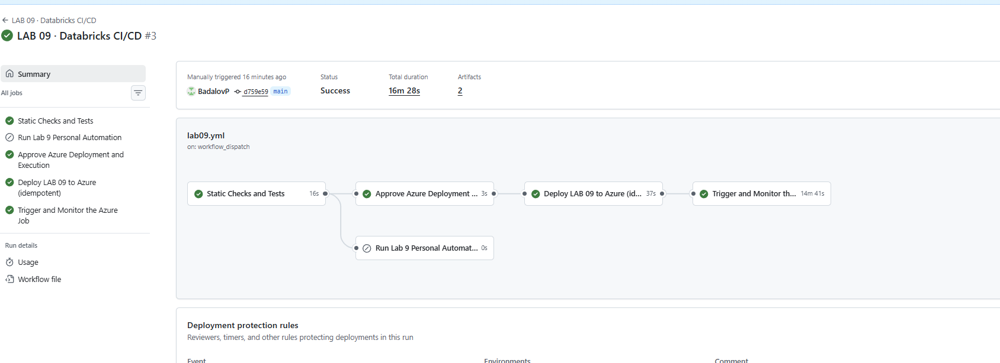
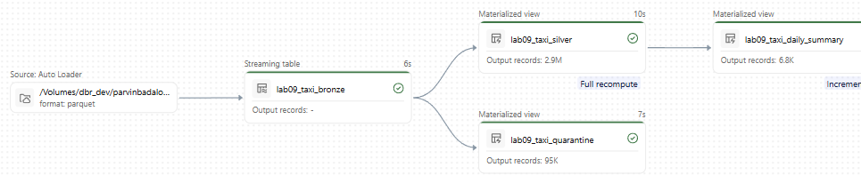
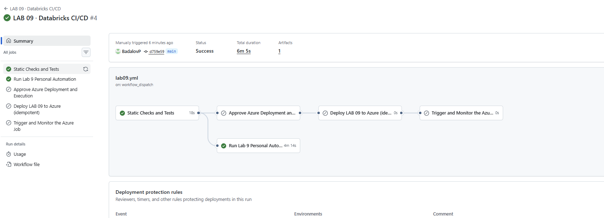
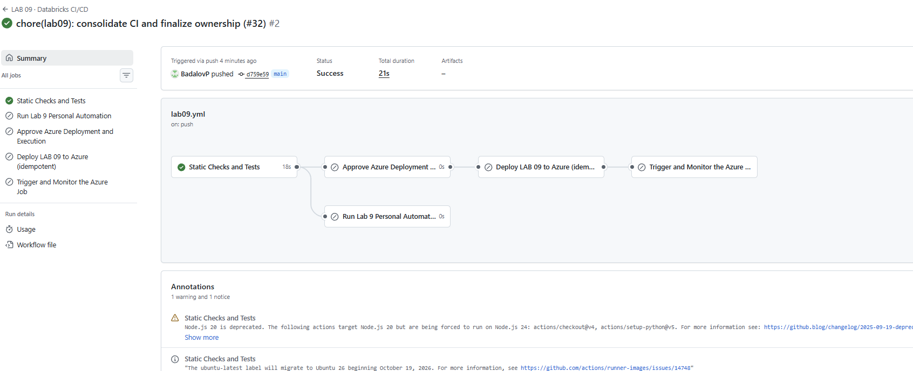
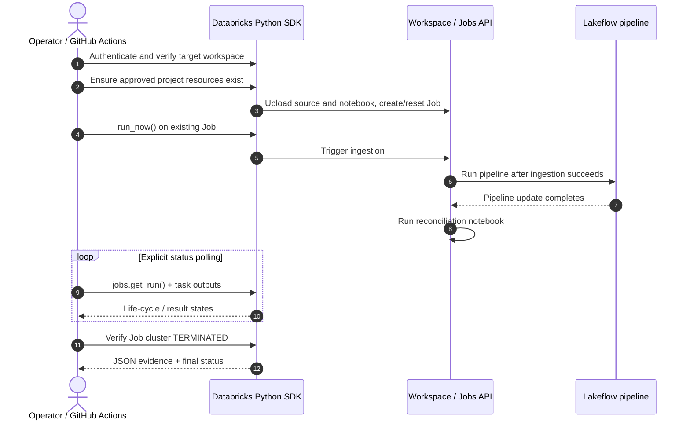

<div align="center">

# Lab 09 · API-Orchestrated Taxi Lakehouse

**One Python codebase · Two Databricks workspaces · One GitHub Actions workflow**

Real NYC TLC data, incremental ingestion, a governed Bronze → Silver / Quarantine → Gold pipeline, SDK-driven Jobs, and end-to-end reconciliation.

[](https://www.python.org/)
[](https://www.databricks.com/)
[](https://www.databricks.com/product/unity-catalog)
[](../../.github/workflows/lab09.yml)
[](https://github.com/BadalovP/Databricks-Academy-Lakehouse/actions/runs/36351092702)

[Architecture](#architecture) · [Successful runs](#verified-results) · [Screenshots](#execution-gallery) · [CI/CD](#one-workflow-two-deployment-targets) · [Run it](#run-it-safely) · [Technical reference](docs/TECHNICAL_REFERENCE.md)

</div>

> [!NOTE]
> **Completed and validated in both workspaces.** The Personal deployment uses serverless execution. The Azure deployment has one permanent three-task Job using on-demand shared Job compute for its notebooks and separately managed Lakeflow compute. All results below are linked to their actual environment; Personal and Azure evidence are not interchangeable.

## At a glance

| | Personal Databricks | Azure Databricks |
|---|---|---|
| **Purpose** | Serverless API automation | Classic Job compute + real pipeline orchestration |
| **Configuration** | [`config/dev.yml`](config/dev.yml) | [`config/azure.yml`](config/azure.yml) |
| **Job** | [`lab09_taxi_reconciliation_job`](https://dbc-1750318a-76a9.cloud.databricks.com/jobs/565783460048532?o=7474653929863069) | [`lab09_taxi_reconciliation_job`](https://adb-7405604503619901.1.azuredatabricks.net/jobs/374991019372414?o=7405604503619901)<br><sub>ID: `374991019372414`</sub> |
| **Pipeline** | `lab09_taxi_pipeline_v2` | [`lab09_taxi_pipeline_v2`](https://adb-7405604503619901.1.azuredatabricks.net/pipelines/93a49a14-366e-4224-b2b3-587ef0b7a028?o=7405604503619901)<br><sub>ID: `93a49a14-366e-4224-b2b3-587ef0b7a028`</sub> |
| **Compute** | Serverless | Shared on-demand Job cluster + pipeline-managed compute |
| **Workflow** | [`lab09.yml`, target: `personal`](../../.github/workflows/lab09.yml) | [`lab09.yml`, target: `azure`](../../.github/workflows/lab09.yml) |
| **Live evidence** | [Successful Personal CI/CD](https://github.com/BadalovP/Databricks-Academy-Lakehouse/actions/runs/36355434578) | [Successful Azure end-to-end CI/CD](https://github.com/BadalovP/Databricks-Academy-Lakehouse/actions/runs/36351092702) |

**The difference from Lab 08:** this lab uses the **Databricks Python SDK / REST API** to provision, deploy, trigger, poll, and verify resources imperatively. The same `lab09` Python package is reused in both deployment targets; environment-specific configuration lives in YAML.

## Architecture

### 1 · Deployment and CI/CD



A normal push **only runs static checks**. A manual dispatch selects exactly one environment and uses that environment's existing human-approval gate. Neither path silently redirects to the other workspace.

### 2 · Actual Azure Job — one visible task graph



The ingestion and reconciliation tasks share Job compute **within a run**. The same physical Job cluster is *not* reused across future runs; Databricks tears it down afterward. Lakeflow manages its own compute independently.

[](docs/images/azure-job-full.png)

*Real Azure Job: ingestion → Lakeflow pipeline → reconciliation. Click for the full screenshot, including the successful run and terminated compute.*

### 3 · Data flow and quality gates



These counts are from the **verified September 27 Azure run**, not a prediction of future runs. Every input month is deduplicated at landing; if everything in the configured list is already present, ingestion returns `NO_NEW_DATA` and downstream tasks still validate the existing data.

## Verified results

### Azure: full API-driven deployment and run

[](https://github.com/BadalovP/Databricks-Academy-Lakehouse/actions/runs/36351092702)

*An additional successful Azure run after workflow consolidation is shown above. The linked September 27 run is the independently verified count-level evidence used below.*

| Verification | Observed result |
|---|---:|
| Ingestion task | `SUCCESS` (`NO_NEW_DATA` on the verified rerun; previously landed month retained) |
| Lakeflow pipeline task | `SUCCESS` |
| Reconciliation task | `SUCCESS` |
| Bronze records | **2,964,624** |
| Valid Silver records | **2,869,585** |
| Quarantined records | **95,039** |
| Gold daily-summary records | **6,803** |
| Reconciliation | **PASS**: `2,964,624 = 2,869,585 + 95,039` |
| Shared Job cluster after run | **Independently confirmed `TERMINATED`** |

**Evidence:** [completed Azure GitHub workflow](https://github.com/BadalovP/Databricks-Academy-Lakehouse/actions/runs/36351092702), [live-validation report](evidence/LIVE_VALIDATION_SUMMARY.md), and [Azure Job in Databricks](https://adb-7405604503619901.1.azuredatabricks.net/jobs/374991019372414?o=7405604503619901). The later September 28 screenshot independently shows another successful three-task Job, but its displayed approximate table counts are not substituted for the September 27 report's exact figures.

### Lakeflow: the four actual tables

[](docs/images/lakeflow-full.png)

*Click to open the complete Lakeflow update screenshot with the four resulting tables.*

| Table | Type | Purpose |
|---|---|---|
| `lab09_taxi_bronze` | Streaming table | Auto Loader input with source-file metadata |
| `lab09_taxi_silver` | Materialized view | Valid trips and enriched zone information |
| `lab09_taxi_quarantine` | Materialized view | Rejected rows **plus their failed rules** |
| `lab09_taxi_daily_summary` | Materialized view | Gold daily summary for downstream analysis |

**Four checks in Silver:** `INVALID_FARE`, `INVALID_DISTANCE`, `INVALID_DATETIME_ORDER`, and `INVALID_MONTH`. A passenger-count anomaly is a warning, not an automatic rejection. Invalid rows are retained in Quarantine rather than silently dropped.

### Personal workspace: separate serverless validation

[](https://github.com/BadalovP/Databricks-Academy-Lakehouse/actions/runs/36355434578)

*Personal target succeeded after the workflows were consolidated. Azure steps were correctly skipped because only one deployment target runs per manual dispatch.*

## One workflow, two deployment targets

The repository's **only active Lab 09 workflow** is [`../../.github/workflows/lab09.yml`](../../.github/workflows/lab09.yml), displayed in GitHub Actions as **LAB 09 · Databricks CI/CD**.

| Event / target | What happens | Compute started? |
|---|---|---|
| `pull_request` or `push` | Ruff, Black, mocked pytest once | **No** |
| `workflow_dispatch` → `personal` | `personal-prod-approval` → serverless `run-all` → report | **Only when approved** |
| `workflow_dispatch` → `azure` | `azure-release-approval` → OIDC deploy → trigger/monitor actual three-task Job → report | **Only when approved** |

<details>
<summary><strong>See the static-only CI screenshot</strong></summary>



This is the expected behavior after a code-only merge, not an incomplete workflow.

</details>

### API/SDK automation at a glance



**Access model.** GitHub's existing OIDC identity deploys and triggers Azure. The Azure Job and pipeline execute as the approved Databricks user via **Run as**; the human account owns the Job and can manage the pipeline. The pipeline's creator/owner remains the service principal because pipeline-owner transfer requires a metastore administrator. No dedicated Entra app was created and no extra privileged credentials were placed in GitHub. [Full security and ownership details](docs/TECHNICAL_REFERENCE.md#identity-ownership-and-security).

## Repository map

```text
lab_09_rest_api_automation/
├── config/
│   ├── dev.yml                  # Personal/serverless
│   └── azure.yml                # Shared Azure workspace
├── notebooks/
│   ├── 01_reconcile_counts.py   # JSON reconciliation result
│   └── 02_ingest_data.py       # Real Azure Job ingestion task
├── pipeline/
│   ├── bronze.py
│   ├── silver.py
│   └── gold.py
├── scripts/
│   ├── deploy_azure_job.py     # Idempotent; never triggers a Job
│   ├── run_azure_job.py        # One run + explicit monitoring
│   └── validate_classic_e2e.py # Separate classic-compute proof
├── src/lab09/                 # Reusable SDK-backed Python package
├── tests/                     # Mocked WorkspaceClient tests
├── evidence/                  # Sanitized original validation reports
├── docs/
│   ├── TECHNICAL_REFERENCE.md  # Implementation notes, caveats, how-to
│   └── images/               # Real execution screenshots
└── README.md                  # This visual overview
```

## Run it safely

From `labs/lab_09_rest_api_automation`:

```bash
# Static checks only; no live Databricks resources
python -m pip install -e . -r requirements-dev.txt
pytest -q
ruff check .
black --check .

# Read-only inspection against a deliberately selected CLI profile
python -m lab09.cli --profile YOUR_VERIFIED_PROFILE status
```

**Live execution:** open [LAB 09 · Databricks CI/CD](https://github.com/BadalovP/Databricks-Academy-Lakehouse/actions/workflows/lab09.yml), choose **Run workflow**, select exactly one `deployment_target` (`personal` or `azure`), and complete that target's existing GitHub approval. Live runs can incur compute charges; routine pushes never trigger them.

> [!CAUTION]
> Do not infer the workspace from a locally named `dev` profile. This project's historical `dev`/`AZURE_DEV` profiles could resolve to the shared Azure workspace. Explicitly verify the host and use the existing approved authentication path. Never commit tokens or use a private PAT in GitHub Actions.

## Assignment coverage

| Original Lab 09 task | Where it is demonstrated |
|---|---|
| Create compute, submit a Job, run a notebook through REST/SDK | [`compute.py`](src/lab09/compute.py), [`jobs.py`](src/lab09/jobs.py), [successful uninterrupted classic-compute evidence](evidence/LIVE_VALIDATION_SUMMARY.md#10-second-azure-prod-attempt-2026-09-27--the-create-torunning-gap-closed-by-automation-alone) |
| Programmatically trigger a pipeline and monitor status | [`pipelines.py`](src/lab09/pipelines.py), [`monitoring.py`](src/lab09/monitoring.py), [Azure live run](evidence/LIVE_VALIDATION_SUMMARY.md#13-permanent-azure-job-succeeds-end-to-end-all-three-tasks-via-github-actions-2026-09-27) |
| Integrate with Week 08 CI/CD | [Single approval-gated Lab 09 GitHub Actions workflow](../../.github/workflows/lab09.yml) |
| Provision → execute → report end to end | [Verified Azure deployment and run](https://github.com/BadalovP/Databricks-Academy-Lakehouse/actions/runs/36351092702) |
| Optional platform CLI | [`python -m lab09.cli`](src/lab09/cli.py) |

## Deeper documentation

- [Technical reference](docs/TECHNICAL_REFERENCE.md) — implementation details, data-quality logic, compute and security design, monitoring, and troubleshooting.
- [Sanitized live validation summary](evidence/LIVE_VALIDATION_SUMMARY.md) — dated Personal and Azure results, earlier failed attempts, confirmed fixes and final evidence.
- [Classic cluster creation → RUNNING → Job → terminated](evidence/LIVE_VALIDATION_SUMMARY.md#10-second-azure-prod-attempt-2026-09-27--the-create-torunning-gap-closed-by-automation-alone) — independent proof of the literal compute-creation requirement.
- [Previous long-form README](docs/legacy/README_before_refresh.md) — the original exhaustive technical explanations and evidence trail, preserved verbatim.
- [Original requirement review](evidence/CLASSIC_CLUSTER_REQUIREMENT_REVIEW.md) — why Personal is serverless and Azure is used for classic-compute verification.
- [GitHub Actions workflow](../../.github/workflows/lab09.yml) — one maintained CI/CD file for both targets.

---

<div align="center">

**Built as part of the Databricks Academy Lakehouse project**
[Back to repository overview](../../README.md) · [Browse Lab 09 source](./) · [Open the CI/CD workflow](https://github.com/BadalovP/Databricks-Academy-Lakehouse/actions/workflows/lab09.yml)

</div>
